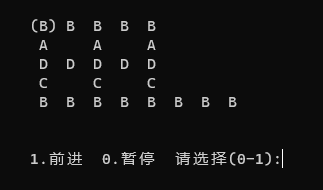

# 《大富翁》案例中的设计模式（版本 2.0）

​																	2023年7月

## 0 开始

### 0-1 功能简述

开发一个控制台应用程序，实现《大富翁》游戏。游戏的功能类似飞行棋，玩家在地图上按指定步数前进，前进到不同的格子上，有不同的效果。用面向对象的思想进行设计，尽量保持设计的灵活性以及弹性，以适应未来变化。

### 0-2 基本运行效果

主菜单：


载入菜单：


选项菜单：


新游戏菜单：


玩家数量菜单：


难度菜单：


游戏界面及菜单(此界面属于开发阶段，最终界面还会标识玩家位置)：


### 0-3 设计思想

>1. 以菜单为程序流程的控制中心，运行时可切换当前菜单；
>2. 各菜单在显示后，由用户选择菜单项，并做相应处理；
>3. 在做相应处理时，可以用到Map，Player等、
>4. 代码风格选择：
>  - 尽可能保证只在堆区创建对象
>
>  - 类名使用大驼峰格式命名
>
>  - 成员函数使用小驼峰格式命名
>
>  - 数据成员，用mXyz格式
>
>  - 静态数据成员，用sXyz格式
>
>  - 使用 shared_ptr<T>存储负责释放的指针，避免显式使用delete
>
>  - using namespace 语句，只用在cpp文件，不在.h文件中出现
>
>    

```C++
// RicherMain.cpp   
#include <memory>
#include "App.h"

// main( )入口
int main( ) {
	//保证只在堆区创建App对象，且自动释放
	// std::shared_ptr<App>  app( new App()); 也可
	std::shared_ptr<App>  app = std::make_shared<App>( );
	app->init( );		//初始化
	app->run( );		//运行
	app->term( );		//终止
}
```


```C++
// App.h
#pragma once
class App {
public:
	void init( );
	void run( );
	void term( );
};
```


```C++
//App.cpp
#include "App.h"
#include "menu.h"

void App::init( ) {
}

void App::run( ) {
	bool running = true;
	while ( running ) {
		Menu * pMenu = 所有菜单集合.当前正使用的菜单( );
		running = pMenu->process( );
	}
}

void App::term( ) {
}
```

### 0-4 初始代码

#### 0-4-1 菜单集合

> 所有菜单集合，先用全局对象表示.
>
> 使用shared_ptr<Menu>可以保证，不存在循环引用时，new的Menu对象，总会delete掉，不会内存泄漏

```C++
// MenuMgr.h
#pragma once
#include <vector>
#include <memory>

class Menu;

// 注意析构使用缺省的即可，不会造成内存泄漏
class MenuMgr {
public:
	MenuMgr( );
	Menu * activedMenu( ) const { return mCurMenu; }
	void   setActivedMenu( int menuType );
private:
	Menu * mCurMenu = nullptr; // 当前菜单
	std::vector< std::shared_ptr<Menu> > mVctMenus = { };   //全体菜单,避免显式delete
};

extern MenuMgr  menuMgr; //全局对象声明

```


```C++
// MenuMgr.cpp
#pragma once
#include <memory>
#include <vector>

#include "Menu.h"
#include "MenuMgr.h"
#include "MenuType.h"

//实例化全局对象MenuMgr
MenuMgr  menuMgr;

MenuMgr::MenuMgr( ) {
	mVctMenus.push_back( std::shared_ptr<Menu>( new MainMenu( ) ) );
	mVctMenus.push_back( std::shared_ptr<Menu>( new NewMenu( ) ) );
	mVctMenus.push_back( std::shared_ptr<Menu>( new LoadMenu( ) ) );
	mVctMenus.push_back( std::shared_ptr<Menu>( new OptionMenu( ) ) );
	mVctMenus.push_back( std::shared_ptr<Menu>( new PlayMenu( ) ) );
	mVctMenus.push_back( std::shared_ptr<Menu>( new SaveMenu( ) ) );
	mVctMenus.push_back( std::shared_ptr<Menu>( new PauseMenu( ) ) );
	mVctMenus.push_back( std::shared_ptr<Menu>( new AnimateMenu( ) ) );
	mVctMenus.push_back( std::shared_ptr<Menu>( new MusicMenu( ) ) );
	mVctMenus.push_back( std::shared_ptr<Menu>( new PlayerCountMenu( ) ) );
	mVctMenus.push_back( std::shared_ptr<Menu>( new DifficultyMenu( ) ) );

	setActivedMenu( MenuType::MAIN_MENU );
}

void MenuMgr::setActivedMenu( int menuType ) {
	mCurMenu = mVctMenus[ menuType ].get( );
}
```


#### 0-4-2 菜单

```C++
// MenuType.h
#pragma once
// 也可使用普通枚举，或枚举类
class MenuType {
public:
	enum Type {
		MAIN_MENU = 0,
		NEW_MENU,
		LOAD_MENU,
		OPTION_MENU,
		PLAY_MENU,
		SAVE_MENU,
		PAUSE_MENU,
		ANIMATE_MENU,
		MUSIC_MENU,
		PLAYER_COUNT_MENU,
		DIFFICULTY_MENU
	};
    enum { TOTAL_COUNT = DIFFICULTY_MENU + 1 }; //菜单个数
};
```


```C++
// Menu.h
#pragma once
#include <memory>
/**
* IMenu接口(可选)
*/
class IMenu {
public:
    virtual ~IMenu( ) = default;
    virtual bool process( ) = 0;
};

class Menu:public IMenu {
public:
    virtual ~Menu( ) = default;
    virtual bool process( ) = 0;
};

/**
* 控制台菜单基类
**/
class ConsoleMenu :public Menu {
public:
    virtual bool process( ) {
        display( );
        int choice = selectMenuItem( );
        return doAction( choice );
    }
protected:
    virtual void display( ) const = 0;
    virtual int  selectMenuItem( ) const;
    virtual bool doAction( int choice ) = 0;
};

/**
* 主菜单
**/
class MainMenu : public ConsoleMenu {
protected:
    virtual void display( ) const  override;
    virtual bool doAction( int choice ) override;
};

/**
* 新游戏菜单
**/
class NewMenu : public ConsoleMenu {
protected:
    virtual void display( ) const  override;
    virtual bool doAction( int choice ) override;
};
/**
* 载入菜单
**/
class LoadMenu : public ConsoleMenu {
protected:
    virtual void display( ) const  override;
    virtual bool doAction( int choice ) override;
};

/**
* 选项菜单
**/
class OptionMenu : public ConsoleMenu {
protected:
    virtual void display( ) const  override;
    virtual bool doAction( int choice ) override;
};

/**
* 游戏菜单
**/
class PlayMenu :public ConsoleMenu {
protected:
    virtual void display( ) const override;
    virtual bool doAction( int choice ) override;
};

/**
* 存档菜单
**/
class SaveMenu :public ConsoleMenu {
protected:
    virtual void display( ) const override;
    virtual bool doAction( int choice ) override;
};

/**
* 暂停菜单
**/
class PauseMenu :public ConsoleMenu {
protected:
    virtual void display( ) const override;
    virtual bool doAction( int choice ) override;
};

/**
 * 动画开关菜单
 **/
class AnimateMenu :public ConsoleMenu {
protected:
    virtual void display( ) const override;
    virtual bool doAction( int choice ) override;
};

/**
* 音乐开关菜单
**/
class MusicMenu :public ConsoleMenu {
protected:
    virtual void display( ) const override;
    virtual bool doAction( int choice ) override;
};

/**
* 玩家数量菜单
**/
class PlayerCountMenu :public ConsoleMenu {
protected:
    virtual void display( ) const override;
    virtual bool doAction( int choice ) override;
};

/**
* 难度等级菜单
**/
class DifficultyMenu :public ConsoleMenu {
protected:
    virtual void display( ) const override;
    virtual bool doAction( int choice ) override;
};
```


```C++
// Menu.cpp
#include <conio.h>
#include <iostream>
using namespace std;

#include "MenuType.h"
#include "Menu.h"
#include "MenuMgr.h"

/**
* 菜单基类
**/
// 读取键盘输入个位数字0到9,
int ConsoleMenu::selectMenuItem( ) const {
	int digital = -1;
	while ( digital < 0 || digital>9 ) {
		digital = _getch( ) - '0';
	}
	_putch( digital + '0' ); //只在正确时回显
	return digital;
}

/**
* 主菜单
**/
void MainMenu::display( ) const {
	system( "cls" );
	cout << "\n";
	cout << "\t 主菜单\n";
	cout << "\t--------\n";
	cout << "\t1.新的游戏\n";
	cout << "\t2.载入游戏\n";
	cout << "\t3.选 项\n";
	cout << "\t0.退 出\n\n";
	cout << "\t请选择(0-3):";
}

bool MainMenu::doAction( int choice ) {
	if ( choice == 0 ) {
		return false;
	} else if ( choice == 1 ) {
		menuMgr.setActivedMenu( MenuType::NEW_MENU );
	} else if ( choice == 2 ) {
		menuMgr.setActivedMenu( MenuType::LOAD_MENU );
	} else if ( choice == 3 ) {
		menuMgr.setActivedMenu( MenuType::OPTION_MENU );
	}
	return true;
}

/**
* 新游戏菜单
**/
void NewMenu::display( ) const {
	system( "cls" );

	cout << "\n\t 开始菜单\n\n";
	cout << "\t1.玩家数量\n";
	cout << "\t2.难度等级\n";
	cout << "\t0.开始游戏\n\n";

	cout << "\t请选择(0-2):";
}

bool NewMenu::doAction( int choice ) {
	if ( choice == 1 ) {
		menuMgr.setActivedMenu( MenuType::PLAYER_COUNT_MENU );
	} else if ( choice == 2 ) {
		menuMgr.setActivedMenu( MenuType::DIFFICULTY_MENU );
	} else if ( choice == 0 ) {
		menuMgr.setActivedMenu( MenuType::PLAY_MENU );
	}
	return true;
}

/**
* 载入菜单
**/
void LoadMenu::display( ) const {
	system( "cls" );
	cout << "\n\t 载入进度菜单\n";
	cout << "\t1.xxxx\n";
	cout << "\t2.xxxx\n";
	cout << "\t3.xxx\n";
	cout << "\t0.返回游戏\n\n";
	cout << "\t请选择(0-3):";
}

bool LoadMenu::doAction( int choice ) {
	//暂时，全部继续游戏
	menuMgr.setActivedMenu( MenuType::PLAY_MENU );
	return true;
}

/**
* 选项菜单
*/
void OptionMenu::display( ) const {
	system( "cls" );

	cout << "\n\t 选项菜单\n\n";
	cout << "\t1.动画开关\n";
	cout << "\t2.音乐开关\n";
	cout << "\t0.回主菜单\n\n";
	cout << "\t请选择(0-2):";
}

bool OptionMenu::doAction( int choice ) {
	if ( choice == 1 ) {
		menuMgr.setActivedMenu( MenuType::ANIMATE_MENU );
	} else if ( choice == 2 ) {
		menuMgr.setActivedMenu( MenuType::MUSIC_MENU );
	} else if ( choice == 0 ) {
		menuMgr.setActivedMenu( MenuType::MAIN_MENU );
	}
	return true;
}

/**
* 游戏界面菜单
**/
void PlayMenu::display( ) const {
	system( "cls" );
	// 显示界面
	// (to be done)

	// 显示菜单
	cout << "\n";
	cout << "\t1.前进  0.暂停 \t请选择(0-1):";
}

bool PlayMenu::doAction( int choice ) {
	if ( choice == 0 ) {
		menuMgr.setActivedMenu( MenuType::PAUSE_MENU );
	} else if ( choice == 1 ) {
		//玩家前进
		// (to be done)
		menuMgr.setActivedMenu( MenuType::PLAY_MENU );
	}
	return true;
}

/**
* 存档菜单
**/
void SaveMenu::display( ) const {
	system( "cls" );

	cout << "\n\t 保存进度菜单\n";
	cout << "\t1.xxxx\n";
	cout << "\t2.xxxx\n";
	cout << "\t3.xxx\n\n";
	cout << "\t请选择(1-3):";
}

bool SaveMenu::doAction( int choice ) {
	if ( choice >= 1 && choice <= 3 ) {
		//保存到对应存档
		// (to be done)

		//直接继续游戏
		menuMgr.setActivedMenu( MenuType::PLAY_MENU );
	}
	return true;
}

/**
* 暂停菜单
**/
void PauseMenu::display( ) const {
	system( "cls" );

	cout << "\n\t 暂停菜单\n\n";
	cout << "\t1.保存进度\n";
	cout << "\t2.回主菜单\n";
	cout << "\t0.继续游戏\n\n";
	cout << "\t请选择(0-3):";
}

bool PauseMenu::doAction( int choice ) {
	if ( choice == 1 ) {
		menuMgr.setActivedMenu( MenuType::SAVE_MENU );
	} else if ( choice == 2 ) {
		menuMgr.setActivedMenu( MenuType::MAIN_MENU );
	} else {
		menuMgr.setActivedMenu( MenuType::PLAY_MENU );
	}
	return true;
}

/**
 * 动画开关菜单
 **/
void AnimateMenu::display( ) const {
	system( "cls" );

	cout << "\n\t 动画菜单\n\n";
	cout << "\t1.开\n";
	cout << "\t2.关\n\n";

	cout << "\t请选择(1-2):";
}

bool AnimateMenu::doAction( int choice ) {
	if ( choice == 1 ) {
		//处理开动画
	} else if ( choice == 2 ) {
		//处理关闭动画
	}
	menuMgr.setActivedMenu( MenuType::OPTION_MENU );
	return true;
}

/**
* 音乐开关菜单
**/
void MusicMenu::display( ) const {
	system( "cls" );

	cout << "\n\t 音乐菜单\n\n";
	cout << "\t1.开\n";
	cout << "\t2.关\n\n";

	cout << "\t请选择(1-2):";
}

bool MusicMenu::doAction( int choice ) {
	if ( choice == 1 ) {
		//处理开音乐
	} else if ( choice == 2 ) {
		//处理关闭音乐
	}
	menuMgr.setActivedMenu( MenuType::OPTION_MENU );
	return true;
}

/**
* 玩家数量菜单
**/
void PlayerCountMenu::display( ) const {
	system( "cls" );

	cout << "\n\t 玩家数量菜单\n\n";
	cout << "\t1.玩家数量(1)\n";
	cout << "\t2.玩家数量(2)\n";
	cout << "\t3.玩家数量(3)\n";
	cout << "\t4.玩家数量(4)\n";
	cout << "\t5.玩家数量(5)\n";
	cout << "\t0.返回\n\n";

	cout << "\t请选择(0-5):";
}

bool PlayerCountMenu::doAction( int choice ) {
	if ( choice >= 1 && choice <= 5 ) {
		//记录玩家数量
		// (to be done)		
	}
	if ( choice >= 0 && choice <= 5 )
		menuMgr.setActivedMenu( MenuType::NEW_MENU );
	return true;
}

/**
* 难度等级菜单
**/
void DifficultyMenu::display( ) const {
	system( "cls" );

	cout << "\n\t 难度等级菜单\n\n";
	cout << "\t1.菜鸟\n";
	cout << "\t2.普通\n";
	cout << "\t3.困难\n";
	cout << "\t4.骨灰\n";
	cout << "\t0.返回\n\n";

	cout << "\t请选择(0-4):";
}

bool DifficultyMenu::doAction( int choice ) {
	if ( choice >= 1 && choice <= 4 ) {
		//记录难度等级
		// (to be done)		
	}
	if ( choice >= 0 && choice <= 4 )
		menuMgr.setActivedMenu( MenuType::NEW_MENU );
	return true;
}
```


#### 0-4-3 地图

```C++
// Map.h
#pragma once
// 接口可选
class IMap {
public:
	virtual ~IMap( ) = default;
	virtual void show( ) const = 0;
};
class Map:public IMap {
public:	
	virtual ~Map( ) = default;
	virtual void show( ) const = 0;
};

```

#### 0-4-4 玩家

```C++
// Player.h
#pragma once

// 接口可选
class IPlayer {
public:
	virtual ~IPlayer( ) = default;
	virtual void advance( ) = 0;
};

class Player :public IPlayer {
public:
	virtual ~Player( ) = default;
	virtual void advance( ) = 0;
};
```

#### 0-4-5 App::run( )

```C++
// App.cpp 
#include "App.h"
#include "Menu.h"
#include "MenuMgr.h"

void App::init( ) {
}

void App::run( ) {
	bool running = true;
	while ( running ) {
		Menu  *  pMenu = menuMgr.activedMenu( );
		running = pMenu->process( );
	}
}

void App::term( ) {
}
```


### 0-5 现在开始

从初始代码开始， 一边完善代码功能，一边应用设计模式！！！

## 1. 菜单集合的管理

> 1. 菜单集合只需要一个实例
> 2. 菜单集合实例，会在程序的多个地方被访问
> 3. 全局对象存在不足
> 4. 使用单例模式重新设计MenuMgr类

### 1-1 单例模式 

```C++
// MenuMgr.h
#pragma once
#include <vector>
#include <memory>

class Menu;
// 注意析构使用缺省的即可，不会造成内存泄漏
class MenuMgr {
public:
	static MenuMgr & getInstance( ) {
		//static MenuMgr mgr; 也可，但不在堆区创建
		static std::shared_ptr<MenuMgr> mgr = nullptr;
		if ( !mgr ) {
			mgr = std::shared_ptr<MenuMgr>( new MemnuMgr( ));
			mgr->initialize( );
		}
		return *mgr;
	}
public:
	Menu * activedMenu( ) const { return mCurMenu; }
	void   setActivedMenu( int menuType );
protected:
	MenuMgr( ) = default;
	void initialize( ); // 将原构造函数的处理，移动到initialize( )中    
private:
	//禁止拷贝，赋值
	MenuMgr( const MenuMgr & ) = delete;
	MenuMgr( MenuMgr && ) = delete;
	MenuMgr & operator=( const MenuMgr & ) = delete;
private:
	Menu * mCurMenu = nullptr;		// 当前菜单
	std::vector< std::shared_ptr<Menu> >	mVctMenus = { };   //全体菜单,避免显式delete
};
```


```C++
// MenuMgr.cpp,去掉全局对象 menuMgr
#pragma once
#include <memory>
#include <vector>

#include "Menu.h"
#include "MenuMgr.h"
#include "MenuType.h"

void MenuMgr::initialize( ) {
	mVctMenus.push_back( std::shared_ptr<Menu>( new MainMenu( ) ) );
	mVctMenus.push_back( std::shared_ptr<Menu>( new NewMenu( ) ) );
	mVctMenus.push_back( std::shared_ptr<Menu>( new LoadMenu( ) ) );
	mVctMenus.push_back( std::shared_ptr<Menu>( new OptionMenu( ) ) );
	mVctMenus.push_back( std::shared_ptr<Menu>( new PlayMenu( ) ) );
	mVctMenus.push_back( std::shared_ptr<Menu>( new SaveMenu( ) ) );
	mVctMenus.push_back( std::shared_ptr<Menu>( new PauseMenu( ) ) );
	mVctMenus.push_back( std::shared_ptr<Menu>( new AnimateMenu( ) ) );
	mVctMenus.push_back( std::shared_ptr<Menu>( new MusicMenu( ) ) );
	mVctMenus.push_back( std::shared_ptr<Menu>( new PlayerCountMenu( ) ) );
	mVctMenus.push_back( std::shared_ptr<Menu>( new DifficultyMenu( ) ) );

	setActivedMenu( MenuType::MAIN_MENU );
}

void MenuMgr::setActivedMenu( int menuType ) {
	mCurMenu = mVctMenus[ menuType ].get( );
}
```


```C++
// Menu.cpp
用MenuMgr::getInstance() 取代 menuMgr
```

```C++
//App.cpp
用MenuMgr::getInstance() 取代 menuMgr
```


### 1-2 单例的类模板

> 系统中会需要多个单例类，如果嫌每次定义麻烦，可定义一个单例的类模板，具体单例类继承该模板

```C++
// Singleton.h
#pragma once
#include <memory>

// 单例的通用基类模板
template <typename T>
class Singleton {
public:
	static T & getInstance( ) {
		//static T mgr; 也可，但不在堆区创建
		static  std::shared_ptr<T>  instance;
		if ( !instance ) {
			instance = std::shared_ptr<T>( new T( ) );
			instance->initialize( );
		}
		return *instance;
	}
protected:
	Singleton( ) = default;
	void initialize( ) { }
private:
	Singleton( const Singleton & ) = delete;
	Singleton( Singleton && ) = delete;
	Singleton & operator=( const Singleton & ) = delete;
};
```

```C++
// MenuMgr.h
#pragma once
#include <vector>
#include <memory>
#include "singleton.h"
class Menu;

// 单例类模板的子类(C++支持)
class MenuMgr :public Singleton<MenuMgr> {
	friend class Singleton<MenuMgr>;
public:
	Menu * activedMenu( ) const { return mCurMenu; }
	void   setActivedMenu( int menuType );
protected:
	MenuMgr( ) = default;
	void initialize( ); // 将原构造函数的处理，移动到initialize( )中    
private:
	Menu * mCurMenu = nullptr;   // 当前菜单
	std::vector< std::shared_ptr<Menu> >    mVctMenus = { };   //全体菜单,避免显式delete
};
```


## 2. 工厂方法模式

> 1. 在MenuMgr中，通过new XxxMenu()创建菜单实例
> 2. 这属于硬编码，增加新的菜单时，需要修改MenuMgr构造函数的实现代码
> 3. 同理，处理 Map，Player，Block等。

### 2-1 MenuFactory

```C++
// MenuFactory.h 
#pragma once
#include "Singleton.h"

class Menu;
class IMenuFactory {
public:
	virtual ~IMenuFactory( ) = default;
	virtual Menu * createMenu( int menuType ) const = 0;
};

// 普通形式
//class MenuFactory :public IMenuFactory {
//public:
//	virtual Menu * createMenu( int menuType ) const override;
//};

// 单例形式
class MenuFactory : public Singleton< MenuFactory >, public IMenuFactory {
	friend class Singleton< MenuFactory >;
protected:
	MenuFactory( ) = default;
public:
	virtual Menu * createMenu( int menuType ) const override;
};
```


```C++
// MenuFactory.cpp
#include <cassert>
#include "MenuType.h"
#include "Menu.h"
#include "MenuFactory.h"

Menu * MenuFactory::createMenu( int menuType ) const {
	assert( menuType >= MenuType::MAIN_MENU && menuType < MenuType::TOTAL_COUNT );

	if ( menuType == MenuType::MAIN_MENU )
		return new MainMenu( );
	else if ( menuType == MenuType::NEW_MENU )
		return new NewMenu( );
	else if ( menuType == MenuType::LOAD_MENU )
		return new LoadMenu( );
	else if ( menuType == MenuType::OPTION_MENU )
		return  new OptionMenu( );
	else if ( menuType == MenuType::PLAY_MENU )
		return  new PlayMenu( );
	else if ( menuType == MenuType::SAVE_MENU )
		return  new SaveMenu( );
	else if ( menuType == MenuType::PAUSE_MENU )
		return  new PauseMenu( );
	else if ( menuType == MenuType::ANIMATE_MENU )
		return  new AnimateMenu( );
	else if ( menuType == MenuType::MUSIC_MENU )
		return  new MusicMenu( );
	else if ( menuType == MenuType::PLAYER_COUNT_MENU )
		return  new PlayerCountMenu( );
	else if ( menuType == MenuType::DIFFICULTY_MENU )
		return  new DifficultyMenu( );
	return nullptr;
}
```

### 2-2 使用MenuFactory

> 1. MenuMgr在initialize( ) 中，需要用到MenuFactory
> 2. 方法一：可将具体MenuFactory以参数形式传入MenuMgr的构造函数(这里不推荐)
> 3. 方法二：可将具体MenuFactory以参数形式传入initialize (这里不推荐)
> 4. 方法三：在MenuMgr::initialize( )中，直接使用单例的MenuFactory（简单）
> 5. 方法四：将原initialize()代码，移到新函数createAllMenus(Menu Factory& fac) 中，并由客户端负责调用createAllMenus时带上MenuFactory参数
> 6. 这里选用方法三

#### 2-2-1 方法三

```C++
// MenuMgr.cpp  直接使用单例的MenuFactory
#include "Menu.h"
#include "MenuMgr.h"
#include "MenuType.h"
#include "MenuFactory.h"

void MenuMgr::initialize( ) {
	// 直接使用单例的MenuFactory
	MenuFactory & fac = MenuFactory::getInstance( );
	for ( int type = MenuType::MAIN_MENU; type < MenuType::TOTAL_COUNT; type++ ) {
		mVctMenus.push_back( std::shared_ptr<Menu>( fac.createMenu( type ) ) );
	}
	setActivedMenu( MenuType::MAIN_MENU );
}

void MenuMgr::setActivedMenu( int menuType ) {
	mCurMenu = mVctMenus[ menuType ].get( );
}

```

#### 2-2-2 方法四

```C++
// MenuMgr.h
#include <memory>
#include <vector>
#include "Menu.h"
#include "singleton.h"
class MenuFactory;

// 单例类模板的子类(C++支持)
class MenuMgr:public Singleton<MenuMgr> {
	friend class Singleton<MenuMgr>;
public:	
	...
    void createAllMenus(MenuFactory & fac);    // 新增
protected:
	MenuMgr( ) = default;
	//void initialize( ); 去掉  
};
```


```C++
// MenuMgr.cpp 将initialize()的内容移到createAllMenus(MenuFactory&)中
#include "Menu.h"
#include "MenuMgr.h"
#include "MenuType.h"
#include "MenuFactory.h"

void MenuMgr::createAllMenus( MenuFactory & fac ) {
	for ( int type = MenuType::MAIN_MENU; type < MenuType::TOTAL_COUNT; type++ ) {
		mVctMenus.push_back( std::shared_ptr<Menu>( fac.createMenu( type ) ) );
	}
	setActivedMenu( MenuType::MAIN_MENU );
}

void MenuMgr::setActivedMenu( int menuType ) {
	mCurMenu = mVctMenus[ menuType ].get( );
}
```

在App::init() 中访问createAllMenus

```C++
// App.cpp
...
void App::init( ) {
	MenuFactory & menuFactory = MenuFactory::getInstance( );
	MenuMgr::getInstance( ).createAllMenus( menuFactory );
}
...
```


### 2-3 变化-简单工厂（只说明，无代码）

例如：

```C++
// Player.h
class Player {
public:
    Player(int gender,int age,bool hasBike);
	Player(int gender,int age, int carCode);
    ...
};
```

可改为：

```C++
// Player.h
class Player {
public:
    static Player createMaleWithBike(int age);
    static Player createMaleNoBike(int age);
    static Player createFemaleWithBike(int age);
    static Player createFemaleNoBike(int age);    
    static Player createMaleWithCar(int age,int carCode);
    static Player createFemaleWithCar(int age,int carCode);    
private:
    Player(int gender,int age,bool hasBike);
	Player(int gender,int age, int carCode);
    ...
};
```


## 3. 初始的Map设计

> Map包含多个Block,Block有几种

### 3-1 Block

>  Block.h + Block.cpp

```C++
// Block.h
#pragma once

//可选
class IBlock {
public:
	virtual ~IBlock( ) = default;
	virtual void draw( ) const = 0;
};
class Block: public IBlock {
public:
	virtual ~Block( ) = default;
	virtual void draw( ) const = 0;
};
class NormalBlock :public Block {
public:
	virtual void draw( ) const override;
};
class MoneyBlock :public Block {
public:
	virtual void draw( ) const override;
};
class TripBlock :public Block {
public:
	virtual void draw( ) const override;
};
class BarBlock :public Block {
public:
	virtual void draw( ) const override;
};
```


```C++
// Block.cpp
#include <iostream>
using namespace std;
#include "Block.h"

void NormalBlock::draw( ) const {
	cout << " A ";
}
void MoneyBlock::draw( ) const {
	cout << " B ";
}
void TripBlock::draw( ) const {
	cout << " C ";
}
void BarBlock::draw( ) const {
	cout << " D ";
}
```


### 3-2  BlockFactory

```C++
// BlockType.h
#pragma once
class BlockType {
public:
	enum Type {
		NORMAL_BLOCK = 0,
		MONEY_BLOCK,
		TRIP_BLOCK,
		BAR_BLOCK
	};

	enum { TOTAL_COUNT = Type::BAR_BLOCK + 1 };	
};
```


```C++
// BlockFactory.h
#pragma once
#include "BlockType.h"
#include "Block.h"
#include "Singleton.h"

// 可选
class IBlockFactory {
public:
	virtual ~IBlockFactory( ) = default;
	virtual Block * createBlock( BlockType::Type type ) const = 0;
};

// 普通的工厂
//class BlockFactory :public IBlockFactory {
//public:
//	virtual Block * createBlock( BlockType::Type type ) const;
//};

// 单例的BlockFactory
class BlockFactory :public Singleton< BlockFactory>, public IBlockFactory {
	friend class Singleton< BlockFactory >;
protected:
	BlockFactory( ) = default;
public:
	virtual Block * createBlock( BlockType::Type type ) const override;
};
```


```C++
// BlockFactory.cpp
#include <cassert>
#include "Block.h"
#include "BlockType.h"
#include "BlockFactory.h"

Block * BlockFactory::createBlock( BlockType::Type type ) const {    
	assert( type >= 0 && type < BlockType::TOTAL_COUNT );

	if ( type == BlockType::NORMAL_BLOCK )
		return new NormalBlock( );
	else if ( type == BlockType::MONEY_BLOCK )
		return new MoneyBlock( );
	else if ( type == BlockType::TRIP_BLOCK )
		return new TripBlock( );
	else if ( type == BlockType::BAR_BLOCK )
		return new BarBlock( );

	return nullptr;
}
```


### 3-3 Map

```C++
// Map.h
#pragma once
#include <vector>
#include <memory>

class Block;
// 接口可选
class IMap {
public:
	virtual ~IMap( ) = default;
	virtual void show( ) const = 0;
};

class Map :public IMap {
public:
	virtual ~Map( ) = default;
	virtual void show( ) const;
public:	
	const std::vector< std::shared_ptr<Block> > & getBlocks( ) const { return mBlocks; }
	Block * getBlockByIndex( int index ) const { return mBlocks[ index ].get( ); }
	void	addBlock( Block * p ) { mBlocks.push_back( std::shared_ptr<Block>( p ) ); }
private:
	std::vector< std::shared_ptr< Block> >  mBlocks;
};
```


```C++
// Map.cpp
#include <iostream>

#include "Block.h"
#include "Map.h"

void Map::show( ) const {
	std::cout << "\n";
	int lastX = 1;
	int lastY = 0;
	for ( const auto & block : mBlocks ) {
		int curX = block->getX( );
		int curY = block->getY( );

		while ( lastY < curY ) { std::cout << "\n\t"; ++lastY; lastX = 1; }
		while ( lastX < curX ) {
			std::cout << "   ";
			++lastX;
		}
		block->draw( );
		lastX = curX + 1;
	}
	std::cout << "\n\n";
}

```


这里，为在控制台显示，需要定义Block的坐标，修改Block的定义：

```C++
// Block.h  补充Block的坐标数据
...
class Block : public IBlock {
public:
	virtual ~Block( ) = default;
	virtual void draw( ) const = 0;
public:
	int	getX( ) const { return mX; }
	int	getY( ) const { return mY; }
	void setXY( int x, int y ) { mX = x; mY = y; }
private:
	int		mX;
	int		mY;
};
...
```


### 3-4 MapFactory

> 例中，只有一个Map类，但可以有多个对象。不同的Map对象，虽然类名可能一致，但其中的数据值不同，可以通过Map的ID确定。创建一个MapFactory，负责创建不同MapID的地图。

```C++
// MapID.h
#pragma once
class MapID {
public:
	enum Value { 
		TOWN_MAP = 0,
		CITY_MAP
	};

	enum { TOTAL_COUNT = CITY_MAP +1 };
};
```


```C++
// MapFactory.h
#pragma once
#include "MapID.h"
#include "Singleton.h"

// 可选
class Map;
class IBlockFactory;

class IMapFactory {
public:
	virtual ~IMapFactory( ) = default;
	virtual Map * createMap( MapID::Value id, IBlockFactory & fac ) const = 0;
};

// 普通形式
//class MapFactory :public IMapFactory {
//public:	
//	virtual Map * createMap( MapID::Value id, IBlockFactory & fac ) const;
//};

// 单例形式
class MapFactory : public Singleton< MapFactory >, public IMapFactory {
	friend class Singleton< MapFactory >;
protected:
	MapFactory( ) = default;
public:
	virtual Map * createMap( MapID::Value id, IBlockFactory & fac ) const override;
};
```


```C++
// MapFactory.cpp
#include <vector>
#include "MapID.h"
#include "Map.h"
#include "MapFactory.h"
#include "BlockFactory.h"
#include "Block.h"

Map * MapFactory::createMap( MapID::Value id, IBlockFactory & fac ) const {
	if ( id == MapID::TOWN_MAP ) {
		//data格式, 例如口字形，共8个Block
		// 每行  {   ID  type,	Left, Right, Up,Down, IniValue, posX, posY }
		static const std::vector< std::vector<int>>  data = {
			{  1,   BlockType::NORMAL_BLOCK ,  0, 2,  0,   4 ,	0,	1,1 },
			{  2,   BlockType::NORMAL_BLOCK ,  1, 3,  0,   0 ,	0,	2,1 },
			{  3,   BlockType::NORMAL_BLOCK ,  2, 0,  0,   5 ,	0,	3,1 },
			{  4,   BlockType::NORMAL_BLOCK ,  0, 0,  1,   6 ,	0,	1,2 },
			{  5,   BlockType::NORMAL_BLOCK ,  0, 0,  3,   8 ,	0,	3,2 },
			{  6,   BlockType::NORMAL_BLOCK ,  0, 7,  4,   0 ,	0,	1,3 },
			{  7,   BlockType::NORMAL_BLOCK ,  6, 8,  0,   0 ,	0,	2,3 },
			{  8,   BlockType::NORMAL_BLOCK ,  7, 0,  5,   0 ,	0,	3,3 }
		};
		
		Map * pMap = new Map( );
		for ( auto & row : data ) {
			Block * pB = fac.createBlock( ( BlockType::Type ) row[ 1 ] );
			pB->setXY( row[ 2 ], row[ 3 ] );
			pMap->addBlock( pB );
		}
		return pMap;
	} else if ( id == MapID::CITY_MAP ) {
		// 每行{ID  type,	Left, Right, Up,Down,		IniValue, posX, posY }
		static const std::vector<std::vector<int>>  data = {
			{ 1,	BlockType::MONEY_BLOCK, 0,  2,  0,	6,		0,	1,	1 },
			{ 2,	BlockType::MONEY_BLOCK,	1,	3,	0,	0,		0,	2,	1 },
			{ 3,	BlockType::MONEY_BLOCK,	2,	4,	0,	7,		0,	3,	1 },
			{ 4,	BlockType::MONEY_BLOCK,	3,	5,	0,	0,		0,	4,	1 },
			{ 5,	BlockType::MONEY_BLOCK,	4,	0,	0,	8,		0,	5,	1 },
			{ 6,	BlockType::NORMAL_BLOCK,0,	0,	1,	9,		0,	1,	2 },
			{ 7,	BlockType::NORMAL_BLOCK,0,	0,	3,	11,		0,	3,	2 },
			{ 8,	BlockType::NORMAL_BLOCK,0,	0,	5,	13,		0,	5,	2 },
			{ 9,	BlockType::BAR_BLOCK,	0,	10,	6,	14,		0,	1,	3 },
			{ 10,	BlockType::BAR_BLOCK,	9,	11,	0,	0,		0,	2,	3 },
			{ 11,	BlockType::BAR_BLOCK,	10, 12, 7,	15,		0,	3,	3 },
			{ 12,	BlockType::BAR_BLOCK,	11,	13,	0,	0,		0,	4,	3 },
			{ 13,	BlockType::BAR_BLOCK,	12,	0,	8,	16,		0,	5,	3 },
			{ 14,	BlockType::TRIP_BLOCK,	0,	0,	9,	17,		0,	1,	4 },
			{ 15,	BlockType::TRIP_BLOCK,	0,	0,	11,	19,		0,	3,	4 },
			{ 16,	BlockType::TRIP_BLOCK,	0,	0,	13,	21,		0,	5,	4 },
			{ 17,	BlockType::MONEY_BLOCK,	0,	18,	14,	0,		0,	1,	5 },
			{ 18,	BlockType::MONEY_BLOCK,	17,	19,	0,	0,		0,	2,	5 },
			{ 19,	BlockType::MONEY_BLOCK,	18,	20,	15,	0,		0,	3,	5 },
			{ 20,	BlockType::MONEY_BLOCK,	19,	21,	0,	0,		0,	4,	5 },
			{ 21,	BlockType::MONEY_BLOCK,	20,	22,	16,	0,		0,	5,	5 },
			{ 22,	BlockType::MONEY_BLOCK,	21,	23,	0,	0,		0,	6,	5 },
			{ 23,	BlockType::MONEY_BLOCK,	22,	24,	0,	0,		0,	7,	5 },
			{ 24,	BlockType::MONEY_BLOCK,	23,	0,	0,	0,		0,	8,	5 }
		};

		Map * pMap = new Map( );
		for ( auto & row : data ) {
			Block * pB = fac.createBlock( ( BlockType::Type ) row[ 1 ] );
			pB->setXY( row[ 2 ], row[ 3 ] );
			pMap->addBlock( pB );
		}
		return pMap;
	}
	return nullptr;
}

```


### 3-5 MapMgr

> 由于只需一个活动的Map实例，在Map中定义类变量也可。但建MapMgr，便于理解和维护，也与前面的风格一致

```C++
// MapMgr.h
#pragma once
#include <memory>
#include "Singleton.h"
#include "MapID.h"

class Map;
class IBlockFactory;
class IMapFactory;

// 单例的MenuMgr
class MapMgr : public Singleton< MapMgr> {
	friend class Singleton< MapMgr>;
public:
	Map * activedMap( ) const { return mCurMap.get( ); }
	// 建立给定编号的地图，MapFactory中的Block，由blockFac负责创建
	void  setActiveMap( MapID::Value mapID, IMapFactory & mapFac, IBlockFactory & blockFac );
protected:
	MapMgr( ) = default;
private:
	std::shared_ptr<Map>	mCurMap = nullptr; // 当前地图    
};
```


```C++
// MapMgr.cpp
#include <memory>
#include "MapID.h"
#include "MapMgr.h"
#include "MapFactory.h"
#include "Map.h"
#include "Block.h"
// 创建地图，并设为当前地图
void MapMgr::setActiveMap( MapID::Value mapID, IMapFactory & mapFac, IBlockFactory & blockFac ) {
	Map * pMap = mapFac.createMap( mapID, blockFac );
	mCurMap = std::shared_ptr<Map>( pMap );
}
```


### 3-6 显示Map

```C++
// App.cpp   加载地图
#include "App.h"
#include "Menu.h"
#include "MenuMgr.h"
#include "MapID.h"
#include "MapMgr.h"
#include "MapFactory.h"
#include "BlockFactory.h"

void App::init( ) {
	// 确定使用的Map工厂
	MapFactory & mapFac = MapFactory::getInstance( );
	// 确定使用的Block工厂
	BlockFactory & blockFac = BlockFactory::getInstance( );
	// 加载地图
	//MapMgr::getInstance( ).setActiveMap( MapID::TOWN_MAP, mapFac, blockFac );
	MapMgr::getInstance( ).setActiveMap( MapID::CITY_MAP, mapFac, blockFac );
}

void App::run( ) {
	bool running = true;
	while ( running ) {
		Menu * pMenu = MenuMgr::getInstance( ).activedMenu( );
		running = pMenu->process( );
	}
}

void App::term( ) {
}
```


```C++
// Menu.cpp  在PlayMenu::display()中显示地图
...
#include "Map.h"
#include "MapMgr.h"
#include "Block.h"
...
/**
* 游戏界面菜单
**/
void PlayMenu::display( ) const {
	system( "cls" );
	// 显示界面
	MapMgr::getInstance( ).activedMap()->show( );

	// 显示菜单
	cout << "\n";
	cout << "\t1.前进  0.暂停 \t请选择(0-1):";
}
...
```


## 4. 初始的Player设计

> Player需要在Block上移动，为此
>
> 1. Block需要记录其左右上下的邻居
> 2. Player在可移动方向移动

### 4-1  Dir

```C++
// Dir.h 整数形式
class Dir {
public:
	enum Direction { LEFT, UP, RIGHT, DOWN, UNKNOW };
	enum { TOTAL_COUNT = DOWN + 1 };
public:
	// 直行方向
	static Dir::Direction opposite( Dir::Direction in ) {
		if ( in == UNKNOW ) return UNKNOW;
		return ( Dir::Direction ) ( ( in + 2 ) % TOTAL_COUNT );
	}
	// 左转方向
	static Dir::Direction turnLeft( Dir::Direction in ) {
		if ( in == UNKNOW ) return UNKNOW;
		return ( Dir::Direction ) ( ( in + 1 ) % TOTAL_COUNT );
	}
	// 右转方向
	static Dir::Direction turnRight( Dir::Direction in ) {
		if ( in == UNKNOW ) return UNKNOW;
		return ( Dir::Direction ) ( ( in + 3 ) % TOTAL_COUNT );
	}
};

//或者 对象形式
//class Dir {
//public:
//	enum Direction { LEFT, UP, RIGHT, DOWN, UNKNOW };
//	enum { TOTAL_COUNT = DOWN + 1 };
//public:
//	Dir( Dir::Direction d ) :mDir( d ) { }
//	operator Dir::Direction( ) const { return ( Dir::Direction ) mDir; }
//	operator int( ) const { return mDir; }
//public:
//	// 直行方向
//	Dir::Direction opposite( ) const{
//		if ( mDir == UNKNOW ) return UNKNOW;
//		return ( Dir::Direction ) ( ( mDir + 2 ) % TOTAL_COUNT );
//	}
//	// 左转方向
//	Dir::Direction turnLeft( ) const {
//		if ( mDir == UNKNOW ) return UNKNOW;
//		return ( Dir::Direction ) ( ( mDir + 1 ) % TOTAL_COUNT );
//	}
//	// 右转方向
//	Dir::Direction turnRight( ) const {
//		if ( mDir == UNKNOW ) return UNKNOW;
//		return ( Dir::Direction ) ( ( mDir + 3 ) % TOTAL_COUNT );
//	}
//private:
//	Dir::Direction	mDir = UNKNOW;
//};

```


### 4-2 Block的邻居

```C++
// Block.h  修改Block的定义，增加neighbors信息
#pragma once
#include "Dir.h"
...
class Block : public IBlock {
public:
	virtual ~Block( ) = default;
	virtual void draw( ) const = 0;
public: //getters/setters
	int	getX( ) const { return mX; }
	int	getY( ) const { return mY; }
	void setXY( int x, int y ) { mX = x; mY = y; }
	Block * getNeighbor( Dir::Direction d ) const { 
		if ( d == Dir::UNKNOW ) return nullptr;
		return mNeighbors[ d ]; 
	}
	void setNeightbor( Dir::Direction d, Block * b ) {
		if ( d == Dir::UNKNOW ) return;
		mNeighbors[ d ] = b;
	}
public: // 辅助（可选）
	bool isLinked( Dir::Direction d ) const {
		if ( d == Dir::UNKNOW ) return false;
		return mNeighbors[ d ];
	}
private:
	int		mX;
	int		mY;
	// 左，上，右，下，的邻居
	Block * mNeighbors[ Dir::TOTAL_COUNT ] = {};
}; 
...
```


### 4-3 指定邻居

> 在MapFactory创建Map时，指定

```C++
// MapFactory.cpp 调整代码
#include <vector>
#include "MapID.h"
#include "Map.h"
#include "MapFactory.h"
#include "BlockFactory.h"
#include "Block.h"

Map * MapFactory::createMap( MapID::Value id, IBlockFactory & fac ) const {
	//data格式, 例如口字形，共8个Block
	// 每行  {   ID  type,	Left, Right, Up,Down, IniValue, posX, posY }
	static const std::vector< std::vector<int>>  data1 = {
		{  1,   BlockType::NORMAL_BLOCK ,  0, 2,  0,   4 ,	0,	1,1 },
		{  2,   BlockType::NORMAL_BLOCK ,  1, 3,  0,   0 ,	0,	2,1 },
		{  3,   BlockType::NORMAL_BLOCK ,  2, 0,  0,   5 ,	0,	3,1 },
		{  4,   BlockType::NORMAL_BLOCK ,  0, 0,  1,   6 ,	0,	1,2 },
		{  5,   BlockType::NORMAL_BLOCK ,  0, 0,  3,   8 ,	0,	3,2 },
		{  6,   BlockType::NORMAL_BLOCK ,  0, 7,  4,   0 ,	0,	1,3 },
		{  7,   BlockType::NORMAL_BLOCK ,  6, 8,  0,   0 ,	0,	2,3 },
		{  8,   BlockType::NORMAL_BLOCK ,  7, 0,  5,   0 ,	0,	3,3 }
	};

	// 每行{ID  type,	Left, Right, Up,Down,		IniValue, posX, posY }
	static const std::vector<std::vector<int>>  data2 = {
		{ 1,	BlockType::MONEY_BLOCK, 0,  2,  0,	6,		0,	1,	1 },
		{ 2,	BlockType::MONEY_BLOCK,	1,	3,	0,	0,		0,	2,	1 },
		{ 3,	BlockType::MONEY_BLOCK,	2,	4,	0,	7,		0,	3,	1 },
		{ 4,	BlockType::MONEY_BLOCK,	3,	5,	0,	0,		0,	4,	1 },
		{ 5,	BlockType::MONEY_BLOCK,	4,	0,	0,	8,		0,	5,	1 },
		{ 6,	BlockType::NORMAL_BLOCK,0,	0,	1,	9,		0,	1,	2 },
		{ 7,	BlockType::NORMAL_BLOCK,0,	0,	3,	11,		0,	3,	2 },
		{ 8,	BlockType::NORMAL_BLOCK,0,	0,	5,	13,		0,	5,	2 },
		{ 9,	BlockType::BAR_BLOCK,	0,	10,	6,	14,		0,	1,	3 },
		{ 10,	BlockType::BAR_BLOCK,	9,	11,	0,	0,		0,	2,	3 },
		{ 11,	BlockType::BAR_BLOCK,	10, 12, 7,	15,		0,	3,	3 },
		{ 12,	BlockType::BAR_BLOCK,	11,	13,	0,	0,		0,	4,	3 },
		{ 13,	BlockType::BAR_BLOCK,	12,	0,	8,	16,		0,	5,	3 },
		{ 14,	BlockType::TRIP_BLOCK,	0,	0,	9,	17,		0,	1,	4 },
		{ 15,	BlockType::TRIP_BLOCK,	0,	0,	11,	19,		0,	3,	4 },
		{ 16,	BlockType::TRIP_BLOCK,	0,	0,	13,	21,		0,	5,	4 },
		{ 17,	BlockType::MONEY_BLOCK,	0,	18,	14,	0,		0,	1,	5 },
		{ 18,	BlockType::MONEY_BLOCK,	17,	19,	0,	0,		0,	2,	5 },
		{ 19,	BlockType::MONEY_BLOCK,	18,	20,	15,	0,		0,	3,	5 },
		{ 20,	BlockType::MONEY_BLOCK,	19,	21,	0,	0,		0,	4,	5 },
		{ 21,	BlockType::MONEY_BLOCK,	20,	22,	16,	0,		0,	5,	5 },
		{ 22,	BlockType::MONEY_BLOCK,	21,	23,	0,	0,		0,	6,	5 },
		{ 23,	BlockType::MONEY_BLOCK,	22,	24,	0,	0,		0,	7,	5 },
		{ 24,	BlockType::MONEY_BLOCK,	23,	0,	0,	0,		0,	8,	5 }
	};

	// 取地图数据
	const std::vector<std::vector<int>> * data = nullptr;	
	if ( id == MapID::TOWN_MAP ) {
		data = & data1;
	} else if ( id == MapID::CITY_MAP ) {
		data = & data2;
	} else {
		return nullptr;
	}

	// 创建全部Block
	Map * pMap = new Map( );
	for ( auto & row : *data ) {
		Block * pB = fac.createBlock( ( BlockType::Type ) row[ 1 ] );
		pB->setXY( row[ 7 ], row[ 8 ] );
		pMap->addBlock( pB );
	}
	// 遍历各Blcok，并指定邻居
	for ( auto & row : *data ) {
		//由于是push_back存入vector，所以index就是创建的顺序
		int index = row[ 0 ] - 1;	// Blocks在Map中的序号
		Block * center = pMap->getBlockByIndex( index); //中心Blcok

		Block * neighbor = nullptr;
		//左邻居
		neighbor = row[2]>0?pMap->getBlockByIndex( row[ 2 ] - 1 ):nullptr;
		center->setNeightbor( Dir::LEFT, neighbor );
		//右邻居
		neighbor = row[ 3 ] > 0 ? pMap->getBlockByIndex( row[ 3 ] - 1 ) : nullptr;
		center->setNeightbor( Dir::RIGHT, neighbor );
		//上邻居
		neighbor = row[ 4 ] > 0 ? pMap->getBlockByIndex( row[ 4 ] - 1 ) : nullptr;
		center->setNeightbor( Dir::UP, neighbor );
		//下邻居
		neighbor = row[ 5 ] > 0 ? pMap->getBlockByIndex( row[ 5 ] - 1 ) : nullptr;
		center->setNeightbor( Dir::DOWN, neighbor );
	}
	return pMap;
}
```


### 4-4 Player

> Player主要行为： 前进         advance( );
>
> Player主要数据：当前所在格子,进入的方向
>
> Player这里主要分用户控制的Player，和电脑控制的Player。是否以子类形式定义UserPlayer和AutoPlayer可选（不定义子类，可在Player定义一个标识数据 mIsUserPlayer）。为演示以后也可能派生新的Player子类，这里定义了子类UserPlayer和AutoPlayer

```C++
// Player.h
#pragma once
#include <string>
#include "Dir.h"

// 接口可选
class IPlayer {
public:
	virtual ~IPlayer( ) = default;
	virtual bool advance( ) = 0;
};

class Block;
class Player :public IPlayer {
public:
	virtual ~Player( ) = default;
	virtual bool advance( ) { return true;}
public: // getters/setters
	const std::string & getName( ) const { return mName; }
	void  setName( const std::string & name ) { mName = name; }
	int	  getMoney( ) const { return mMoney; }
	void  setMoney( int m ) { mMoney = m; }
	int   getHp( ) const { return mHp; }
	void  setHp( int hp ) { mHp = hp; }
	Block * getStand( ) const { return mpStand; }
	Dir::Direction getEnterDir( ) const { return mEnterDir; }
	void  setStand( Dir::Direction enterDir, Block * stand ) {
		mEnterDir = enterDir;
		mpStand = stand;
	}
public: // 辅助（可选）
	int   addMoney( int add ) { mMoney += add; return mMoney; }
	int   addHp( int add ) { mHp += add; return mHp; }		 
private:
	Block * mpStand; // 所在的Block
	Dir::Direction  mEnterDir = Dir::UNKNOW;	//进入的方向
	std::string 	mName = "";		//姓名
	int				mMoney = 0;		//金钱
	int				mHp = 100;		//体力
};

class UserPlayer :public Player {
public:

};

class AutoPlayer :public Player {
public:
};
```


### 4-5 加载Players

```C++
// App.cpp
...
#include "PlayerMgr.h"
...
void App::init( ) {		
	...
	// 加载全部Players
	PlayerMgr::getInstance( ).resetPlayers( 2 );
}
...
```

### 4-6 PlayerMgr

> 由于Player的子类变化不大，Player暂不定义PlayerFactory，而直接在PlayerMgr中创建具体的多个Player。

```C++
// PlayerMgr.h
#pragma once
#include <vector>
#include <memory>
#include "singleton.h"
#include "Player.h"

class PlayerMgr :public Singleton<PlayerMgr> {
	friend class Singleton<PlayerMgr>;
public:
	//重置游戏人数（重新开始）
	void resetPlayers( int num );
public:// getters/setters	
	const std::vector<std::shared_ptr<Player>> & getAllPlayers( ) const { return mPlayers; }
	void     addPlayer( Player * p ) { mPlayers.push_back( std::shared_ptr<Player>( p ) ); }
	Player * getActivePlayer( ) const { return mActivePlayer; }
	void	 setActivePlayer( Player * player ) { mActivePlayer = player; }
public:
	// 激活下一个
	Player * nextPlayer( );
protected:
	PlayerMgr( ) = default;
private:
	Player * mActivePlayer;		//当前活动Player
	std::vector<std::shared_ptr<Player> >	mPlayers = { };		//全部Player
};
```


```C++
// PlayerMgr.cpp
#include "PlayerMgr.h"
#include "Player.h"
#include "Map.h"
#include "MapMgr.h"
#include "Block.h"

void PlayerMgr::resetPlayers( int num ) {
	//确保至少一个玩家, 至多8个
	if ( num < 1 ) num = 1;
	if ( num > 8 )  num = 8;

	static const std::string names[ ] = {
		"赵一伤",
		"钱二败",
		"孙三毁",
		"李四摧",
		"周五输",
		"吴六破",
		"郑七灭",
		"王八衰"
	};

	//释放原有players
	mPlayers.clear( );

	//取第一个Blcok
	Block * firstBlock = MapMgr::getInstance( ).activedMap( )->getBlockByIndex( 0 );

	//建立全部玩家	
	for ( int i = 0; i < num; i++ ) {
		Player * player = nullptr;        
		if ( i == num - 1 ) {
			//最后一个是用户玩家
			player = new UserPlayer( );
		} else {
			player = new AutoPlayer( );
		}
		player->setName( names[ i ] );
		//设置Player的初始位置
		player->setStand( Dir::UNKNOW, firstBlock );
		mPlayers.push_back( std::shared_ptr<Player>( player ) );
	}

	//当前Player,为第一个
	setActivePlayer( mPlayers.front( ).get( ) );
}

Player * PlayerMgr::nextPlayer( ) {
	// this->mActivePlayer 改成局部变量传递给lambda
	const Player * curPlayer = mActivePlayer;
	// 当前位置
	auto func = [ curPlayer ]( auto & player ) { return player.get( ) == curPlayer; };
	auto it = find_if( mPlayers.begin( ), mPlayers.end( ), func );

	if ( (++it) != mPlayers.end( ) ) {
		//下一个Player
		setActivePlayer( it->get( ) );
	} else {
		//已到最后，取第一个
		setActivePlayer( mPlayers.front( ).get( ) );
	}
	return mActivePlayer;
}
```


### 4-7 Player显示

> 在Block::draw( )显示Player位置，需要标记不同类型玩家
>
> 为此改进Block。 改名draw为drawText，新实现一个draw( )
>
> ```C++
> // 每个Block子类draw()的新实现示意
> void NormalBlock::draw( ) const {
> 	//取得站在本Block上的玩家
> 	Player * player = MapMgr::getInstance( ).activeMap( )->findPlayerOnBlock( this );
> 	if( !player ) // 无Player站
> 		cout << " A ";
> 	else { //不同Player，显示不同的字符标记
> 		cout << player->flagChar( Dir::LEFT );
> 		cout << "A";
> 		cout << player->flagChar( Dir::RIGHT );
> 	}
> }
> ```
>
> 

```C++
// Block.cpp
#include <iostream>
using namespace std;
#include "Block.h"
#include "Player.h"
#include "PlayerMgr.h"

void NormalBlock::draw( ) const {
	//取得站在本Block上的玩家
	Player * player = PlayerMgr::getInstance( ).findPlayerOnBlock( this );
	if ( !player ) // 无Player站
		cout << " A ";
	else { //不同Player，显示不同的字符标记
		cout << player->flagChar( Dir::LEFT );
		cout << "A";
		cout << player->flagChar( Dir::RIGHT );
	}
}
void MoneyBlock::draw( ) const {
	//取得站在本Block上的玩家
	Player * player = PlayerMgr::getInstance( ).findPlayerOnBlock( this );
	if ( !player ) // 无Player站
		cout << " B ";
	else { //不同Player，显示不同的字符标记
		cout << player->flagChar( Dir::LEFT );
		cout << "B";
		cout << player->flagChar( Dir::RIGHT );
	}
}
void TripBlock::draw( ) const {
	//取得站在本Block上的玩家
	Player * player = PlayerMgr::getInstance( ).findPlayerOnBlock( this );
	if ( !player ) // 无Player站
		cout << " C ";
	else { //不同Player，显示不同的字符标记
		cout << player->flagChar( Dir::LEFT );
		cout << "C";
		cout << player->flagChar( Dir::RIGHT );
	}
}
void BarBlock::draw( ) const {
	//取得站在本Block上的玩家
	Player * player = PlayerMgr::getInstance( ).findPlayerOnBlock( this );
	if ( !player ) // 无Player站
		cout << " D ";
	else { //不同Player，显示不同的字符标记
		cout << player->flagChar( Dir::LEFT );
		cout << "D";
		cout << player->flagChar( Dir::RIGHT );
	}
}
```

实现PlayerMgr::findPlayerOnBlock(Block *)

```C++
// PlayerMgr.h
...
class PlayerMgr:public Singleton<PlayerMgr> {
...
public:
	// 激活下一个
	Player * nextPlayer( );
	// 取得站在Block上的玩家
	Player * findPlayerOnBlock( const Block * block ) const;
protected:
	...
};
```


```C++
// PlayerMgr.cpp
...
// 取得站在Block上的玩家
Player * PlayerMgr::findPlayerOnBlock( const Block * block ) const {
	Player * found = nullptr;
	for ( auto & player : mPlayers ) {
		if ( player->getStand() == block ) {
			found = player.get( );
		}
	}
	// 若多个玩家站Block，返回UserPlayer
	return found;
}    
```


添加 Player::flagChar(Dir::Direction dir)

```C++
// Player.h
class Player :public IPlayer {
public:
	virtual ~Player( ) = default;
	virtual bool advance( ) { return true; }
	virtual char flagChar( Dir::Direction d ) const = 0; //不同类型Player的显示标记
    ...
};    
class UserPlayer :public Player {
public:
	virtual char flagChar( Dir::Direction d ) const override {
		return ( d == Dir::LEFT ) ? '(' : ')';
	}
};

class AutoPlayer :public Player {
public:    
	virtual char flagChar( Dir::Direction d ) const override {
		return ( d == Dir::LEFT ) ? '[' : ']';
	}
};
```

此时的运行结果，如下：（还不能前进）




## 5. Player前进


### 5-1 PlayeMenu::process( )

> ```C++
> ...
> else if( choice == 1) {
> 	//玩家前进
> 	当前玩家.advance( );		
> 	取下一个玩家
>  从当前玩家开始新一轮前进   
> 	MenuMgr::getInstance( ).setActivedMenu( MenuType::PLAY_MENU );
> }	
> 所以修改为:
> forced: true 执行，false 电脑玩家直行，UserPlayer不直行
> return: 执行成功 true，否则 false
> bool advance(bool forced = false); 
> 
> ```

```C++
//Menu.cpp  
...
#include "PlayerMgr.h"
#include "Player.h"
...    
Player::doAction( int choice )	
    	...
 	} else if ( choice == 1 ) {
		//玩家前进
		Player * player = PlayerMgr::getInstance( ).getActivePlayer( );
		player->forceAdvance( ); //强制UserPlayer前进
         //设置下一个为AcivePlayer
		PlayerMgr::getInstance( ).nextPlayer( );
         //继续开始新一轮前进
		PlayerMgr::getInstance( ).startRound();
        
		MenuMgr::getInstance( ).setActivedMenu( MenuType::PLAY_MENU );
	}
	...
}
...
```

新增PlayerMgr::startRound( );

```C++
// PlayerMgr.h
...
class PlayerMgr :public Singleton<PlayerMgr> {
	friend class Singleton<PlayerMgr>;
public:
	//重置游戏人数（重新开始）
	void resetPlayers( int num );
	// 激活下一个
	Player * nextPlayer( );
	// 取得站在Block上的玩家
	Player * findPlayerOnBlock( const Block * block ) const;
	// 继续新一轮前进
	void	startRound( );  //新增
    ...
};
```


```C++
// PlayerMgr.cpp
...
// 继续新一轮前进
void PlayerMgr::startRound( ) {	
	// 一直前进，直到遇到下一个UserPlayer
	bool goon = mActivePlayer->advance( );;
	while ( goon ) {
		nextPlayer( );
		goon = mActivePlayer->advance(  );
	}
}
```


### 5-2 Player::advance( )

  

```C++
// Player.h
#pragma once
#include <string>
#include "Dir.h"

// 接口可选
class IPlayer {
public:
	virtual ~IPlayer( ) = default;
	virtual bool advance( ) = 0;
};

class Block;
class Player :public IPlayer {
public:
	virtual ~Player( ) = default;
	virtual bool advance( ) = 0; //要求前进，但UserPlayer直接返回false
	virtual void forceAdvance( ); //强制必须前进
	virtual char flagChar( Dir::Direction d ) const = 0;
protected:
	virtual int  decideSteps( ) const { return 1; }  //缺省只走1步,子类不同值
	virtual bool moveStep( ); //向前移动一步. 不能继续前进，返回false
	virtual Dir::Direction decideMoveDir( ) const; //确定下一步前进方向  
public: // getters/setters
	...
};

class UserPlayer :public Player {
public:
	virtual char flagChar( Dir::Direction d ) const override {
		return ( d == Dir::LEFT ) ? '(' : ')';
	}
	virtual bool advance( ) override { return false; }
protected:
	// User玩家每轮前进3步
	virtual int decideSteps( ) const { return 3; }
};

class AutoPlayer :public Player {
public:
	virtual char flagChar( Dir::Direction d ) const override {
		return ( d == Dir::LEFT ) ? '[' : ']';
	}
	virtual bool advance( ) override { Player::forceAdvance( ); return true; }
protected:
	// 电脑玩家每步前进4步
	virtual int decideSteps( ) const { return 4; }
};
```


```C++
// Player.cpp 实现void forceAdvance( );
#include "Player.h"
#include "Block.h"

void Player::forceAdvance( ) {
	// 确定移动步数
	int steps = decideSteps( );

	bool goon = true;
	while ( goon && steps > 0 ) {
		goon = moveStep( ); //向前移动一步
		--steps;
	}
}

bool Player::moveStep( ) {
	//确定移动方向
	Dir::Direction dir = decideMoveDir( );
	// 取得目标Block
	Block * nextBlock = mpStand->getNeighbor( dir );
	// 进入目标Block，目标的进入方向正好与dir相反
	setStand( Dir::opposite( dir ), nextBlock );
	//处理进入后果，返回是否可继续移动
	bool goon = nextBlock->enterBy( this );
	return goon;
}
```

此时，待解决Player::decideMoveDir( ) 和 Block::enterBy( ).

### 5-3 Player::decideMoveDir( )

> 从可前进的方向，随机选一个

```C++
// Player.cpp
...
// 确定前进方向
Dir::Direction Player::decideMoveDir( ) const {
	// 取得所有可用方向(不含进入方向)，放入vector-dirs中
	std::vector<Dir::Direction> dirs = {};
	for ( Dir::Direction i = Dir::LEFT; i < Dir::TOTAL_COUNT; i = ( Dir::Direction ) ( i + 1 ) ) {
		if ( i != mEnterDir && mpStand->getNeighbor( i ) )
			dirs.push_back( ( Dir::Direction ) i );
	}

	// 初始无进入方向时，任选一个方向
	if ( mEnterDir == Dir::UNKNOW ) {
		//从dirs中随机选一个
		return dirs[rand( ) % dirs.size( )];
	}

	//只有进入方向，无其它可用方向，原路返回
	if ( dirs.size( ) == 0 ) {		
		return mEnterDir;
	}

	//从dirs中随机选一个
	return dirs[ rand( ) % dirs.size( ) ];
}
```

初始化时，初始随机数发生器种子

```C++
// App.cpp
#include <ctime>
...

void App::init( ) {
	// 初始化随机数发生器
	srand( ( unsigned int ) time( 0 ) );
    ...
}        
```


### 5-4 Block::enterBy( )

```C++
// Block.h  新增enterBy(Player *)

class Player;
//可选
class IBlock {
public:
	virtual ~IBlock( ) = default;
	virtual void draw( ) const = 0;
	virtual bool enterBy( Player * player ) = 0;
};
class Block : public IBlock , public IClonableBlock {
public:
	virtual ~Block( ) = default;
	virtual void draw( ) const ;
	virtual Block * clone( ) const override=0;
	virtual bool enterBy( Player * player ) override = 0;
protected:
    ...
};
class NormalBlock :public Block {
public:	
	...
	virtual bool enterBy( Player * player ) override;
	...
};
class MoneyBlock :public Block {
public:    
	...
	virtual bool enterBy( Player * player ) override;
	...
};
class TripBlock :public Block {
public:    
	...
	virtual bool enterBy( Player * player ) override;
	...
};
class BarBlock :public Block {
public:
	...
	virtual bool enterBy( Player * player ) override;
	...
};
```


```C++
// Block.cpp
...
    
bool NormalBlock::enterBy( Player * player ) {
	return true; //可继续移动
}
bool MoneyBlock::enterBy( Player * player ) {
	player->addMoney( 100 );
	return true;
}

bool TripBlock::enterBy( Player * player ) {
	player->addHp( -15 );
	return true;
}

bool BarBlock::enterBy( Player * player ) {
	return false; //被阻拦，停止移动
}
```


### 5-5 Player Count Menu::process

```C++
bool PlayerCountMenu::doAction( int choice ) {
	if ( choice >= 1 && choice <= 5 ) {
		//记录玩家数量
		PlayerMgr::getInstance().resetPlayers(choice);	
	}
	if ( choice >= 0 && choice <= 5 )
		MenuMgr::getInstance( ).setActivedMenu( MenuType::NEW_MENU );
	return true;
}
```


### 5-6 NewMenu::process

```C++
// Menu.cpp
...
bool NewMenu::doAction( int choice ) {
	if ( choice == 1 ) {
		MenuMgr::getInstance( ).setActivedMenu( MenuType::PLAYER_COUNT_MENU );
	} else if ( choice == 2 ) {
		MenuMgr::getInstance( ).setActivedMenu( MenuType::DIFFICULTY_MENU );
	} else if ( choice == 0 ) {
         // 开始游戏
         PlayerMgr::getInstance( ).startRound( );        
		MenuMgr::getInstance( ).setActivedMenu( MenuType::PLAY_MENU );
	}
	return true;
}
...
```


## 6. IO的封装

> 现在的IO直接固定为标准设备的输入输出，考虑到系统的独立性，最好将IO独立出来。
>
> 考虑到IO的特点，这里只是简单地将与输入输出有关的功能，放入IO类的类方法中。即使未来有变化，至多执行需修改或扩展IO类。

### 6-1 IO类

```C++
// IO.h
#pragma once
#include <conio.h>
#include <iostream>
#include <string>
class IO {
public:
	static unsigned short int readDigital( ) {
		unsigned short int digital = 0xFF;
		while ( digital < 0 || digital>9 ) {
			digital = _getch( ) - '0';
		}
		_putch( digital + '0' ); //只在正确时回显
		return digital;
	}

	static void cls( ) {
		system( "cls" );
	}
    
	template <typename T, typename... TArgs>
	static void print( const T & value );

	template <typename T, typename... TArgs>
	static void print( const T & value, const TArgs &... args );

	template <typename T, typename... TArgs>
	static void println( const T & value, const TArgs &... args );
};

template <typename T, typename... TArgs>
inline void IO::print( const T & value ) {
	std::cout << value;
}

template <typename T, typename... TArgs>
inline void IO::print( const T& value, const TArgs &... args ) {
	print( value );
	if ( sizeof...( args ) > 0 ) {
		print( ' ' );
		print( args... );
	}
}

template <typename T, typename... TArgs>
inline void IO::println( const T & value, const TArgs &... args ) {
	print(value,args... );
	print( '\n' );
}
```


### 6-2 Menu中cout

> 去掉#include <iostream>，添加 #include "IO.h"
>
> 将程序中所有 cout << 的代码，改为 IO::print(...)或IO::println
>
> 将程序中slelectMenuItem中的，改成 IO::readDigtal()

```C++
// Menu.cpp
#include "IO.h"
#include "MenuType.h"
#include "Menu.h"
#include "MenuMgr.h"
#include "Map.h"
#include "MapMgr.h"
#include "Block.h"
#include "PlayerMgr.h"
#include "Player.h"

/**
* 菜单基类
**/
// 读取键盘输入个位数字0到9,
int ConsoleMenu::selectMenuItem( ) const {
	return IO::readDigital( );
}

/**
* 主菜单
**/
void MainMenu::display( ) const {
	IO::cls( );

	IO::println( "\n\t 主菜单" );
	IO::println( "\t--------" );
	IO::println( "\t1.新的游戏" );
	IO::println( "\t2.载入游戏" );
	IO::println( "\t3.选 项" );
	IO::println( "\t0.退 出\n" );
	IO::print( "\t请选择(0-3):" );
}

bool MainMenu::doAction( int choice ) {
	if ( choice == 0 ) {
		return false;
	} else if ( choice == 1 ) {
		MenuMgr::getInstance( ).setActivedMenu( MenuType::NEW_MENU );
	} else if ( choice == 2 ) {
		MenuMgr::getInstance( ).setActivedMenu( MenuType::LOAD_MENU );
	} else if ( choice == 3 ) {
		MenuMgr::getInstance( ).setActivedMenu( MenuType::OPTION_MENU );
	}
	return true;
}

/**
* 新游戏菜单
**/
void NewMenu::display( ) const {
	IO::cls( );

	IO::println( "\n\t 开始菜单\n" );
	IO::println( "\t1.玩家数量" );
	IO::println( "\t2.难度等级" );
	IO::println( "\t0.开始游戏\n" );

	IO::print( "\t请选择(0-2):" );
}

bool NewMenu::doAction( int choice ) {
	if ( choice == 1 ) {
		MenuMgr::getInstance( ).setActivedMenu( MenuType::PLAYER_COUNT_MENU );
	} else if ( choice == 2 ) {
		MenuMgr::getInstance( ).setActivedMenu( MenuType::DIFFICULTY_MENU );
	} else if ( choice == 0 ) {
		// 开始游戏
		PlayerMgr::getInstance( ).startRound( );
		MenuMgr::getInstance( ).setActivedMenu( MenuType::PLAY_MENU );
	}
	return true;
}

/**
* 载入菜单
**/
void LoadMenu::display( ) const {
	IO::cls( );
	IO::println( "\n\t 载入进度菜单\n" );
	IO::println( "\t1.xxxx" );
	IO::println( "\t2.xxxx" );
	IO::println( "\t3.xxx" );
	IO::println( "\t0.返回游戏\n" );

	IO::print( "\t请选择(0-3):" );
}

bool LoadMenu::doAction( int choice ) {
	//暂时，全部继续游戏
	MenuMgr::getInstance( ).setActivedMenu( MenuType::PLAY_MENU );
	return true;
}

/**
* 选项菜单
*/
void OptionMenu::display( ) const {
	IO::cls( );

	IO::println( "\n\t 选项菜单\n" );
	IO::println( "\t1.动画开关" );
	IO::println( "\t2.音乐开关" );
	IO::println( "\t0.回主菜单\n" );
	IO::print( "\t请选择(0-2):" );
}

bool OptionMenu::doAction( int choice ) {
	if ( choice == 1 ) {
		MenuMgr::getInstance( ).setActivedMenu( MenuType::ANIMATE_MENU );
	} else if ( choice == 2 ) {
		MenuMgr::getInstance( ).setActivedMenu( MenuType::MUSIC_MENU );
	} else if ( choice == 0 ) {
		MenuMgr::getInstance( ).setActivedMenu( MenuType::MAIN_MENU );
	}
	return true;
}

/**
* 游戏界面菜单
**/
void PlayMenu::display( ) const {
	IO::cls( );
	// 显示界面
	MapMgr::getInstance( ).activedMap( )->show( );

	// 显示菜单	
	IO::print( "\n\t1.前进  0.暂停 \t请选择(0-1):" );
}

bool PlayMenu::doAction( int choice ) {
	if ( choice == 0 ) {
		MenuMgr::getInstance( ).setActivedMenu( MenuType::PAUSE_MENU );
	} else if ( choice == 1 ) {
		//玩家前进
		Player * player = PlayerMgr::getInstance( ).getActivePlayer( );
		player->forceAdvance( ); //强制UserPlayer前进
		 //设置下一个为AcivePlayer
		PlayerMgr::getInstance( ).nextPlayer( );
		//继续开始新一轮前进
		PlayerMgr::getInstance( ).startRound( );

		MenuMgr::getInstance( ).setActivedMenu( MenuType::PLAY_MENU );
	}
	return true;
}

/**
* 存档菜单
**/
void SaveMenu::display( ) const {
	IO::cls( );

	IO::println( "\n\t 保存进度菜单" );
	IO::println( "\t1.xxxx" );
	IO::println( "\t2.xxxx" );
	IO::println( "\t3.xxx\n" );
	IO::print( "\t请选择(1-3):" );
}

bool SaveMenu::doAction( int choice ) {
	if ( choice >= 1 && choice <= 3 ) {
		//保存到对应存档
		// (to be done)

		//直接继续游戏
		MenuMgr::getInstance( ).setActivedMenu( MenuType::PLAY_MENU );
	}
	return true;
}

/**
* 暂停菜单
**/
void PauseMenu::display( ) const {
	IO::cls( );

	IO::println( "\n\t 暂停菜单\n" );
	IO::println( "\t1.保存进度" );
	IO::println( "\t2.回主菜单" );
	IO::println( "\t0.继续游戏\n" );
	IO::print( "\t请选择(0-3):" );
}

bool PauseMenu::doAction( int choice ) {
	if ( choice == 1 ) {
		MenuMgr::getInstance( ).setActivedMenu( MenuType::SAVE_MENU );
	} else if ( choice == 2 ) {
		MenuMgr::getInstance( ).setActivedMenu( MenuType::MAIN_MENU );
	} else {
		MenuMgr::getInstance( ).setActivedMenu( MenuType::PLAY_MENU );
	}
	return true;
}

/**
 * 动画开关菜单
 **/
void AnimateMenu::display( ) const {
	IO::cls( );

	IO::println( "\n\t 动画菜单\n" );
	IO::println( "\t1.开" );
	IO::println( "\t2.关\n" );

	IO::print( "\t请选择(1-2):" );
}

bool AnimateMenu::doAction( int choice ) {
	if ( choice == 1 ) {
		//处理开动画
	} else if ( choice == 2 ) {
		//处理关闭动画
	}
	MenuMgr::getInstance( ).setActivedMenu( MenuType::OPTION_MENU );
	return true;
}

/**
* 音乐开关菜单
**/
void MusicMenu::display( ) const {
	IO::cls( );

	IO::println( "\n\t 音乐菜单\n" );
	IO::println( "\t1.开" );
	IO::println( "\t2.关\n" );

	IO::print( "\t请选择(1-2):" );
}

bool MusicMenu::doAction( int choice ) {
	if ( choice == 1 ) {
		//处理开音乐
	} else if ( choice == 2 ) {
		//处理关闭音乐
	}
	MenuMgr::getInstance( ).setActivedMenu( MenuType::OPTION_MENU );
	return true;
}

/**
* 玩家数量菜单
**/
void PlayerCountMenu::display( ) const {
	IO::cls( );

	IO::println( "\n\t 玩家数量菜单\n" );
	IO::println( "\t1.玩家数量(1)" );
	IO::println( "\t2.玩家数量(2)" );
	IO::println( "\t3.玩家数量(3)" );
	IO::println( "\t4.玩家数量(4)" );
	IO::println( "\t5.玩家数量(5)" );
	IO::println( "\t0.返回\n" );

	IO::print( "\t请选择(0-5):" );
}

bool PlayerCountMenu::doAction( int choice ) {
	if ( choice >= 1 && choice <= 5 ) {
		//记录玩家数量
		PlayerMgr::getInstance( ).resetPlayers( choice );
	}
	if ( choice >= 0 && choice <= 5 )
		MenuMgr::getInstance( ).setActivedMenu( MenuType::NEW_MENU );
	return true;
}

/**
* 难度等级菜单
**/
void DifficultyMenu::display( ) const {
	IO::cls( );

	IO::println( "\n\t 难度等级菜单\n" );
	IO::println( "\t1.菜鸟" );
	IO::println( "\t2.普通" );
	IO::println( "\t3.困难" );
	IO::println( "\t4.骨灰" );
	IO::println( "\t0.返回\n" );

	IO::print( "\t请选择(0-4):" );
}

bool DifficultyMenu::doAction( int choice ) {
	if ( choice >= 1 && choice <= 4 ) {
		//记录难度等级
		// (to be done)		
	}
	if ( choice >= 0 && choice <= 4 )
		MenuMgr::getInstance( ).setActivedMenu( MenuType::NEW_MENU );
	return true;
}

```


### 6-3 Block的draw

```C++
// Block.cpp
#include "IO.h"
#include "Block.h"
#include "Player.h"
#include "PlayerMgr.h"

void NormalBlock::draw( ) const {
	//取得站在本Block上的玩家
	Player * player = PlayerMgr::getInstance( ).findPlayerOnBlock( this );
	if ( !player ) // 无Player站
		IO::print( " A " );		
	else { //不同Player，显示不同的字符标记
		IO::print( player->flagChar( Dir::LEFT ));
		IO::print( "A" );		
		IO::print( player->flagChar( Dir::RIGHT ));
	}
}
void MoneyBlock::draw( ) const {
	//取得站在本Block上的玩家
	Player * player = PlayerMgr::getInstance( ).findPlayerOnBlock( this );
	if ( !player ) // 无Player站
		IO::print( " B " );
	else { //不同Player，显示不同的字符标记
		IO::print( player->flagChar( Dir::LEFT ) );
		IO::print( "B" );
		IO::print( player->flagChar( Dir::RIGHT ) );
	}
}
void TripBlock::draw( ) const {
	//取得站在本Block上的玩家
	Player * player = PlayerMgr::getInstance( ).findPlayerOnBlock( this );
	if ( !player ) // 无Player站
		IO::print( " C " );
	else { //不同Player，显示不同的字符标记
		IO::print( player->flagChar( Dir::LEFT ) );
		IO::print( "C" );
		IO::print( player->flagChar( Dir::RIGHT ) );
	}
}
void BarBlock::draw( ) const {
	//取得站在本Block上的玩家
	Player * player = PlayerMgr::getInstance( ).findPlayerOnBlock( this );
	if ( !player ) // 无Player站
		IO::print( " D " );
	else { //不同Player，显示不同的字符标记
		IO::print( player->flagChar( Dir::LEFT ) );
		IO::print( "D" );
		IO::print( player->flagChar( Dir::RIGHT ) );
	}
}

/**
* enterBy(Player *)
**/

...
    
```


### 6-4 Map::show

```C++
// Map.cpp
#include "IO.h"
#include "Block.h"
#include "Map.h"

void Map::show( ) const {

	IO::print("\n" );

	int lastX = 1;
	int lastY = 0;
	for ( const auto & block : mBlocks ) {
		int curX = block->getX( );
		int curY = block->getY( );

		while ( lastY < curY ) { 			
			IO::print( "\n\t" );
			++lastY; 
			lastX = 1; 
		}
		while ( lastX < curX ) {			
			IO::print( "   " );
			++lastX;
		}
		block->draw( );
		lastX = curX + 1;
	}
	IO::print("\n\n" );	
}

```


## 至此，游戏的大框架成了。 下面，应用设计模式改进现有设计


## 7 . 用过的模式

### 7-1 单例

### 7-2 工厂方法

### 7-3 模板方法

#### 7-3-1 例 Menu::process

```C++
...
class ConsoleMenu :public Menu {
public:
	virtual bool process( ) {
		display( );
		int choice = selectMenuItem( );
		return doAction( choice );
	}
protected:
	virtual void display( ) const = 0;
	virtual int  selectMenuItem( ) const;
	virtual bool doAction( int choice ) = 0;
};

/**
* 主菜单
**/
class MainMenu : public ConsoleMenu {
protected:
	virtual void display( ) const  override;
	virtual bool doAction( int choice ) override;
};
...
```


#### 7-3-2 例 Player::forceAdvance()

```C++
// Player.h
...
class Player :public IPlayer {
public:
	...
	virtual void forceAdvance( ); //强制必须前进
	...
protected:
	virtual int  decideSteps( ) const { return 1; }  //缺省只走1步,子类不同值
	virtual bool moveStep( ); //向前移动一步. 不能继续前进，返回false
	virtual Dir::Direction decideMoveDir( ) const; //确定下一步前进方向  
public: // getters/setters
    ...
};        
```

```C++
// Player.cpp
...
void Player::forceAdvance( ) {
	// 确定移动步数
	int steps = decideSteps( );

	bool goon = true;
	while ( goon && steps > 0 ) {
		goon = moveStep( ); //向前移动一步
		--steps;
	}
}

bool Player::moveStep( ) {
	//确定移动方向
	Dir::Direction dir = decideMoveDir( );
	...
}

// 确定前进方向
Dir::Direction Player::decideMoveDir( ) const {
	...
}

```


#### 7-3-3 模板方法

> 观察Block的draw的实现代码，存在相似代码

```C++
...
void NormalBlock::draw( ) const {
	//取得站在本Block上的玩家
	Player * player = PlayerMgr::getInstance( ).findPlayerOnBlock( this );
	if ( !player ) // 无Player站
		IO::print( " A " );		
	else { //不同Player，显示不同的字符标记
		IO::print( player->flagChar( Dir::LEFT ));
		IO::print( "A" );		
		IO::print( player->flagChar( Dir::RIGHT ));
	}
}
void MoneyBlock::draw( ) const {
	//取得站在本Block上的玩家
	Player * player = PlayerMgr::getInstance( ).findPlayerOnBlock( this );
	if ( !player ) // 无Player站
		IO::print( " B " );
	else { //不同Player，显示不同的字符标记
		IO::print( player->flagChar( Dir::LEFT ) );
		IO::print( "B" );
		IO::print( player->flagChar( Dir::RIGHT ) );
	}
}
void TripBlock::draw( ) const {
	//取得站在本Block上的玩家
	Player * player = PlayerMgr::getInstance( ).findPlayerOnBlock( this );
	if ( !player ) // 无Player站
		IO::print( " C " );
	else { //不同Player，显示不同的字符标记
		IO::print( player->flagChar( Dir::LEFT ) );
		IO::print( "C" );
		IO::print( player->flagChar( Dir::RIGHT ) );
	}
}
void BarBlock::draw( ) const {
	//取得站在本Block上的玩家
	Player * player = PlayerMgr::getInstance( ).findPlayerOnBlock( this );
	if ( !player ) // 无Player站
		IO::print( " D " );
	else { //不同Player，显示不同的字符标记
		IO::print( player->flagChar( Dir::LEFT ) );
		IO::print( "D" );
		IO::print( player->flagChar( Dir::RIGHT ) );
	}
}
...
```


应用模板方法改进设计：

> 1. 由基类Block的draw( )提供draw的基本过程
> 2. 由派生类提供draw过程中具体的子过程或具体细节
> 3. 子类中的draw，就不需要override父类的draw了。

```C++
// Block.h

class Block : public IBlock {
public:
	...
	virtual void draw( ) const ; //提供基本过程
	...
protected:
	virtual char content( ) const = 0; //由子类提供内容细节
};  


class NormalBlock :public Block {
	...
protected:
	virtual char content( ) const override; 
};

class MoneyBlock :public Block {
	...
protected:
	virtual char content( ) const override;
};
class TripBlock :public Block {
	...
protected:
	virtual char content( ) const override;
};
class BarBlock :public Block {
	...
protected:
	virtual char content( ) const override;
};
```


```C++
// Block.cpp
void Block::draw( ) const {
	//取得站在本Block上的玩家
	Player * player = PlayerMgr::getInstance( ).findPlayerOnBlock( this );
	if ( !player ) {// 无Player站
		IO::print( " " );
		IO::print( content( ) );
		IO::print( " " );
	} else { //不同Player，显示不同的字符标记
		IO::print( player->flagChar( Dir::LEFT ) );
		IO::print( content() );
		IO::print( player->flagChar( Dir::RIGHT ) );
	}
}

char NormalBlock::content( ) const {
	return 'A';
}

char MoneyBlock::content( ) const {
	return 'B';
}
char TripBlock::content( ) const {
	return 'C';
}
char BarBlock::content( ) const {
	return 'D';
}

```


### 7-4 状态模式

#### 7-4-1 例 Menu的state

#### 7-4-2 Student（内部控制方案）

```C++
// Student
class Student {
public:
    virtual ~Sutdent() = default;
    virtual void study( ) { mState->study();}
    virtual void entertainment() { mState->emtertaomemt();}
    virtual void sleep() { cout<<"Sleep"; }
    virtual void graduate() {
        if( ...)
	        mState = shared_ptr<State>(new JuniorState());
        else if( ... )
            mState = shared_ptr<State>(new HighState());
        else 
            mState = shared_ptr<State>(new CollegeState( ));
    }
public:
    void setState(State * s) 
       { mState = shared_ptr<State>(s);}
protected:
    shared_ptr<State> 	mState;
};
```


```C++
class State {
public:
    virtual ~State() = default;
    virtual void entertainment() = 0;
    virtual void study( ) = 0;    
};

class PrimaryState: public State {
public:
    virtual void entertainment() {}
    virtual void study( ) { }     
};
class JuniorState:public State {
public:
    virtual void entertainment() {}
    virtual void study( ) { }         
};
class HighState:public State {
public:
    virtual void entertainment() {}
    virtual void study( ) { }         
};
class College:public State {
public:
    virtual void entertainment() {}
    virtual void study( ) { }         
};
```

#### 7-4-3 Student (外部控制方案)

```C++
class  XXXX {
public:
    void exam( Student & stu) {
        stu.setState(new CollegeState( ));
    }
};
```


## 8. 原型方法模式

> 1. Map中含有多种Block，每种Block多个实例，各实例间差异小
> 2. Block无复杂数据，容易复制
> 3. Block各类都实现clone接口

### 8-1 Block的clone接口

```C++
// Block.h 添加clone接口
#pragma once
#include "Dir.h"
...
class Block : public IBlock {
public:
	// 显式定义了拷贝构造，需要显式定义构造
	Block( ) = default;
    ...
	virtual Block * clone( ) const = 0;
protected:
	...
	// 拷贝时，数据要重置，或由客户端显式地用setter修改
	Block( const Block & ) {
		mX = mY = 0;
		for ( int d = Dir::LEFT; d < Dir::TOTAL_COUNT; d++ )
			mNeighbors[ d ] = nullptr;
	}
public: //getters/setters
    ...
};

class NormalBlock :public Block {
public:	
	virtual NormalBlock * clone( ) const override;
	...
};
class MoneyBlock :public Block {
public:
	virtual NormalBlock * clone( ) const override;
    ...
};
class TripBlock :public Block {
public:
	virtual NormalBlock * clone( ) const override;
    ...
};
class BarBlock :public Block {
public:	
	virtual NormalBlock * clone( ) const override;
    ...
};

```


```C++
// Block.cpp
....
/**
* Clone
**/
NormalBlock * NormalBlock::clone( ) const {
	return new NormalBlock( *this );
}
MoneyBlock * MoneyBlock::clone( ) const {
	return new MoneyBlock( *this );
}
TripBlock * TripBlock::clone( ) const {
	return new TripBlock( *this );
}
BarBlock * BarBlock::clone( ) const {
	return new BarBlock( *this );
}
```


### 8-2 Block的原型工厂

```C++
// BlockFactory.h
#pragma once
#include <vector>

...


// 单例的Block原型工厂
class BlockProtoFactory : public Singleton<BlockFactory>, public IBlockFactory {
	friend class Singleton<BlockFactory>;
protected:
	BlockProtoFactory( ) = default;
	void initialize( );
public:
	virtual Block * createBlock( BlockType::Type type ) const override;
	// 提供更改样本的能力,本例中没有使用
	void changePrototype( BlockType::Type type, Block * sample );
private:
	std::vector<std::shared_ptr<Block> >  mProtoBlocks = { };  //样本集
};
```


```C++
// BlockFactory.cpp
...    
/**
* Block的原型工厂方法
**/
void BlockProtoFactory::initialize( ) {
	mProtoBlocks.push_back( std::shared_ptr<Block>( new NormalBlock( ) ) );
	mProtoBlocks.push_back( std::shared_ptr<Block>( new MoneyBlock( ) ) );
	mProtoBlocks.push_back( std::shared_ptr<Block>( new TripBlock( ) ) );
	mProtoBlocks.push_back( std::shared_ptr<Block>( new BarBlock( ) ) );
}

Block * BlockProtoFactory::createBlock( BlockType::Type type ) const {
	assert( type >= 0 && type < BlockType::TOTAL_COUNT );
	return mProtoBlocks[ type ]->clone( );
}

void BlockProtoFactory::changePrototype( BlockType::Type type, Block * sample ) {
	assert( type >= 0 && type < BlockType::TOTAL_COUNT );
	// 更改样本
	mProtoBlocks[ type ] = std::shared_ptr<Block>( sample );
}
```


### 8-3 使用原型工厂

```C++
// App.cpp
...
void App::init( ) {
	// 初始化随机数发生器
	srand( ( unsigned int ) time( 0 ) );

	// 确定使用的Map工厂
	MapFactory & mapFac = MapFactory::getInstance( );
	// 确定使用的Block工厂
	//BlockFactory & blockFac = BlockFactory::getInstance( );
	BlockFactory & blockFac = BlockProtoFactory::getInstance( );
	// 初始地图
	//MapMgr::getInstance( ).setActiveMap( MapID::TOWN_MAP, mapFac, blockFac );
	MapMgr::getInstance( ).setActiveMap( MapID::CITY_MAP, mapFac, blockFac );

	// 加载全部Players
	PlayerMgr::getInstance( ).resetPlayers( 2 );
}
...
```


### 8-4  clone的影响

> 现在地图中各Block使用原型方法创建，即使用clone方法。那么就要考虑：
>
> 1. 是否容易实现clone() ？. 我们这里的Block数据简单，缺省的拷贝构造函数就行。
>
> 2. clone( )后，哪些数据需要重置？这里X，Y都会被set, 但mNeighborBlocks数据能正确set吗？
>    最好reset为nullptr。
>
>    ```C++
>    // 为未来安全起见，最好在Block.h中让Block的拷贝构造函数，重置四方邻居。
>    public:
>    	Block( ) = default;    // 构造函数
>    	Block( const Block & rhs ) { //拷贝构造
>             mID = mX = mY = 0;
>    		for ( auto pB : mNeighborBlocks )
>    			pB = nullptr;
>    	}
>    ```
>
> 3. 若后续增加Block的新成员，上述问题，一定要留心注意！！！

## 9. 生成器模式-Map 

> 1. Map由多个Block组成。 
> 2. 各Map的数据结构不同，使用的布局数据不同，使用的BlockFactory不同
> 3. 设计者可以正确的创建不同Map，但对于Map的一般使用者，正确实例化Map是不容易的。
> 4. 一般Map的使用者，更关心取得实例，对于创建过程，不是特别在意。


### 9-1 演变过程

> 考察MapFactory中的createMap( ) 实现, 其大体格式如下：
>
> ```C++
> Map * MapFactory::createMap( Arguments ) {
> if( 条件1 ) {
>   ...
>   return pMap;
> }else if ( 条件2 ) {
>   ...
>   return pMap;
> }else if ( 条件3 ) {
>   ...
> }else if() {
>   ...
> }else
> ...    
> 
> }
> ```
>
> 若分支过多或需要不停地增加新分支，且多个分支代码内容相似， 如何处理且满足开闭原则？
>
> 可以想到的是:将每个分支的代码，移入Builder类子类的getMap( )中，这样当需要新增if分支时，只需从Builder派生新子类，在其getMap( )中给出实现即可。
>
> ```C++
> class MapFactory {
> public:    
> 	virtual Map * createMap( MapBuilder * pBuilder,Arguments) 
>   		{ return pBuilder->getMap( ... ); }
> };
> 或
> class MapFactory {
> public:
> void setBuilder(MapBuilder * p); //或通过构造函数设置pBuilder
> virtual Map * createMap( Arguments ) 
>   { return pBuilder->getMap(...); }
> private:
> 	MapBuilder * pBuilder = nullptr;
> };    
> 
> --------------------
> class MapBuilder {
> public:
> virtual Map * getMap( ) = 0;
> };
> 
> class XxxBuilder:public MapBuilder {
> public:
> 	virtual Map * getMap( ) override {
> 	  XxxMap * map = new XxxMap();
> 	  map->setPartA( buildPartA( ));
> 	  map->setPartB( buildPartB( ));
> 	  map->setBlock( buildBlock( ));
> 	  return map;
> 	}
> };
> 或
> class XxxBuilder:public MapBuilder {
> public:
>   virtual Map * getMap( ) override {
>       buildMap( );
>       buildPartA( );
>       buildPartB( );
>       buildBlock( );
>       return pMap;
>   }
> private:
> 	Map * pMap = nullptr;
> };    
> 
> ```
>
> > 上边的Builder及子类就是基本的生成器模式。
> >
> > 但上边的生成器，只能生成含有一个A，一个B，一个Block的Map，且组装次序固定；
> >
> > 若想将组装数量和次序，独立出来，可将这部分移到createMap函数中，如:
>
> ```C++
> class MapFactory {
> public:    
> 	virtual Map * createMap( MapBuilder * pBuilder,Arguments)  {
>         pBuilder->buildMap();
>         pBuilder->buildPartA();
>         pBuilder->buildPartA();
>         pBuilder->buildPartB();
>         pBuilder->buildBlock();
>         return pBuilder->getMap();
>     }
> };
> 
> class Builder {
> public:
> 	virtual void buildMap() =0;
>     virtual void buildPartA() = 0;
>     virtual void buildPartB() = 0;
>     virtual void buildBlock() = 0;    
>     Map * getMap( ) = 0;
> };
> class XxxBuilder:public Builder {
> public:
>     void buildMap( ) { pMap = new YyyMap(); }
>     void buildPartA() {  partA = ...; pMap->setPartA( partA ); }
>     void buildPartB() {  partB = ...; pMap->setPartA( partB ); }    
> 	void buildBlock() {  block = ...; pMap->setBlock( block ); }
>     Map * getMap() { return pMap;}
> private:
>     Map * pMap = nullptr;
> }
> ```
>
> 此时的MapFactory中createMap的主要功能，虽然仍是创建Map，但代码更多考虑 1）不同的具体Builder 2）构建所需子产品的数量和次序。 这时的 createMap( )函数代码也就可再封装成Director类(指导器类)了。
>
> ```C++
> class MapFactory {
> public:    
> 	virtual Map * createMap( MapDirecotr * director) {
>         Builder * builder = new XxxBuilder( );
> 	    director->setBuilder( builder );	
>         return director->makeMap( );
>     }
> };
> 
> class Director {
> public:
>     void setBuilder ( Builder * builder){ pBuilder = builder;}
>     Map * makeMap( ) { 
>         pBuilder->buildMap();
>         pBuilder->buildPartA();
>         pBuilder->buildPartA();
>         pBuilder->buildPartB();
>         pBuilder->buildBlock();
>         return pBuilder->getMap();        
>     }
> private:
>     Builder * pBuilder = nullptr;
> };
> 
> class Builder {
> public:
> 	virtual void buildMap() =0;
>     virtual void buildPartA() = 0;
>     virtual void buildPartB() = 0;
>     virtual void buildBlock() = 0;    
>     Map * getMap( ) = 0;
> };
> class XxxBuilder:public Builder {
> public:
>     void buildMap( ) { pMap = new YyyMap(); }
>     void buildPartA() {  partA = ...; pMap->setPartA( partA ); }
>     void buildPartB() {  partB = ...; pMap->setPartA( partB ); }    
> 	void buildBlock() {  block = ...; pMap->setBlock( block ); }
>     Map * getMap() { return pMap;}
> private:
>     Map * pMap = nullptr;
> };
> 
> ```
>
> 

### 9-2 什么时候用？

> 1. 使用工厂方法模式时，if语句多吗?需要频繁增加吗？
>
> 2. 新增的if语句块之间，差异的原因是什么？（部件的类型？ 部件的数量？部件的组装次序和过程？部件的成员数值？）
>
> 3. 部件的类型- 可由Builder的子类确定
>
> 4. 部件数量 - 可由Director或Director子类确定
>
> 5. 部件的组装次序和过程- 可由Director或Director子类确定
>
> 6. 部件的数值- a)函数参数确定 - BuildPart( argument)即可
>
>    ​                    b)由复杂业务逻辑确定- 可Builder，也可Director。


### 9-3 例子 

> 篮子有多个水果，0把或1把刀，2个瓶子.  
>
> 创建篮子

```C++
class Basket {
public:
    ...
    setters/getters略    
private：
	vector<Fruit *>  mpFruits;
    Knife		*	mpKnife;
    Bottle		*	mpBottles[2] = { };
}
```

> 用生成器模式构建Basket

```C++
class IBasketBuilder {
public:
	virtual ~IBasketBuilder() = default;
    virtual void buildBasket( ) = 0;
    virtual void buildFruit( const string & typeName) = 0;
    virtual void buildKnife( ) = 0;
    virtual void buildBottle( int pos) = 0;
    virtual Basket * getBasket( ) = 0;
};

class AppleBasketBuilder:public IBasketBuilder {
public:
    virtual void buildBasket( ) {  
        mpBasket = new Basket( ); 
    }
    
    virtual void buildFruit( const string & typeName)  {
        Fruit * fruit = nullptr;
    	if (typeName == "Apple") fruit = new  Apple( );
        else if (typeName == "Orange") fruit = new  Orange( );
        else if (typeName == "StrawBerry") fruit = new  StrawBerry( );
        ...
            
        mpBasket->addFruit(fruit);    
    }
    
    virtual void buildKnife( ) {
        mpBasket->setKnife( new Knife( ));
    }
    virtual void buildBottle(int pos) {
        mpBasket->setBottle(pos,new Bottle( ));
    }
    virtual Basket * getBasket( ) { 
        return mpBasket;
    }    
private:
    Basket 	*	mpBasket = nullptr
};
```


> Director， 这里提供了多个样式的不同make方法；也可以从BasketDirector派生子类，在子类中override函数
>
> Basket * makeBasket（ ）。

```C++
class BasketDirector {
public:
    BasketDirector( IBasketBuilder * pBuilder) {
        mpBuilder = pBuilder;
    }
    // 创建样式一的篮子
    Basket *  make01Basket( ) {
        mpBuilder->buildBasket( );
        mpBuilder->buildFruit("Apple");
        mpBuilder->buildFruit("Orange");
        
        //mpBuilder->buildKnife();
        mpBuilder->buildBottle(0);
        mpBuilder->buildBottle(1);
        return mpBuilder->getBasket();
    }
    
    // 创建样式二的篮子
    Basket *  make02Basket( ) {
        mpBuilder->buildBasket( );
        mpBuilder->buildFruit("Apple");
        mpBuilder->buildFruit("StrawBerry");
        mpBuilder->buildFruit("Apple");
        
        mpBuilder->buildKnife();
        //mpBuilder->buildBottle(0);
        mpBuilder->buildBottle(1);
        return mpBuilder->getBasket();
    }    
private:
    IBasketBuilder * mpBuilder = nullptr;
};
```


### 9-4 Map的生成器

> 在本案例中的Map应用生成器模式：Map中只有Block，所以MapBuilder的核心成员只有buildBlock一个，所以在本例中Builder的实际意义不大。Director指导Block的组装过程，由于Map中Block的不同布局只是数据不同，其组装算法过程是一样的。总之，本例中使用生成器模式用于创建Map，意义不大。若强行使用生成器模式：
>
> 1. 第一种，将不同Map的数据，由Director的子类维护，那么几个地图，就可以有几个Director子类，这时的生成器模式，可由 N个Director和1个Builder组成。
> 2. 第二种，将不同Map的数据，由Director类维护，那么几个地图，就在Director中定义几个makeXyzMap方法，这时的生成器模式，可由 1个Director和1个Builder组成。
> 3. 第三种，将不同Map的数据，由客户端维护，数据以参数的形式传递给Director，那么这时的生成器模式，就变成只需要1个Director和1个Builder了。这样的生成器，就没有必要了。
>
> 下面按第一种，强行使用生成器模式。

#### 9-4-1 MapBuilder

```C++
// MapBuilder.h
#pragma once
#include "BlockType.h"
#include "Dir.h"

class Map;
class MapBuilder {
public:
	virtual ~MapBuilder( ) = default;
	virtual void buildMap( ) = 0;
	virtual void buildBlock(BlockType::Type type,int x,int y ) = 0;
	virtual void setLink( Dir::Direction d, int fromID,int toID ) = 0;
	virtual Map * getMap( ) = 0;
};

class CommonMapBuilder :public MapBuilder {
public:	
	virtual void buildMap( );
	virtual void buildBlock( BlockType::Type type, int x, int y ) override;
	virtual void setLink( Dir::Direction d,int fromID, int toID ) override;
	virtual Map * getMap( ) { return mpMap; }
private:
	Map * mpMap;
};
```


```C++
// MapBuilder.cpp
#include <cassert>
#include "Map.h"
#include "MapBuilder.h"
#include "BlockType.h"
#include "BlockFactory.h"

void CommonMapBuilder::buildMap( ) {
	mpMap = new Map( );
}

void CommonMapBuilder::buildBlock( BlockType::Type type, int x, int y ) {
	Block * block = BlockFactory::getInstance( ).createBlock( type );
	block->setXY( x, y );
	mpMap->addBlock( block );
}

void CommonMapBuilder::setLink( Dir::Direction d, int fromID, int toID ) {
	assert( fromID >= 1);
	if ( toID <= 0 ) return;

	Block * self = mpMap->getBlockByIndex( fromID - 1 );
	Block * dest = mpMap->getBlockByIndex( toID - 1 );
	self->setNeightbor( d, dest );
}
```


#### 9-4-2 MapDirector

```C++
// MapDirector.h
#pragma once
class Map;
class MapBuilder;
class MapDirector {
public:
	MapDirector( MapBuilder * builder ) 
		:mpBuilder( builder ) { }
	virtual ~MapDirector( ) = default;
	virtual Map * makeMap( ) = 0;
protected:
	MapBuilder * mpBuilder;
};

class TownMapDirector :public MapDirector {
public:
	TownMapDirector( MapBuilder * builder )
		:MapDirector( builder ) {	}
	virtual Map * makeMap( );
};

class CityMapDirector :public MapDirector {
public:
	CityMapDirector( MapBuilder * builder )
		:MapDirector( builder ) { 	}
	virtual Map * makeMap( );
};
```


```C++
// MapDirector.cpp
#include "MapDirector.h"
#include "MapBuilder.h"
#include "Map.h"
#include "BlockType.h"
#include "Block.h"

/**
* 指导构建简单点的TownMap
*/
Map * TownMapDirector::makeMap( ) {
	//data格式, 例如口字形，共8个Block
	// 每行  {   ID  type,	Left, Right, Up,Down, IniValue, posX, posY }
	static const std::vector< std::vector<int>>  data = {
		{  1,   BlockType::NORMAL_BLOCK ,  0, 2,  0,   4 ,	0,	1,1 },
		{  2,   BlockType::NORMAL_BLOCK ,  1, 3,  0,   0 ,	0,	2,1 },
		{  3,   BlockType::NORMAL_BLOCK ,  2, 0,  0,   5 ,	0,	3,1 },
		{  4,   BlockType::NORMAL_BLOCK ,  0, 0,  1,   6 ,	0,	1,2 },
		{  5,   BlockType::NORMAL_BLOCK ,  0, 0,  3,   8 ,	0,	3,2 },
		{  6,   BlockType::NORMAL_BLOCK ,  0, 7,  4,   0 ,	0,	1,3 },
		{  7,   BlockType::NORMAL_BLOCK ,  6, 8,  0,   0 ,	0,	2,3 },
		{  8,   BlockType::NORMAL_BLOCK ,  7, 0,  5,   0 ,	0,	3,3 }
	};

	mpBuilder->buildMap( );

	for ( const auto & row : data ) {
		mpBuilder->buildBlock( ( BlockType::Type ) row[ 1 ], row[ 7 ], row[ 8 ] );
	}

	for ( const auto & row : data ) {
		mpBuilder->setLink( Dir::LEFT, row[ 0 ], row[ 2 ] );
		mpBuilder->setLink( Dir::RIGHT, row[ 0 ], row[ 3 ] );
		mpBuilder->setLink( Dir::UP, row[ 0 ], row[ 4 ] );
		mpBuilder->setLink( Dir::DOWN, row[ 0 ], row[ 5 ] );
	}

	return mpBuilder->getMap( );
}


/**
* 指导构建复杂点的CityMap
*/
Map * CityMapDirector::makeMap( ) {
	//data格式,
	// 每行{ID  type,	Left, Right, Up,Down,		IniValue, posX, posY }
	static const std::vector<std::vector<int>>  data = {
		{ 1,	BlockType::MONEY_BLOCK, 0,  2,  0,	6,		0,	1,	1 },
		{ 2,	BlockType::MONEY_BLOCK,	1,	3,	0,	0,		0,	2,	1 },
		{ 3,	BlockType::MONEY_BLOCK,	2,	4,	0,	7,		0,	3,	1 },
		{ 4,	BlockType::MONEY_BLOCK,	3,	5,	0,	0,		0,	4,	1 },
		{ 5,	BlockType::MONEY_BLOCK,	4,	0,	0,	8,		0,	5,	1 },
		{ 6,	BlockType::NORMAL_BLOCK,0,	0,	1,	9,		0,	1,	2 },
		{ 7,	BlockType::NORMAL_BLOCK,0,	0,	3,	11,		0,	3,	2 },
		{ 8,	BlockType::NORMAL_BLOCK,0,	0,	5,	13,		0,	5,	2 },
		{ 9,	BlockType::BAR_BLOCK,	0,	10,	6,	14,		0,	1,	3 },
		{ 10,	BlockType::BAR_BLOCK,	9,	11,	0,	0,		0,	2,	3 },
		{ 11,	BlockType::BAR_BLOCK,	10, 12, 7,	15,		0,	3,	3 },
		{ 12,	BlockType::BAR_BLOCK,	11,	13,	0,	0,		0,	4,	3 },
		{ 13,	BlockType::BAR_BLOCK,	12,	0,	8,	16,		0,	5,	3 },
		{ 14,	BlockType::TRIP_BLOCK,	0,	0,	9,	17,		0,	1,	4 },
		{ 15,	BlockType::TRIP_BLOCK,	0,	0,	11,	19,		0,	3,	4 },
		{ 16,	BlockType::TRIP_BLOCK,	0,	0,	13,	21,		0,	5,	4 },
		{ 17,	BlockType::MONEY_BLOCK,	0,	18,	14,	0,		0,	1,	5 },
		{ 18,	BlockType::MONEY_BLOCK,	17,	19,	0,	0,		0,	2,	5 },
		{ 19,	BlockType::MONEY_BLOCK,	18,	20,	15,	0,		0,	3,	5 },
		{ 20,	BlockType::MONEY_BLOCK,	19,	21,	0,	0,		0,	4,	5 },
		{ 21,	BlockType::MONEY_BLOCK,	20,	22,	16,	0,		0,	5,	5 },
		{ 22,	BlockType::MONEY_BLOCK,	21,	23,	0,	0,		0,	6,	5 },
		{ 23,	BlockType::MONEY_BLOCK,	22,	24,	0,	0,		0,	7,	5 },
		{ 24,	BlockType::MONEY_BLOCK,	23,	0,	0,	0,		0,	8,	5 }
	};

	mpBuilder->buildMap( );

	for ( const auto & row : data ) {
		mpBuilder->buildBlock( ( BlockType::Type ) row[ 1 ], row[ 7 ], row[ 8 ] );
	}

	for ( const auto & row : data ) {
		mpBuilder->setLink( Dir::LEFT, row[ 0 ], row[ 2 ] );
		mpBuilder->setLink( Dir::RIGHT, row[ 0 ], row[ 3 ] );
		mpBuilder->setLink( Dir::UP, row[ 0 ], row[ 4 ] );
		mpBuilder->setLink( Dir::DOWN, row[ 0 ], row[ 5 ] );
	}

	return mpBuilder->getMap( );
}

```


#### 9-4-3 使用生成器

> 增加一个void  setActiveMap( MapID::Value mapID );

```C++
// MapMgr.h
...
// 单例的MapMgr
class MapMgr : public Singleton< MapMgr> {
	...
	// 建立给定编号的地图，MapFactory中的Block，由blockFac负责创建
	void  setActiveMap( MapID::Value mapID, IMapFactory & mapFac, IBlockFactory & blockFac );
	void  setActiveMap( MapID::Value mapID ); //演示生成器模式
};
```


```C++
// MapMgr.cpp
#include "MapBuilder.h"
#include "MapDirector.h"
...
    
    
void MapMgr::setActiveMap( MapID::Value mapID ) {
	MapBuilder * builder = nullptr;
	MapDirector * director = nullptr;

	if ( mapID == MapID::TOWN_MAP ) {
		builder = new CommonMapBuilder( );
		director = new TownMapDirector( builder );
	} else if ( mapID == MapID::CITY_MAP ) {
		builder = new CommonMapBuilder( );
		director = new CityMapDirector( builder );
	} else {
		return;
	}

	Map * pMap = director->makeMap( );
	mCurMap = std::shared_ptr<Map>( pMap );

	delete director;
	delete builder;
}
```


#### 9-4-4 加载地图

> 在App::init中加  MapMgr::getInstance( ).setActiveMap( MapID::CITY_MAP );  //演示生成器模式

```C++
// App.cpp
void App::init( ) {
	// 初始化随机数发生器
	srand( ( unsigned int ) time( 0 ) );

	// 确定使用的Map工厂
	MapFactory & mapFac = MapFactory::getInstance( );
	// 确定使用的Block工厂
	BlockFactory & blockFac = BlockFactory::getInstance( );
	// BlockFactory & blockFac = BlockProtoFactory::getInstance( ); //原型工厂
	// 初始地图
	//MapMgr::getInstance( ).setActiveMap( MapID::TOWN_MAP, mapFac, blockFac );
	//MapMgr::getInstance( ).setActiveMap( MapID::CITY_MAP, mapFac, blockFac );
    
	MapMgr::getInstance( ).setActiveMap( MapID::CITY_MAP );  //演示生成器模式
	
    // 加载全部Players
	PlayerMgr::getInstance( ).resetPlayers( 2 );
}
```


## 10. 抽象工厂（只说明）

> 只说明，无代码
>
> 1. 例如，要扩展为一个3D的，或具有卡通风格的，需要增加整套的3D或卡通风格的Menu，Block等。
>
> 2. 若继续使用上边的Factory类，则
>
> 3. 可能需要增加MenuType的枚举值
>
> 4. 同时，派生子类，并override其中的createMenu函数，可能如：
>
>    ```C++
>    Menu * XxxChildFactory::createMenu(int menuType) {
>        if(menuType == MenuType::MAIN_MENU)
>            return new MainMenu();
>        else if ...
>        else if (menuType == MenuType::MAIN_3D_MENU)
>            return new Main3DMenu();
>        ...
>        else if (menuType == MenuType::MAIN_CARTOON_MENU)
>            return new MainCartoonMenu();        
>    }
>    Menu * XyzChildFactory::createMap(int mapType) {
>        if(mapType == MapType::XXX_MAP)
>            return new XxxMap();
>        else if ...
>        else if (menuType == MapType::XXX_3D_MAP)
>            return new Xxx3DMap();
>        ...
>        else if (menuType == MapType::XXX_CARTOON_MAP)
>            return new XxxCartoonMap();
>        ...        
>    }
>    ```
>
> 5. 考虑这时的X..ChildFactory类：在使用这些类的实例时，会调用成员函数createMenu和createMap，
>    但参数由调用方指定。 由此，就可能会产生如下的使用：创建了一个普通MainMenu，两个3D的PlayMenu，以及一个卡通风格的Map。
>
> 6. 如何看待5中的问题？首先，一定是不合理，也不应出现；其次，是XxxChildFactory定义错了吗？也不是；那么，是调用方的错误吗？是也不是！！！
>
> 7. 说是调用方的错误，在于参数给错了。但XxxChildFactory类的接口没有要求呀！没要求就应可用任何枚举值！所以，也不完全是调用方的错误。
>
> 8. 采用抽象工厂模式解决上述问题：
>
> 9. 就是让Factory的每个子类，只能创建本套内的产品！！

例如：

```C++
// Factory.h 不变
#pragma once
class Menu;
class Block;
class Map;
class BlockProtoFactory;
class Factory
{
public:
	virtual ~Factory( ) = default;
	virtual Menu * createMenu( int menuType ) const = 0;
	virtual Block * createBlock( int blockType ) const = 0;
	virtual Map * createMap( int mapType ) const = 0;
};
```

> 派生不同的Factory子类，如ConsoleFactory，D3Factory，CartoonFactory

```C++
//Factory.h
...
//普通控制台产品的工厂    
class  ConsoleFactory:public Factory {
public:
	virtual Menu * createMenu( int menuType ) const override;
	virtual Block * createBlock( int blockType ) const override;
	virtual Map * createMap( int mapType ) const override;    
};

// 3D产品的工厂
class  D3Factory:public Factory {
public:
	virtual Menu * createMenu( int menuType ) const override;
	virtual Block * createBlock( int blockType ) const override;
	virtual Map * createMap( int mapType ) const override;    
};
// 卡通产品的工厂
class  CartoonFactory:public Factory {
public:
	virtual Menu * createMenu( int menuType ) const override;
	virtual Block * createBlock( int blockType ) const override;
	virtual Map * createMap( int mapType ) const override;    
};
```

> 在实现各类时，只产生本套内的产品，如

```C++
//Factory.cpp
...
Menu * ConsoleFactory::createMenu( int menuType ) const {
    if(menuType == MenuType::MAIN_MENU)
        return new MainMenu( );
    else if(menuType == MenuType::LOAD_MENU)
        return new LoadMenu( );
    ...
}
Menu * D3Factory::createMenu( int menuType ) const {
    if(menuType == MenuType::MAIN_MENU)
        return new Main3DMenu( );
    else if(menuType == MenuType::LOAD_MENU)
        return new Load3DMenu( );
    ...
}
Menu * CartoonFactory::createMenu( int menuType ) const {
    if(menuType == MenuType::MAIN_MENU)
        return new MainCartoonMenu( );
    else if(menuType == MenuType::LOAD_MENU)
        return new LoadCartoonMenu( );
    ...
}
```

由上边代码，可见，每个类产生的Menu/Block/Map等，一定都是一套内的。这样，当用户使用Factory的子类时，就不会再出现多套产品(也称多个产品簇)混用的情况。作为Factory子类的使用者，使用方便且安全！


## 11. 桥接模式

> Player的行为和数据，易变。
>
> 如，增加新的行为   使用卡片，useCard( )；  用金钱换生命值，moneyToHp( )等
>
> 如，advance( )的实现变化
>
> 如，区分金币和银币，getMoney( ) 时，一个金币等于10个银币
>
> 如，增加交通工具的数据

### 11-1 分离接口和实现

> Player  --------->PlayerImp
>
> 原有接口的实现变化，由PlayerImp及其子类适应。
>
> 新增接口的变化，由Player及其子类适应

#### a. Player

> 修改内容（先将原Player的内容移到PlayerImp中），Player中
>
> 保留：原virtual的所有，原非virtual的公有（可用operator->简化）
>
> 修改：添加数据成员 shared_ptr<PlayerImp> mImp; 以及getter/setter
>
> 注意： UserPlayer和AutoPlayer，移入PlayerImp中了。因为这两个子类的实现是既有的。

```C++
// Player.h
#pragma once
#include <memory>
#include "Dir.h"

// 接口可选
class IPlayer {
public:
	virtual ~IPlayer( ) = default;
	virtual bool advance( ) = 0;
};

class Block;
class PlayerImp;
class Player :public IPlayer {
public:
	virtual ~Player( ) = default;
	virtual bool advance( ); //要求前进，但UserPlayer直接返回false
	virtual void forceAdvance( ); //强制必须前进
	virtual char flagChar( Dir::Direction d ) const;
protected:
	virtual int  decideSteps( ) const;  //缺省只走1步,子类不同值
	virtual bool moveStep( ); //向前移动一步. 不能继续前进，返回false
	virtual Dir::Direction decideMoveDir( ) const; //确定下一步前进方向  
public: //重载 operator->(), 简化编码
	PlayerImp * operator ->( ) { return mImp.get( ); }
	const PlayerImp * operator ->( ) const { return mImp.get( ); }
public:	// imp的getter/setter
	PlayerImp * getImp( ) { return mImp.get( ); }
	const PlayerImp * getImp( )const { return mImp.get( ); }
	void setImp( PlayerImp * pImp );
private:
	std::shared_ptr<PlayerImp>		mImp; //handle-body中的body
};
```

> 实现上，函数的原功能都委托改mImp

```C++
// Player.cpp
#include <vector>
#include "Player.h"
#include "PlayerImp.h"

bool Player::advance( bool forced ) {
	return mImp->advance(forced);
}

char Player::getFlag( int side ) const {
	return mImp->getFlag(side);
}

int Player::decideSteps( ) const {
	return mImp->decideSteps( );
}

bool Player::moveStep( ) {
	return mImp->moveStep( );
}

Dir::Direction Player::decideMoveDir( ) const {
	return mImp->decideMoveDir( );
}

void Player::setImp( PlayerImp * pImp ) {
	mImp = std::shared_ptr<PlayerImp>( pImp );
	mImp->setPlayer( this );   //让Player与PlayerImp双向关联
}
```

​	( 待解决 mImp->setPlayer( this );  )


#### b. PlayerImp

> 基本就是原先的Player.h.
>
> 增加：数据成员 Player * mpPlayer = nullptr;
>
> 增加：setPlayer( Player * handler)
>
> 增加：friend class Player;， （简单，且setPlayer也可以设为私有）

```C++
// PlayerImp.h ,基本就是原先的Player.h
#pragma once
#include <string>
#include "Dir.h"

class Block;
class PlayerImp {
	friend class Player;
public:
	virtual ~PlayerImp( ) = default;
	virtual bool advance( ) = 0; //要求前进，但UserPlayer直接返回false
	virtual void forceAdvance( ); //强制必须前进
	virtual char flagChar( Dir::Direction d ) const = 0;
protected:
	virtual int  decideSteps( ) const { return 1; }  //缺省只走1步,子类不同值
	virtual bool moveStep( ); //向前移动一步. 不能继续前进，返回false
	virtual Dir::Direction decideMoveDir( ) const; //确定下一步前进方向  
public: // getters/setters
	const std::string & getName( ) const { return mName; }
	void  setName( const std::string & name ) { mName = name; }
	int	  getMoney( ) const { return mMoney; }
	void  setMoney( int m ) { mMoney = m; }
	int   getHp( ) const { return mHp; }
	void  setHp( int hp ) { mHp = hp; }
	Block * getStand( ) const { return mpStand; }
	Dir::Direction getEnterDir( ) const { return mEnterDir; }
	void  setStand( Dir::Direction enterDir, Block * stand ) {
		mEnterDir = enterDir;
		mpStand = stand;
	}
public: // 辅助（可选）
	int   addMoney( int add ) { mMoney += add; return mMoney; }
	int   addHp( int add ) { mHp += add; return mHp; }
private: // Player 的getter/setter
	void setPlayer( Player * p ) { mpPlayer = p; }
	// Player * getPlayer( ) const { return mpPlayer; }
private:
	Block * mpStand; // 所在的Block
	Dir::Direction  mEnterDir = Dir::UNKNOW;	//进入的方向
	std::string 	mName = "";		//姓名
	int				mMoney = 0;		//金钱
	int				mHp = 100;		//体力
private:
	Player * mpPlayer = nullptr;
};


class UserPlayerImp :public PlayerImp {
public:
	virtual char flagChar( Dir::Direction d ) const override {
		return ( d == Dir::LEFT ) ? '(' : ')';
	}
	virtual bool advance( ) override { return false; }
protected:
	// User玩家每轮前进3步
	virtual int decideSteps( ) const { return 3; }
};

class AutoPlayerImp :public PlayerImp {
public:
	virtual char flagChar( Dir::Direction d ) const override {
		return ( d == Dir::LEFT ) ? '[' : ']';
	}
	virtual bool advance( ) override { PlayerImp::forceAdvance( ); return true; }
protected:
	// 电脑玩家每步前进4步
	virtual int decideSteps( ) const { return 4; }
};

```


```C++
// PlayerImp.cpp  基本就是原先的Player.cpp
#include <vector>
#include "PlayerImp.h"
#include "Player.h"
#include "Block.h"
#include "Dir.h"

void PlayerImp::forceAdvance( ) {
	// 确定移动步数
	int steps = decideSteps( );

	bool goon = true;
	while ( goon && steps > 0 ) {
		goon = moveStep( ); //向前移动一步
		--steps;
	}
}

bool PlayerImp::moveStep( ) {
	//确定移动方向
	Dir::Direction dir = decideMoveDir( );
	// 取得目标Block
	Block * nextBlock = mpStand->getNeighbor( dir );
	// 进入目标Block，目标的进入方向正好与dir相反
	setStand( Dir::opposite( dir ), nextBlock );
	//处理进入后果，返回是否可继续移动
	bool goon = nextBlock->enterBy( this );
	return goon;
}

// 确定前进方向
Dir::Direction PlayerImp::decideMoveDir( ) const {
	// 取得所有可用方向(不含进入方向)，放入vector-dirs中
	std::vector<Dir::Direction> dirs = {};
	for ( Dir::Direction i = Dir::LEFT; i < Dir::TOTAL_COUNT; i = ( Dir::Direction ) ( i + 1 ) ) {
		if ( i != mEnterDir && mpStand->getNeighbor( i ) )
			dirs.push_back( ( Dir::Direction ) i );
	}

	// 初始无进入方向时，任选一个方向
	if ( mEnterDir == Dir::UNKNOW ) {
		//从dirs中随机选一个
		return dirs[ rand( ) % dirs.size( ) ];
	}

	//只有进入方向，无其它可用方向，原路返回
	if ( dirs.size( ) == 0 ) {
		return mEnterDir;
	}

	//从dirs中随机选一个
	return dirs[ rand( ) % dirs.size( ) ];
}

```

（待解决 bool goon = nextBlock->enterBy( this ); ）

#### c. this指针问题

> PlayerImp.cpp中的语句出现问题：
>
> bool goon = nextBlock->enterBy( this ); 
>
> 其中 this的类型是 PlayerImp * ，enterBy需要Player*类型

```C++
// PlayerImp.cpp 解决this指针问题

	// bool goon = nextBlock->enterBy( this ); 修改为
    bool goon = nextBlock->enterBy( mpPlayer );

```


#### d. 实例化Imp

> 在创建Player时，同时指定PlayerImp
>
> 同时，将 部分 player->   形式改为   (*player)->， 适应operator->()函数
>
> PlayerImp是否需要定义工厂，可选。（本例没建工厂，直接创建了）

```C++
// PlayerMgr.cpp  修改new UserPlayer(),new AutoPlayer, player->的多个地方
#include <string>
#include "PlayerMgr.h"
#include "Player.h"
#include "Map.h"
#include "MapMgr.h"
#include "Block.h"
#include "PlayerImp.h"

void PlayerMgr::resetPlayers( int num ) {
	//确保至少一个玩家, 至多8个
	if ( num < 1 ) num = 1;
	if ( num > 8 )  num = 8;

	static const std::string names[ ] = {
		"赵一伤",
		"钱二败",
		"孙三毁",
		"李四摧",
		"周五输",
		"吴六破",
		"郑七灭",
		"王八衰"
	};

	//释放原有players
	mPlayers.clear( );

	//取第一个Blcok
	Block * firstBlock = MapMgr::getInstance( ).activedMap( )->getBlockByIndex( 0 );

	//建立全部玩家	
	for ( int i = 0; i < num; i++ ) {
        Player * player = new Player();
		if ( i == num - 1 ) {
			//最后一个是用户玩家
			player->setImp( new UserPlayerImp( ));
		} else {
			player->setImp( new AutoPlayerImp( ));
		}
		(*player)->setName( names[ i ] );
		//设置Player的初始位置
		(*player)->setStand( Dir::UNKNOW, firstBlock );
        addPlayer(player);
	}

	//当前Player,为第一个
	setActivePlayer( mPlayers.front( ).get( ) );
}

Player * PlayerMgr::nextPlayer( ) {
	// this->mActivePlayer 改成局部变量传递给lambda
	const Player * curPlayer = mActivePlayer;
	// 当前位置
	auto func = [ curPlayer ]( auto & player ) { return player.get( ) == curPlayer; };
	auto it = find_if( mPlayers.begin( ), mPlayers.end( ), func );

	if ( (++it) != mPlayers.end()) {
		//下一个Player
		setActivePlayer( it->get( ) );
	} else {
		//已到最后，取第一个
		setActivePlayer( mPlayers.front( ).get( ) );
	}
	return mActivePlayer;
}

// 取得站在Block上的玩家
Player * PlayerMgr::findPlayerOnBlock( const Block * block ) const {
	Player * found = nullptr;
	for ( auto & player : mPlayers ) {
		if ( (*player)->getStand() == block ) {
			found = player.get( );
		}
	}
	// 若多个玩家站Block，返回UserPlayer
	return found;
}

// 继续新一轮前进
void PlayerMgr::startRound( ) {
	// 一直前进，直到遇到下一个UserPlayer
	bool goon = mActivePlayer->advance( );;
	while ( goon ) {
		nextPlayer( );
		goon = mActivePlayer->advance( );
	}
}
  
```


同理，修改Block.cpp中由operator->( )引入的语法问题。

```C++
// Block.cpp
...
#include "PlayerImp.h"
...
bool MoneyBlock::enterBy( Player * player ) {
	( *player )->addMoney( 100 );
	return true;
}

bool TripBlock::enterBy( Player * player ) {
	( *player )->addHp( -15 );
	return true;
}    
...
```


### 11-2 适应已有实现的变化

> 所有已有实现变化，在PlayerImp的子类中适应

```C++
// PlayerImp.h
class XyzUserPlayerImp:public UserPlayerImp {
public:
	virtual bool forceAdvance( ) {  /* 实现1 */} ;
     ...
};

class ZyxAutoPlayerImp:public AutoPlayerImp {
public:
	virtual bool forceAdvance( ) {  /* 实现2 */} ;
     ...   
};
```

### 11-3 实现变化的适应(例)

> 如，让用户玩家每步只前进2步，电脑用户每步前进3步

```C++
//PlayerImp.h 只新增
...
    
class Step2UserPlayerImp :public UserPlayerImp {
protected:
	virtual int decideSteps( ) const { return 2; }
};

class Step3AutoPlayerImp :public AutoPlayerImp {
protected:
	virtual int decideSteps( ) const { return 3; }
};    
```


```C++
// PlayerMgr.cpp  实例化Player时
...
    	if ( i == num - 1 ) {
			//最后一个是用户玩家			
			//player->setImp( new UserPlayerImp( ) );
            player->setImp( new Step2UserPlayerImp( ) );
		} else {
			//player->setImp( new AutoPlayerImp( ) );
			player->setImp( new Step3AutoPlayerImp( ) );            
		}
...
```


### 11-4 适应接口的变化(例)

> 所有属于接口的变化，在Player的子类中适应

```C++
//Player.h

class ExtPlayer:public Player {
public:
    //新增接口
    void useCard() { ... }
    void useVehicle( ) { .... }	
    //细化接口
    int  getMoney( ) { return mImp->getMoney() * (mpVehicle?3:2); }    
private:
    vector<Card *> mCards;
    Vehicle *  mpVehicle;
};
// 使用时要注意，特别是重载了operator->后：如
// ExtPlayer * player = new ExtPlayer();
// player->getMoney();   //3或2倍的
// (*player).getMoney();   //3或2倍的
// (*player)->getMoney();   //imp中1倍的
```


## 12. 策略模式

> 前进步数策略/ 前进方向选择策略

### 12-1 随机数

> 有几点考虑：
>
> 1. 程序中多地方用到随机数，格式为 rand( )% xxx + yyy;  ，用法应简化
> 2. 现在用的是C库中的rand( )函数，但C库的随机数有固有的问题(如均匀性，shuffle,多随机数流等),
> 3. 建议使用C++11或C++17以后的随机库
> 4. 避免要求用户使用类似 srand(time(0))的形式，显式初始化随机数发生器。
>
> 为此，下面先将随机数独立到Rand类(实现方式多样，这里只是一种)

```C++
// Rand.h
#pragma once
#include <ctime>	
#include <random>	// C++11的随机库
#include <memory>
class Rand {
public:
	// 生成[low,high]闭区间的随机数
	static  int byRange( int low, int high );
public:
	virtual ~Rand( ) = default;
	virtual  int randomValue( int low, int high ) = 0;
};

/**
* C库的随机数生成
*/
class CRandom :public Rand {
public:
	virtual  int randomValue( int low, int high ) {
		static bool isInitialized = false;
		if ( !isInitialized ) {
			//初始化C库的随机数发生器
			srand( ( unsigned int ) time( nullptr ) );
			isInitialized = true;
		}
		return rand( ) % ( high - low + 1 ) + low;
	}
};

/**
* C++库的随机数生成，使用默认（缺省，预设）的引擎
*/
class Mt19937Random :public Rand {
public:
	std::mt19937 & getEngine( ) {
		static std::random_device rd;
		static std::mt19937 e( rd( ) ); //也是C++默认的引擎
		return e;
	}
	virtual  int randomValue( int low, int high ) {
		std::uniform_int_distribution<> distrib( low, high );
		return distrib( getEngine( ) );
	}
};

//================================================
/**
* 静态的随机数访问接口
*/
inline  int Rand::byRange( int low, int high ) {
	//static std::shared_ptr<Rand>  r( new CRandom( ) );
	static std::shared_ptr<Rand>  r( new Mt19937Random( ) );
	return r->randomValue( low, high );
}
```


>  使用 Rand类:
>
>  1. 将代码中 rand( )%（max-min+1)+min 修改 为 Rand::byRange(min,max)
>  2. 添加 #include "Rand.h"
>  3. 去掉 App::init( )中的 srand((unsigned int)time(nullptr))

```C++
// App.cpp
//#include <ctime>
...

void App::init( ) {
	// 初始化随机数发生器
	//srand( ( unsigned int ) time( nullptr ) );
    ...
}        
```

```C++
// PlayerImp.cpp
...
#include "Rand.h"
...    
// 确定前进方向
Dir::Direction PlayerImp::decideMoveDir( ) const {
	...
	// 初始无进入方向时，任选一个方向
	if ( mEnterDir == Dir::UNKNOW ) {
		//从dirs中随机选一个
         //return dirs[ rand()% dirs.size( )];
		return dirs[ Rand::byRange( 0, dirs.size( ) - 1 ) ];
	}
	...

	//从dirs中随机选一个
    //return dirs[ rand()% dirs.size( )];
	return dirs[ Rand::byRange( 0, dirs.size( ) - 1 ) ];
}
```


### 12-1 步数策略

> 考察PlayerImp.cpp中：
>
> ```C++
> class Step2UserPlayerImp :public UserPlayerImp {
> protected:
> 	virtual int decideSteps( ) const { return 2; }
> };
> 
> class Step3AutoPlayerImp :public AutoPlayerImp {
> protected:
> 	virtual int decideSteps( ) const { return 3; }
> };
> ```
>
> 这里的步数是定死的。可以想见，会有多种变化，如1-6的随机数，更可能是依据上下文环境，
>
> 通过算法计算而得。
>
> 将计算步数的过程独立到一个策略类中，在确定步数时，同时传递上下文。

```C++
// StepStrategy.h
#pragma once
#include "Rand.h"

// 移动步数策略
class Player;
class StepStrategy {
public:
	virtual ~StepStrategy( ) = default;
	virtual int determineSteps( Player * player ) const = 0;
};

// 固定步数策略
class FixedStepStrategy :public StepStrategy {
public:
	FixedStepStrategy( int steps ) :mSteps( steps ) { }
	void setFixedSteps( int n ) { mSteps = n; }
	int  getFixedSteps( ) const { return mSteps; }
	virtual int determineSteps( Player * player ) const {
		return mSteps;
	}
private:
	int		mSteps = 1;
};

// 随机步数的策略
class RandomStepStrategy :public StepStrategy {
public:
	virtual int determineSteps( Player * player ) const {
		// 投掷骰子决定
		return Rand::byRange( 1, 6 );
	}
};
```


### 12-2 方向策略

> 同理，Player前进时，前进方向的选择，也是一个算法的问题，也可抽象出一个方向策略类中。

```C++
// DirStrategy.h
#pragma once
#include "Dir.h"

class Player;
// 移动方向选择策略
class DirStrategy {
public:
	virtual ~DirStrategy( ) = default;
	virtual Dir::Direction  determineDirection( Player * player ) const = 0;
};

//随机选择方向策略
class RandomDirStrategy :public DirStrategy {
public:
	virtual Dir::Direction determineDirection( Player * player ) const override;
};

//直行策略
class StraightDirStrategy :public DirStrategy {
public:
	virtual Dir::Direction determineDirection( Player * player ) const override;
};

//不同概率方向策略
class ProbabilityDirStrategy :public DirStrategy {
public:
	virtual Dir::Direction determineDirection( Player * player ) const override;
};


```

```C++
// DirStrategy.cpp
#include <vector>
#include "Dir.h"
#include "Player.h"
#include "PlayerImp.h"
#include "DirStrategy.h"
#include "Block.h"
#include "Rand.h"

//随机选择方向策略
Dir::Direction RandomDirStrategy::determineDirection( Player * pPlayer ) const {
	//取得进入方向和邻居
	Player & player = *pPlayer;
	Dir::Direction  inDir = player->getEnterDir( );
	//取所有连接方向到dirs
	std::vector<Dir::Direction> dirs = {};
	for ( int d = Dir::LEFT; d < Dir::TOTAL_COUNT; d++ ) {
		if ( player->getStand( )->getNeighbor( ( Dir::Direction ) d ) )
			dirs.push_back( ( Dir::Direction ) d );
	}

	if ( inDir == Dir::UNKNOW ) {
		//游戏初始，方向不定，随机选一个
		return dirs[ Rand::byRange( 0, dirs.size( ) - 1 ) ];
	}

	if ( dirs.size( ) == 1 ) {
		// 无其它方向，只能回头
		return inDir;
	};

	// 有其它方向，不许回头, 从可移动方向中删除进入的方向
	dirs.erase( remove( dirs.begin( ), dirs.end( ), inDir ), dirs.end( ) );
	// 唯一可动方向
	if ( dirs.size( ) == 1 ) return dirs.front( );

	// 在可动方向随机选一个
	return dirs[ Rand::byRange( 0, dirs.size( ) - 1 ) ];
}

//直行优先
Dir::Direction StraightDirStrategy::determineDirection( Player * pPlayer ) const {
	Player & player = *pPlayer;
	Dir::Direction  inDir = player->getEnterDir( );
	//取所有连接方向到dirs
	std::vector<Dir::Direction> dirs = {};
	for ( int d = Dir::LEFT; d < Dir::TOTAL_COUNT; d++ ) {
		if ( player->getStand( )->getNeighbor( ( Dir::Direction ) d ) )
			dirs.push_back( ( Dir::Direction ) d );
	}

	if ( inDir == Dir::UNKNOW ) {
		//游戏初始，方向不定，随机选一个
		return dirs[ Rand::byRange( 0, dirs.size( ) - 1 ) ];
	}

	if ( dirs.size( ) == 1 ) {
		// 无其它方向，只能回头
		return inDir;
	};

	//存在直行，则选直行
	auto it = find( dirs.begin( ), dirs.end( ), Dir::opposite( inDir ) );
	if ( it != dirs.end( ) ) {
		return *it;
	}

	// 有其它方向，则不许回头
		//从可移动方向中删除进入的方向
	dirs.erase( remove( dirs.begin( ), dirs.end( ), inDir ), dirs.end( ) );
	// 在可动方向随机选一个
	return dirs[ Rand::byRange( 0, dirs.size( ) - 1 ) ];
}

//按不同概率选择方向
Dir::Direction ProbabilityDirStrategy::determineDirection( Player * pPlayer ) const {
	Player & player = *pPlayer;
	Dir::Direction  inDir = player->getEnterDir( );
	//取所有连接方向到dirs
	std::vector<Dir::Direction> dirs = {};
	for ( int d = Dir::LEFT; d < Dir::TOTAL_COUNT; d++ ) {
		if ( player->getStand( )->getNeighbor( ( Dir::Direction ) d ) ) 
			dirs.push_back( ( Dir::Direction ) d );
	}

	if ( inDir == Dir::UNKNOW ) {
		//游戏初始，方向不定，随机选一个
		return dirs[ Rand::byRange( 0, dirs.size( ) - 1 ) ];
	}

	if ( dirs.size( ) == 1 ) {
		// 无其它方向，只能回头
		return inDir;
	};

	// 有其它方向，则不许回头，从可移动方向中删除来时方向
	dirs.erase( remove( dirs.begin( ), dirs.end( ), inDir ), dirs.end( ) );
	// 唯一可动方向
	if ( dirs.size( ) == 1 ) return dirs.front( );

	//存在直行?
	auto it = find( dirs.begin( ), dirs.end( ), Dir::opposite( inDir ) );
	if ( it == dirs.end( ) ) {
		// 不能直行,即只能左转或右转,相等概率，在可动方向随机选一个
		return dirs[ Rand::byRange( 0, dirs.size( ) - 1 ) ];
	}

	//存在直行,先从可移动方向中删除直行方向
	dirs.erase( remove( dirs.begin( ), dirs.end( ), Dir::opposite( inDir ) ), dirs.end( ) );
	//此时，dir.size( )只能是1或2，即左转和右转
	int num = Rand::byRange( 1, 100 );
	if ( dirs.size( ) == 1 ) {
		// 直行50%，左转或右转50%
		if ( num > 50 ) return Dir::opposite( inDir );
		else  return dirs.front( );
	} else if ( dirs.size( ) == 2 ) {
		if ( num > 50 )
			// 直行50%，
			return Dir::opposite( inDir );
		else
			// 左转和右转各25 %
			return dirs[ Rand::byRange( 0, 1 ) ];
	}

	return Dir::UNKNOW; //不会执行到此
}
```


### 12-3 方向策略改进

> 优化
>
> 每次都计算连接方向，没必要。应在Block的setNeighbor时，就记录。
>
> 方向策略存在重复代码。应用模板方法模式

```C++
// Block.h
#pragma once
#include <vector>  //增加
#include "Dir.h"

class Block : public IBlock {
public:
    // 拷贝时，数据要重置，或由客户端显式地用setter修改
	Block( const Block & ) {
		mX = mY = 0;
		for ( int d = Dir::LEFT; d < Dir::TOTAL_COUNT; d++ )
			mNeighbors[ d ] = nullptr;
        mNeighborDirs.clear(); //新增
	}
    ...
public: //getters/setters
    ...

	void setNeightbor( Dir::Direction d, Block * b ) {
		if ( d == Dir::UNKNOW ) return;
		mNeighbors[ d ] = b;
        if(b) mNeighborDirs.push_back(d);   //新增
	}
    const std::vector<Dir::Direction> & getNeighborDirs()  const { return mNeighborDirs;}  //新增
public: // 辅助（可选）
	...
private:
	int		mX;
	int		mY;
	// 左，上，右，下，的邻居
	Block * mNeighbors[ Dir::TOTAL_COUNT ] = {};
    std::vector<Dir::Direction> 	mNeighborDirs = {};  //新增
};
```


```C++
// DirStrategy.h
#pragma once
#include "Dir.h"

class Player;
//简化代码书写
typedef std::vector<Dir::Direction> DirVector; 
// 移动方向选择策略
class DirStrategy {
public:
	virtual ~DirStrategy( ) = default;
	virtual Dir::Direction  determineDirection( Player * player ) const;
protected:
	virtual Dir::Direction  makeDirection( const Dir::Direction  inDir, DirVector & dirs ) const = 0;
};

//随机选择方向策略
class RandomDirStrategy :public DirStrategy {
protected:
	Dir::Direction  makeDirection( const Dir::Direction  inDir, DirVector & dirs ) const override;
};

//直行策略
class StraightDirStrategy :public DirStrategy {
protected:
	Dir::Direction  makeDirection( const Dir::Direction  inDir, DirVector & dirs ) const override;
};

//不同概率方向策略
class ProbabilityDirStrategy :public DirStrategy {
protected:
	Dir::Direction  makeDirection( const Dir::Direction  inDir, DirVector & dirs ) const override;
};
```


```C++
// DirStrategy.cpp
#include <vector>
#include "Dir.h"
#include "Player.h"
#include "PlayerImp.h"
#include "DirStrategy.h"
#include "Block.h"
#include "Rand.h"

// 确定方向模板
Dir::Direction DirStrategy::determineDirection( Player * player ) const {
	//取得进入方向和邻居
	Dir::Direction  inDir = ( *player )->getEnterDir( );
	// 从效率上考虑，先不拷贝vector
	const std::vector<Dir::Direction> & constDirs = ( *player )->getStand( )->getNeighborDirs( );

	if ( inDir == Dir::UNKNOW ) {
		//游戏初始，方向不定，随机选一个
		return constDirs[ Rand::byRange( 0, constDirs.size( ) - 1 ) ];
	}

	if ( constDirs.size( ) == 1 ) {
		// 无其它方向，只能回头
		return inDir;
	};

	// 此时拷贝
	std::vector<Dir::Direction>   dirs = constDirs;
	// 有其它方向，不许回头, 从可移动方向中删除进入的方向
	dirs.erase( remove( dirs.begin( ), dirs.end( ), inDir ), dirs.end( ) );
	// 唯一可动方向
	if ( dirs.size( ) == 1 ) return dirs.front( );

	// 从其它方向选择一个
	return makeDirection( inDir, dirs );
}

//---------------------------------------------
// 各子类在可移动方向中，选择一个
//---------------------------------------------

//随机选择方向策略
Dir::Direction RandomDirStrategy::makeDirection( const Dir::Direction  inDir, DirVector & dirs ) const {
	// 在可动方向随机选一个
	return dirs[ Rand::byRange( 0, dirs.size( ) - 1 ) ];
}

//直行优先
Dir::Direction StraightDirStrategy::makeDirection( const Dir::Direction  inDir, DirVector & dirs ) const {
	//存在直行，则选直行
	auto it = find( dirs.begin( ), dirs.end( ), Dir::opposite( inDir ) );
	if ( it != dirs.end( ) ) {
		return *it;
	}

	// 在可动方向随机选一个
	return dirs[ Rand::byRange( 0, dirs.size( ) - 1 ) ];
}

Dir::Direction ProbabilityDirStrategy::makeDirection( const Dir::Direction  inDir, DirVector & dirs ) const {
	// 与进入方向相对的方向
	Dir::Direction oppDir = Dir::opposite( inDir );
	//存在直行?
	auto it = find( dirs.begin( ), dirs.end( ), oppDir );
	if ( it == dirs.end( ) ) {
		// 不能直行,即只能左转或右转,相等概率，在可动方向随机选一个
		return dirs[ Rand::byRange( 0, dirs.size( ) - 1 ) ];
	}

	//存在直行,先从可移动方向中删除直行方向
	dirs.erase( remove( dirs.begin( ), dirs.end( ), oppDir ), dirs.end( ) );
	//此时，dir.size( )只能是1或2，即左转和右转
	int num = Rand::byRange( 1, 100 );
	if ( num > 50 ) {
		// 直行50%
		return oppDir;
	} else {
		// size()==1时，左转或右转50%
		// size()==2时，左转和右转各25 %
		return dirs[ Rand::byRange( 0, dirs.size( ) - 1 ) ];
	}

	return Dir::UNKNOW; //不会直行到此
}


```


### 12-4 管理策略

> 策略是用于Player::advance(), 每个Playe有两个策略，多个Player可共用同一个策略，
>
> 策略的实例数量不会太多
>
> 使用策略类的时机，是在创建Player实例时，这在PlayerMgr中，而
>
> PlayerMgr是一个单例（可看作一个控制类对象）。所以
>
> 1. 是否创建策略工厂，是可选的
>
> 2. 本例中，就不定义普通策略工厂了，而演示使用简单工厂
>
> 3. 此外，还可以通过定义策略管理器来管理策略
>
> 4. PlayerMgr的实现中用通过简单工厂获取具体策略。
>
> 5. 当前，策略是由PlayerImp类使用的, 但考虑到扩展，还是将策略实例放在Player类中，
>
>    PlayerImp可通过getter函数获得策略实例

```C++
// StepStrategy.h 简单工厂方法模式 
#pragma once
#include <memory>

// 移动步数策略
class Player;
class FixedStepStrategy;
class RandomStepStrategy;
class StepStrategy {
public:
    // 简单工厂
	static FixedStepStrategy * createFixedStepStrategy( int steps );
	static RandomStepStrategy * createRandomStepStrategy( );
public:
	virtual ~StepStrategy( ) = default;
	virtual int determineSteps( Player * player ) const = 0;
};

// 固定步数策略
class FixedStepStrategy :public StepStrategy {
	friend class StepStrategy;
protected:
	FixedStepStrategy( int fixedSteps =1):mSteps(fixedSteps) { }
public:
    void  setFixedSteps( int n ) { mSteps = n; }
	int   getFixedSteps( ) const { return mSteps; }
	virtual int determineSteps( Player * player ) const 
		{ return mSteps; }
private:
	int		mSteps = 1;
};

// 随机步数的策略
class RandomStepStrategy :public StepStrategy {
	friend class StepStrategy;
protected:
	RandomStepStrategy( ) = default;
public:
	virtual int determineSteps( Player * player ) const;
};

//=====================
/**
* 步数策略的简单工厂方法
*/
inline FixedStepStrategy * StepStrategy::createFixedStepStrategy( int steps ) {
	return new FixedStepStrategy(steps );
}

inline RandomStepStrategy * StepStrategy::createRandomStepStrategy( ) {
	return new RandomStepStrategy( );
}

```


> 方向策略的实现，同步数策略类似。
>
> 这里再演示一下，用模版减少代码量

```C++
// DirStrategy.h
#pragma once
#include "Dir.h"

class Player;
typedef std::vector<Dir::Direction> DirVector; //简化代码书写

// 移动方向选择策略
class DirStrategy {
public:
	// 用一个函数模板，取代三个简单工厂方法，减少代码编写量，
	// 模板函数的实现，在DirStrategy类的定义后面
	// 注意：本质上没有减少类方法数量，只是程序员写的少。
	template<class T>
	static T * createDirStrategy( );
	//static RandomDirStrategy * createRandomDirStrategy( );
	//static StraightDirStrategy * createStraightDirStrategy( );	
	//static ProbabilityDirStrategy * createProbabilityDirStrategy( );
public:
	virtual ~DirStrategy( ) = default;
	virtual Dir::Direction  determineDirection( Player * player ) const;
protected:
	virtual Dir::Direction  makeDirection( const Dir::Direction  inDir, DirVector & dirs ) const = 0;
};


//随机选择方向策略
class RandomDirStrategy :public DirStrategy {
	friend class DirStrategy;
protected:
	RandomDirStrategy( ) = default;
protected:
	Dir::Direction  makeDirection( const Dir::Direction  inDir, DirVector & dirs ) const override;
};

//直行策略
class StraightDirStrategy :public DirStrategy {
	friend class DirStrategy;
protected:
	StraightDirStrategy( ) = default;
protected:
	Dir::Direction  makeDirection( const Dir::Direction  inDir, DirVector & dirs ) const override;
};

//不同概率方向策略
class ProbabilityDirStrategy :public DirStrategy {
	friend class DirStrategy;
protected:
	ProbabilityDirStrategy( ) = default;
protected:
	Dir::Direction  makeDirection( const Dir::Direction  inDir, DirVector & dirs ) const override;
};

//----------------------------------------
// 函数模板的实现，需和DirSrategy类放在同一个.h文件
//----------------------------------------
template<class T>
inline T * DirStrategy::createDirStrategy( ) {
    return new T();
}

```


### 12-5 使用策略

```C++
// Player.h 增加策略的getters/setters
#pragma once
...
class DirStrategy;
class StepStrategy;

class Player :public IPlayer {
	...
public:// 策略的getter/setter
	DirStrategy * getDirStrategy( ) const { return mDirStrategy.get(); }
	void setDirStrategy( DirStrategy * strategy ); 
	StepStrategy * getStepStrategy( ) const { return mStepStrategy.get(); }
	void setStepStrategy( StepStrategy * strategy );           
private:
	std::shared_ptr<PlayerImp>		mImp;
	std::shared_ptr<DirStrategy>	mDirStrategy;
	std::shared_ptr<StepStrategy>	mStepStrategy;
};
```


```C++
// Player.cpp
...
#include "DirStrategy.h"
#include "StepStrategy.h"
...    
void Player::setImp( PlayerImp * pImp ) {
	mImp = std::shared_ptr<PlayerImp>( pImp );
	mImp->setPlayer( this );   //让Player与PlayerImp双向关联
}

void Player::setDirStrategy( DirStrategy * strategy ) {
	 mDirStrategy = std::shared_ptr<DirStrategy>( strategy ); 
}

void Player::setStepStrategy( StepStrategy * strategy ) {
	mStepStrategy = std::shared_ptr<StepStrategy>( strategy );
}
```


```C++
// PlayerImp.h 修改定义
...
class PlayerImp {
	...
protected:
	virtual int decideSteps( ) const;
    ...
protected:
	Player * mPlayer = nullptr;
};

class UserPlayerImp : public PlayerImp {
public:
	...
protected:
	//virtual int decideSteps( ) const { return 3; }   //UserPlayer前进3步
};

class AutoPlayerImp :public PlayerImp {
public:
	...
protected:
	//virtual int decideSteps( ) const { return 4; }		//AutoPlayer前进4步
};


class Step2UserPlayerImp :public UserPlayerImp {
protected:
	//virtual int decideSteps( ) const { return 2; }
};

class Step3AutoPlayerImp :public AutoPlayerImp {
protected:
	//virtual int decideSteps( ) const { return 3; }
};

```


```C++
// PlayerImp.cpp
...
#include "StepStrategy.h"
...
int PlayerImp::decideSteps( ) const {
	return mPlayer->getStepStrategy( )->determineSteps( mPlayer);	
}
...
```


### 12-6 实例化策略

> 在PlayerMgr中实例化Strategy

```C++
// PlayerMgr.cpp
...
void PlayerMgr::resetPlayers( int num ) {
    ...        
	//建立全部玩家
	for ( int i = 0; i < num; i++ ) {
		Player * player = new Player( );
		if ( i == num - 1 ) {
			//最后一个是用户玩家						
			player->setImp( new Step2UserPlayerImp( ) );	
             //设置策略
			player->setStepStrategy( StepStrategy::createFixedStepStrategy( 2 ));
			//player->setDirStrategy( DirStrategy::createDirStrategy<StraightDirStrategy>( ) );
			player->setDirStrategy( DirStrategy::createDirStrategy<ProbabilityDirStrategy>( ) );
		} else {			
			player->setImp( new Step3AutoPlayerImp( ) );
             //设置策略
			//player->setStepStrategy( StepStrategy::createFixedStepStrategy( 3 ) );
			player->setStepStrategy( StepStrategy::createRandomStepStrategy(  ) );
			player->setDirStrategy( DirStrategy::createDirStrategy<RandomDirStrategy>( ) );
		}
        ...
    }            
	...  
}
...
```


## 13. 适配器

> 接口不一致，
>
> 方法一：修改成一致。问题是，1）能改吗？ 2）能改正确吗？
>
> 方法二：类适配器（要求有源码）
>
> 方法三：对象适配器

### 13-1 类适配器

考察ConsoleMenu中的 selectMenuItem( )实现：

```C++
// menu.cpp
// 读取键盘输入个位数字0到9,
int ConsoleMenu::selectMenuItem( ) const {
	return IO::readDigtal();
}
```

上述代码，只能从键盘输入0-9的整数，大于10的不读入。 现有第三方的类KeyBoard，可以读入任何输入，如

```C++
class Keyboard {
public:
    int  readDigtal() const { ... }
    int  readInt( ) const { ... }
    float readFloat( ) const { ...}
    ...
private:
    ...
};
```

若不想自己重新实现读入整数，而是使用Keyboard类的已实现功能，可

```C++
// Menu.h
...
class ConsoleMenu:public Menu, private Keyboard {
public:    
    ...
protected:        
	int selectMenuItem( ) const {
        return readInt();
	}    
};    
```

类适配器的不足：1.需要源码，2.可能会导致ConsoleMenu以及子类，数据增多，多占地方  3.由于使用了多重继承，后续的派生子类受限。4.继承的只能是Keyboard类自身，不能是Keyboard的子类

### 13-2 对象适配器

```C++
// Menu.h
...
class ConsoleMenu:public Menu {
public:    
    ...
protected:        
	int selectMenuItem( ) const {
        static Keyboard keyboard; //也可以定义为ConsoleMenu的数据成员
        return keyboard.readInt();
	}    
}; 
```

对象适配器避免了类适配器的大多数不足，更灵活。缺点是相比类适配器，代码更多（如定义构造函数，set函数等）。

### 14-3 例 适配cls

> 注意IO中的cls函数，这里使用了system( "cls" );，属于调用Window的系统函数。
>
> ```C++
> // IO.h
> class IO {
> public:
> 	...
> 	static void cls( ) {
> 		system( "cls" );
> 	}
> };    
> ```
>
> 若有一个第三方提供的dll，其中提供的头文件beauty.h中导出的类有,
>
> ```C++
> ...
> class ICommand {
> public:
>  virtual ~ICommand() = default;
> 	virtual void clearScreen();
> 	virtual void drawColorText( ... );
> };
> 
> class PlainCommandImp;
> class PlainCommand :public ICommand {
> public:
> 	PlainCommand( )：mImp(new PlainCommandImp() ) {}
>  virtual ~PlainCommand() { delete mImp;}
> 	virtual void clearScreen();
> 	virtual void drawColorText( ... );    
> private:
> 	PlainCommandImp * mImp = nullptr;
> }; 
> 
> class D3CommandImp;
> class D3Command :public ICommand {
> public:
> 	D3Command( )：mImp(new D3CommandImp() ) {}
>  virtual ~D3Command() { delete mImp;}
> 	virtual void clearScreen();
> 	virtual void drawColorText( ... );    
> private:
> 	D3CommandImp * mImp = nullptr;
> }; 
> 
> ```
>
> 对于用户程序，只能形如
>
> ```C++
> ...
> #include "Beauty.h"
> ...
> 
> ```
>
> 但不能使用继承，复用Beauty中的类。只能通过创建Comand实例，复用Beauty中功能。
>
> 那么，再IO::cls中复用Beauty的功能。

```C++
// IO.h
...
#include "Beauty.h"
    
class IO {
    ...
	static void cls( ) {
        // system( "cls" );
        spCommand->clearScreen();   //让clearScreen适配了cls接口
	}
private:
    //类变量或实例变量，如
    static inline shared_ptr<ICommand> spCommand = make_shared<PlainCommand>();  //C++17以上    
    //C++17以下类变量，需要类外初始化
    //static shared_ptr<ICommand> spCommand;
    //实例变量，需要由构造函数或setter函数，设置mpCommand
    //shared_ptr<ICommand> mpCommand = nullptr;
};    
```


## 14. 合成模式

## 15. 装饰器模式

> Block的enterBy(Player *)  有增强的效果
>
> 解决：
>
> 1. 直接使用继承，随着不同效果的需求增加，子类数量会激增
> 2. 使用装饰器模式

### 15-1 修改IBlock类

> 派生Block的装饰器类，可以：
>
> 1）从Block类派生，但由于Block本身有较多数据，不适合作为装饰器模式的顶层类。
>
> 2）（本例采用）从IBlock类派生，由于本案例前边Map聚集的是Block，需要修改前面的部分代码。

增加IBlock的接口内容：将Block中的所有虚函数，以及公有函数，抽象到IBlock的接口中。

```C++
// Block.h
#pragma once
#include <vector>
#include <memory>
#include "Dir.h"

class Player;
//可选
class IBlock {
public:		
	virtual ~IBlock( ) = default;
	virtual void draw( ) const = 0; //提供基本过程
	virtual bool enterBy( Player * player )  = 0;
	virtual IBlock * clone( ) const = 0;	//可选（如使用了原型工厂，则需要）
	virtual char content( ) const = 0; //由子类提供内容细节
public: //getters/setters
	virtual int	getX( ) const = 0;
	virtual int	getY( ) const = 0;
	virtual void setXY( int x, int y ) = 0;
	virtual IBlock * getNeighbor( Dir::Direction d ) const = 0;
	virtual void setNeightbor( Dir::Direction d, IBlock * b ) = 0;
	//新增，取所有邻居方向
	virtual const std::vector<Dir::Direction> & getNeighborDirs( )  const = 0;
public: // 辅助（可选）
	virtual bool isLinked( Dir::Direction d ) const = 0;
};
...
```


将原Block类中Block改为IBlock

```C++
//Block.h
...
class Block : public IBlock {
public:
	// 显式定义了拷贝构造，需要显式定义构造
	Block( ) = default;
	virtual ~Block( ) = default;
	virtual void draw( ) const ; //提供基本过程
	virtual bool enterBy( Player * player ) override = 0;
protected:
	virtual char content( ) const = 0; //由子类提供内容细节
	// 拷贝时，数据要重置，或由客户端显式地用setter修改
	Block( const Block & ) {
		mX = mY = 0;
		for ( int d = Dir::LEFT; d < Dir::TOTAL_COUNT; d++ )
			mNeighbors[ d ] = nullptr;
		mNeighborDirs.clear( ); //新增
	}
public: //getters/setters
	int	getX( ) const { return mX; }
	int	getY( ) const { return mY; }
	void setXY( int x, int y ) { mX = x; mY = y; }
	IBlock * getNeighbor( Dir::Direction d ) const {
		if ( d == Dir::UNKNOW ) return nullptr;
		return mNeighbors[ d ];
	}
	void setNeightbor( Dir::Direction d, IBlock * b ) override {
		if ( d == Dir::UNKNOW ) return;
		mNeighbors[ d ] = b;
		if ( b ) mNeighborDirs.push_back( d );   //新增
	}
	//新增，取所有邻居方向
	const std::vector<Dir::Direction> & getNeighborDirs( )  const { return mNeighborDirs; }  
public: // 辅助（可选）
	bool isLinked( Dir::Direction d ) const {
		if ( d == Dir::UNKNOW ) return false;
		return mNeighbors[ d ];
	}
private:
	int		mX = 0;
	int		mY = 0;
	// 左，上，右，下，的邻居
	IBlock * mNeighbors[ Dir::TOTAL_COUNT ] = {};
	//新增,所有邻居方向
	std::vector<Dir::Direction> 	mNeighborDirs = {};  
};

class NormalBlock :public Block {
public:	
	virtual bool enterBy( Player * player ) override;
	virtual NormalBlock * clone( ) const override;
protected:
	virtual char content( ) const override; 
};
class MoneyBlock :public Block {
public:
	virtual bool enterBy( Player * player ) override;
	virtual MoneyBlock * clone( ) const override;
protected:
	virtual char content( ) const override;
};
class TripBlock :public Block {
public:
	virtual bool enterBy( Player * player ) override;
	virtual TripBlock * clone( ) const override;
protected:
	virtual char content( ) const override;
};
class BarBlock :public Block {
public:	
	virtual bool enterBy( Player * player ) override;
	virtual BarBlock * clone( ) const override;
protected:
	virtual char content( ) const override;
};

```


### 15.2 装饰器BlockDecorator

> 从IBlock派生出BlockDecorator类，作为Block的装饰器类。
>
> 注意clone()函数需要定义，不能象其它函数那样直接委托给mBlock，需单独实现

```C++
// Block.h
...
//*************************************
// Block的装饰器
//*************************************
class BlockDecorator :public IBlock {
public:
	BlockDecorator( IBlock * p ) {
		mBlock.reset( p );
	}
	virtual void draw( ) const { mBlock->draw( ); }
	virtual bool enterBy( Player * player ) { return mBlock->enterBy( player ); }

	//clone(),在语义上已经不是mBlock->clone()了，需要单独定义。
	virtual IBlock * clone( ) const;

	virtual char content( ) const { return mBlock->content( ); }
public: //getters/setters
	virtual int	getX( ) const { return mBlock->getX( ); };
	virtual int	getY( ) const { return mBlock->getY( ); };
	virtual void setXY( int x, int y ) { mBlock->setXY( x, y ); }
	virtual IBlock * getNeighbor( Dir::Direction d ) const { return mBlock->getNeighbor( d ); }
	virtual void setNeightbor( Dir::Direction d, IBlock * b ) { mBlock->setNeightbor( d, b ); }
	//新增，取所有邻居方向
	virtual const std::vector<Dir::Direction> & getNeighborDirs( )  const { return mBlock->getNeighborDirs( ); };
public: // 辅助（可选）
	virtual bool isLinked( Dir::Direction d ) const { return mBlock->isLinked( d ); };
protected:
	std::shared_ptr<IBlock> 		mBlock;
};   
```

```C++
//Block.cpp
...
/******************
* Block的装饰器
******************/
IBlock * BlockDecorator::clone( ) const {
	//1)mBlock使用共享计数（逻辑clone）
	//BlockDecorator * result = new BlockDecorator( *this );
	//return result; 
	
	//2)物理意义上的clone
	IBlock * block = mBlock->clone( );	
	BlockDecorator * result = new BlockDecorator( nullptr );
	result->mBlock.reset(block);
	return result;	
}    
```


### 15.3 装饰Block

> 扩展IBlock的enterBy()效果，如除原有效果外，恢复固定量的HP。

从BlockDecorator类派生出RestoreHpBlock类

```C++
// Block.h
...
/**
* 具体的Block的装饰类: RestoreHpBlock
* 新增效果：原enterBy()效果的基础上，再恢复一定数量的Hp
*/
class RestoreHpBlock :public BlockDecorator {
public:
	RestoreHpBlock( Block * p,int addedHp );
	virtual bool enterBy( Player * player ) override;
private:
	int		mAddedHp =0;
};
```


```C++
// Block.cpp
...
/**
*  Block恢复HP的装饰器
**/
RestoreHpBlock::RestoreHpBlock( Block * p, int addedHp )
	:BlockDecorator(p ),mAddedHp(addedHp) 
{
}

bool RestoreHpBlock::enterBy( Player * player ) {
	bool result = BlockDecorator::enterBy( player );			//原行为效果
	( *player )->setHp(( *player )->getHp( ) + mAddedHp );		//新增效果：每格恢复mAddedHp点HP
	return result;
}
```


### 15-4 装饰TripBlock

> 若想给TripBlock也增加一些装饰 ，如进入TripBlock时，要显示一段动画，可以：
>
> 1）继续从上边的BlockDecorator派生新的装饰（这里采用）
>
> 2）或者基于TripBlock，再应用一遍装饰器模式模式。

```C++
// Block.h

/**
*  具体的Block的装饰器类: HeadAnimateBlock
*  新增效果：先显示一段动画，再执行原enterBy()效果
*/
class HeadAnimateBlock :public BlockDecorator {
public:
	HeadAnimateBlock( IBlock * p );
	virtual bool enterBy( Player * player ) override;
private:
	void  playHeadAnimate( ) const;
};

/**
*  具体的BlocK的装饰器类: TailAnimateBlock
*  新增效果：在执行原enterBy()效果基础上，在显示一段动画
*/
class TailAnimateBlock :public BlockDecorator {
public:
	TailAnimateBlock( IBlock * p );
	virtual bool enterBy( Player * player ) override;
private:
	void  playTailAnimate( ) const;
};
```


```C++
// Block.cpp

/**
*  具体的BlocK的装饰器类: HeadAnimateBlock
*  新增效果：先显示一段动画，再执行原enterBy()效果
*/
HeadAnimateBlock::HeadAnimateBlock( Block * p )
	:BlockDecorator(p){
}

bool HeadAnimateBlock::enterBy( Player * player ) {
	playHeadAnimate( );
	return BlockDecorator::enterBy( player );
}

void HeadAnimateBlock::playHeadAnimate( ) const {
	/*略*/
}


/**
*  具体的BlocK的装饰器类: TailAnimateBlock
*  新增效果：在执行原enterBy()效果基础上，在显示一段动画
*/
TailAnimateBlock::TailAnimateBlock( Block * p )
	:BlockDecorator( p ) {
}

bool TailAnimateBlock::enterBy( Player * player ) {
	bool result = BlockDecorator::enterBy( player );
	playTailAnimate( );
	return result;
}

void TailAnimateBlock::playTailAnimate( ) const {
	/*略*/
}

```


### 15-5 修改Blcok工厂

> 修改BlockFacotry和BlockProtoFactory中的createBlock()的返回类型为IBlock *,聚集也改为IBlock

```C++
// BlockFactory.h
#pragma once
#include <vector>
#include "BlockType.h"
#include "Block.h"
#include "Singleton.h"

// 可选
class IBlockFactory {
public:
	virtual ~IBlockFactory( ) = default;
	virtual IBlock * createBlock( BlockType::Type type ) const = 0;
};

// 普通的工厂
//class BlockFactory :public IBlockFactory {
//public:
//	virtual IBlock * createBlock( BlockType::Type type ) const;
//};

// 单例的BlockFactory
class BlockFactory :public Singleton< BlockFactory >, public IBlockFactory {
	friend class Singleton< BlockFactory>;
protected:
	BlockFactory( ) = default;
public:
	virtual IBlock * createBlock( BlockType::Type type ) const override;
};


// 单例的Block原型工厂
class BlockProtoFactory : public Singleton<BlockFactory>, public IBlockFactory {
	friend class Singleton<BlockFactory>;
protected:
	BlockProtoFactory( ) = default;
	void initialize( );
public:
	virtual IBlock * createBlock( BlockType::Type type ) const override;
	// 提供更改样本的能力,本例中没有使用
	void changePrototype( BlockType::Type type, Block * sample );
private:
	std::vector<std::shared_ptr<IBlock> >  mProtoBlocks = { };  //样本集
};


```

相应的BlcokFactory.cpp中函数原型也做相应修改

```C++
//BlockFactory.cpp
#include <cassert>
#include "Block.h"
#include "BlockType.h"
#include "BlockFactory.h"

IBlock * BlockFactory::createBlock( BlockType::Type type ) const {    
	assert( type >= 0 && type < BlockType::TOTAL_COUNT );

	if ( type == BlockType::NORMAL_BLOCK )
		return new NormalBlock( );
	else if ( type == BlockType::MONEY_BLOCK )
		return new MoneyBlock( );
	else if ( type == BlockType::TRIP_BLOCK )
		return  new TripBlock( );
	else if ( type == BlockType::BAR_BLOCK )
		return new BarBlock( );

	return nullptr;
}

/**
* 单例的原型工厂
*/
void BlockProtoFactory::initialize( ) {
	mProtoBlocks.push_back( std::shared_ptr<IBlock>( new NormalBlock( ) ) );
	mProtoBlocks.push_back( std::shared_ptr<IBlock>( new MoneyBlock( ) ) );
	mProtoBlocks.push_back( std::shared_ptr<IBlock>( new TripBlock( ) ) );
	mProtoBlocks.push_back( std::shared_ptr<IBlock>( new BarBlock( ) ) );
}

IBlock * BlockProtoFactory::createBlock( BlockType::Type type ) const {
	assert( type >= 0 && type < BlockType::TOTAL_COUNT );
	return mProtoBlocks[ type ]->clone( );
}

void BlockProtoFactory::changePrototype( BlockType::Type type, IBlock * sample ) {
	assert( type >= 0 && type < BlockType::TOTAL_COUNT );
	// 更改样本
	mProtoBlocks[ type ] = std::shared_ptr<IBlock>( sample );
}
```

### 15.6 修改Map

> 修改Map相关中的Block，为IBlock

修改Map.h中的Block，为IBlock

```c++
// Map.h
#pragma once
#include <vector>
#include <memory>

class IBlock;
// 接口可选
class IMap {
public:
	virtual ~IMap( ) = default;
	virtual void show( ) const = 0;
};

class Map :public IMap {
public:
	virtual ~Map( ) = default;
	virtual void show( ) const;
public:	
	const std::vector< std::shared_ptr<IBlock> > & getBlocks( ) const { return mBlocks; }
	IBlock * getBlockByIndex( int index ) const { return mBlocks[ index ].get( ); }
	void	addBlock( IBlock * p ) { mBlocks.push_back( std::shared_ptr<IBlock>( p ) ); }
private:
	std::vector< std::shared_ptr<IBlock> >  mBlocks;
};

```


修改MapFactory.cpp中相关的Block为IBlock

```C++
// MapFactory.cpp
...
		int index = row[ 0 ] - 1;	// Blocks在Map中的序号
		IBlock * center = pMap->getBlockByIndex( index); //中心Blcok

		IBlock * neighbor = nullptr;
....
```


同理，改MapBuilder中的Block为IBlock

```c++
// MapBuilder.cpp
...
void CommonMapBuilder::buildBlock( BlockType::Type type, int x, int y ) {
	IBlock * block = BlockFactory::getInstance( ).createBlock( type );
	block->setXY( x, y );
	mpMap->addBlock( block );
}

void CommonMapBuilder::setLink( Dir::Direction d, int fromID, int toID ) {
	assert( fromID >= 1);

	if ( toID <= 0 ) return;

	IBlock * self = mpMap->getBlockByIndex( fromID - 1 );
	IBlock * dest = mpMap->getBlockByIndex( toID - 1 );
	self->setNeightbor( d, dest );
}
...
```


同理，改PlayerImp中的Block为IBlock，略


### 15.6 使用装饰

> 扩展原MoneyBlock的效果，为在原功能的基础上，恢复HP。
>
> 扩展原TripBlock的效果，在原功能基础上，先显示一段动画，完成后，再显示一段动画

修改BlockFactory，应用装饰。

如：将原MoneyBlock扩展为ResotreHpBlock，将TripBlock扩展为HeadAnimateBlock+TailAnimateBlock

```C++
// BlockFactory.cpp
#include <cassert>
#include "Block.h"
#include "BlockType.h"
#include "BlockFactory.h"

IBlock * BlockFactory::createBlock( BlockType::Type type ) const {    
	assert( type >= 0 && type < BlockType::TOTAL_COUNT );

	if ( type == BlockType::NORMAL_BLOCK )
		return new NormalBlock( );
	else if ( type == BlockType::MONEY_BLOCK )
        //扩展为RestoreHpBlock
		return new RestoreHpBlock( new MoneyBlock( ),50 );  
	else if ( type == BlockType::TRIP_BLOCK )
		//扩展为HeadAnimateBlock+TailAnimateBlock
		return new HeadAnimateBlock( new TailAnimateBlock( new TripBlock( ) ) );
	else if ( type == BlockType::BAR_BLOCK )
		return new BarBlock( );

	return nullptr;
}
```


此时执行，显示时不符合逻辑。 原因：在Block->draw()中，需要通过PlayerMgr::getInstance( ).findPlayerOnBlock( this );取得当前block上的玩家。而BlockDecorator::draw( )委托给mBlock了，这样在mBlock->draw()时的this指针，已不在是Player所在的Block了。改：override BlockDecroator的draw（ ）。

```C++
//Blcok.h
...
//*************************************
// Block的装饰器
//*************************************
class BlockDecorator :public IBlock {
public:
	...
	virtual void draw( ) const override;
    ....
};        
```

```C++
//Block.cpp
...
void BlockDecorator::draw( ) const {
	//取得站在本Block上的玩家
	Player * player = PlayerMgr::getInstance( ).findPlayerOnBlock( this );
	if ( !player ) {// 无Player站
		IO::print( " " );
		IO::print( mBlock->content( ) );
		IO::print( " " );
	} else { //不同Player，显示不同的字符标记
		IO::print( player->flagChar( Dir::LEFT ) );
		IO::print( mBlock->content( ) );
		IO::print( player->flagChar( Dir::RIGHT ) );
	}
}
```


## 16.代理模式

> 静态代理和动态代理。
>
> > 例：
> >
> > IPlayer接口可有一个或多个行为（本案例中中有advance( )一个行为)，
> >
> > 先希望在不修改原各Player类的前提下，扩展各Player的行为能力，如在日志中记录的能力。
> >
> > 同样，也可能希望扩展所有Block的enterBy行为，如在日志中记录的能力
>
> 

### 16.1 静态代理

```C++
class PlayerProxy:public IPlayer {
public:
    PlayerProxy(Player * player);
	virtual void advance( );
private:        
    std::shared_ptr<Player>  mPlayer;
};
```

```C++
PlayerProxy::PlayerProxy(Player * player)
    :mPlayer(player) {  }
void PlayerProxy::advance( ) {
    Logger::getInstance().write(...);
    mPlayer->advance();
}
```


### 16.2 动态代理(java)-基于接口的

> 下面扩展IBlock的enterBy（）行为，即为各种Block增加日志记录的行为。
>
> 说明：更好的例子，应该是扩展Player的行为。 由于前面的PlayerMgr聚集的是Player而不是IPlayer，若要在这里演示此模式，还需要象15章里那样，改Player为IPlayer。这里偷懒，就扩展IBlock了。

```Java
public class DynamicProxy implements InvocationHandler {
    protected Object proxyTarget; //被代理对象
  
    public Object getProxyInstance(Object target) {
        this.proxyTarget = target;
        //动态生成代理类，并实例化出一个对象
        return Proxy.newProxyInstance(
            proxyTarget.getClass().getClassLoader(), proxyTarget.getClass().getInterfaces(), this);
    }

    @override
    public Object invoke(Object proxy, Method method, Object[] args) throws Throwable {
        Object returnObject = null;  //方法返回的对象
	    //在logger中记录player信息
        Logger.getInstatnce().write("....");
        returnObject = method.invoke(proxyTarget, args);
        return returnObject;
    }        
}

```

在BlockFactory中实例化动态代理

```java
public class BlockFactory implements IBlockFactory{
    public IBlock createBlock( BlockType.Type type ) {         
         DynamicProxy proxy = new DynamicProxy();        
		if ( type == BlockType.NORMAL_BLOCK ) {
            IBlock block = (IBlock) proxy.getProxyInstance(
                              new NormalBlock( )  );
			return block;
         } else if ( type == BlockType.MONEY_BLOCK )  {        
        	IBlock block = (IBlock) proxy.getProxyInstance(
                              new RestoreHpBlock( new MoneyBlock( ),50 ));
			return block;  //扩展为RestoreHpBlock
         } else if ( type == BlockType.TRIP_BLOCK ){
			//扩展为HeadAnimateBlock+TailAnimateBlock
             IBlock block = (IBlock) proxy.getProxyInstance(
                              new HeadAnimateBlock( new TailAnimateBlock( new TripBlock( ) ) ) );
			return block;            
            
        } else if ( type == BlockType.BAR_BLOCK ) {
            IBlock block = (IBlock) proxy.getProxyInstance(
                               new BarBlock( ) ) ;
			return block;             
        }
		return null;        
    }
    ...
}
```


## 17.享元模式

> 例：Block/火光粒子

## 18. 外观(门面)模式

> 例：输出使用direct3D，directPlay，DirectMusic

## 19. 命令模式

### 19.1 扩展Player

> 考察Player的扩展功能，如系统增加了卡片系统，魔法系统，道具系统等，那么一个Player除了可advance()之外，还可能增加其它行为，如
>
> useCard(...)  ,   //使用卡片，如财富卡，抢夺卡
>
> useMigic(...),  //使用魔法，如金刚护体，飞行术
>
> useArtfact(...)，//使用道具，如摩托，轿车
>
> 而且可以想到各行为的参数类型和参数个数，不会是一样的。
>
> 为此考虑使用命令模式。
>
> 这里，Player已使用了桥接模式，useItem属于新增的接口，所以从Player类派生。

```C++
// Player.h

class Command;

class ExtPlayer :public Player {
public:
	virtual void useItem( Command * cmd);
};
```


```C++
// Player.cpp
...
#include "Command.h"
...    
void ExtPlayer::useItem( Command * cmd ) {
	cmd->excute( this );
}

```


### 19.2 Command类

```C++
// Command.h
#pragma once

class Player;
class Command {
public:
	virtual ~Command( ) = default;
	virtual void excute( Player * sender ) = 0;
};

//使用财富卡，增加使用者的Money
class MoneyCardCommand :public Command {
public:
	MoneyCardCommand( ) = default;
	virtual void excute( Player * sender );
};

//使用均富卡，平均玩家和另一指定玩家的Money
class BalanceCardCommand :public Command {
public:
	BalanceCardCommand( Player * target ) 
		: mpTargetPlayer(target) { }
	virtual void excute( Player * sender );
private:	
	Player * mpTargetPlayer;
};
```


```C++
// Command.cpp
#include "Command.h"
#include "Player.h"
#include "PlayerImp.h"

//使用财富卡，增加使用者的Money
void MoneyCardCommand::excute( Player * sender ) {
	int oldMoney = (*sender )->getMoney( );	
	//增加2000Money
	( *sender )->setMoney( oldMoney + 2000 );
}

//使用均富卡，平均玩家和另一指定玩家的Money
void BalanceCardCommand::excute( Player * sender ) {
	int m1 = ( *sender )->getMoney( );
	int m2 = ( *mpTargetPlayer )->getMoney( );
	int avg = ( m1 + m2 ) / 2;
	( *sender )->setMoney( avg );
	( *mpTargetPlayer )->setMoney( avg );
}
```


### 19.3 新增菜单

> 作为示例，在PlayMenu中增加新的菜单项 “使用道具1”和“使用道具2”，用于演示使用财富卡和均富卡。

从PlayMenu派生新类CardPlayMenu

```C++
// Menu.h
...
class CardPlayMenu :public PlayMenu {
protected:
	virtual void display( ) const override;
	virtual bool doAction( int choice ) override;
};
```

```C++
// Menu.cpp
...
#include "Command.h"
...
void CardPlayMenu::display( ) const {
	IO::cls( );
	// 显示界面
	MapMgr::getInstance( ).activedMap( )->show( );

	// 显示菜单	
	IO::print( "\n\t1.前进	2.财富卡   3.均富卡    0.暂停 \t请选择(0-3):" );
}

bool CardPlayMenu::doAction( int choice ) {
	if ( choice == 2 ) {
		//创建Command实例
		std::shared_ptr<Command> cmd = std::make_shared<MoneyCardCommand>( );		
		//取当前玩家
		ExtPlayer * player = (ExtPlayer *) PlayerMgr::getInstance( ).getActivePlayer( );
		//使用道具
		player->useItem( cmd.get() );		
		return true;
	} else if ( choice == 3 ) {
		//演示与第一个电脑玩家，均分财富（只适合人数>=2）		
		Player * other = PlayerMgr::getInstance( ).getAllPlayers( ).at( 1 ).get();
		//创建Command实例
		std::shared_ptr<Command> cmd = std::make_shared<BalanceCardCommand>( other );		
		//取当前玩家
		ExtPlayer * player = ( ExtPlayer * ) PlayerMgr::getInstance( ).getActivePlayer( );
		//使用道具
		player->useItem( cmd.get() );		
		return true;
	} else {
		return PlayMenu::doAction( choice );
	}
}    
```


修改MenuFactory::createMenu()

```C++
// MenuFactory.cpp
Menu * MenuFactory::createMenu( int menuType ) const {
	assert( menuType >= MenuType::MAIN_MENU && menuType < MenuType::TOTAL_COUNT );
	...
	else if ( menuType == MenuType::PLAY_MENU )
         //return  new PlayMenu( );
		return  new CardPlayMenu( );
	else if ( menuType == MenuType::SAVE_MENU )
	...
}        
```

实例化ExtPlayer：修改PlayerMgr.cpp中的new Player 为 new ExtPlayer

```C++
// PlayerMgr.cpp
...
void PlayerMgr::resetPlayers( int num ) {
    ...
	//建立全部玩家	
	for ( int i = 0; i < num; i++ ) {
         //Player * player = new Player( );
		Player * player = new ExtPlayer( ); 
        ...
    }
    ...
}
```


## 20.责任链

> 现增加使用道具Bomb，作用是伤害玩家所在Block的一定范围内且同行或同列的玩家。

```C++
// Command.h
...
class IBlock;    
class BombCommand :public Command {
public:
	BombCommand( int range ) :mRange( range ) { }
	virtual void excute( Player * sender );
private:
	void doExplode( IBlock * block, Dir::Direction d, int steps );
private:
	int	 mRange = 3;  //Bomb伤害范围
}; 
```

```C++
// Command.cpp
...
void BombCommand::excute( Player * sender ) {
	// bomb伤害的原点位置
	IBlock * stand = ( *sender )->getStand( );
	for ( int d = Dir::LEFT; d < Dir::TOTAL_COUNT; ++d ) {
		Dir::Direction dir = ( Dir::Direction ) d;
		IBlock * next = stand->getNeighbor( dir );
		if( next ) {
            //本质上，应该是 next->explode(dir,mRange-1),这需要修改IBlock接口，
            //为避免改接口，直接在BombComand类，实现了doExplode(...)。
            //因此本例可看作责任链模式的一个变化应用
		   doExplode(next,dir,mRange-1 );
        }
	}
}

void BombCommand::doExplode( IBlock * block, Dir::Direction d, int steps ) {
	if ( steps <= 0 ) return;

	// 取得next上的player（这里，假设至多只有一个Player站next上，待完善）
	Player * player = PlayerMgr::getInstance( ).findPlayerOnBlock( block );
	if ( player ) {
		Player & ref = *player;
		ref->setHp( ref->getHp( ) / 2 ); //HP减半
	}

	//继续沿方向的下一个Block
	IBlock * next = block->getNeighbor( d );
	if ( next )
		doExplode( next, d, --steps );
}
```

