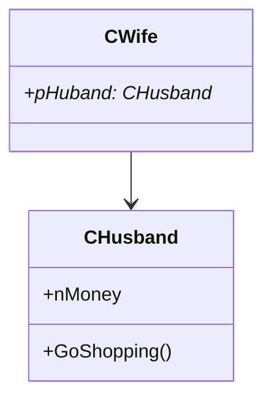
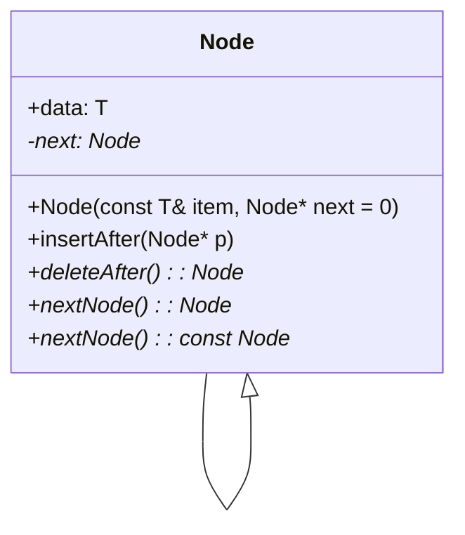
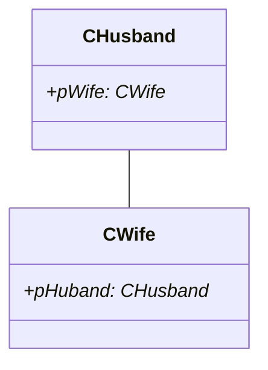
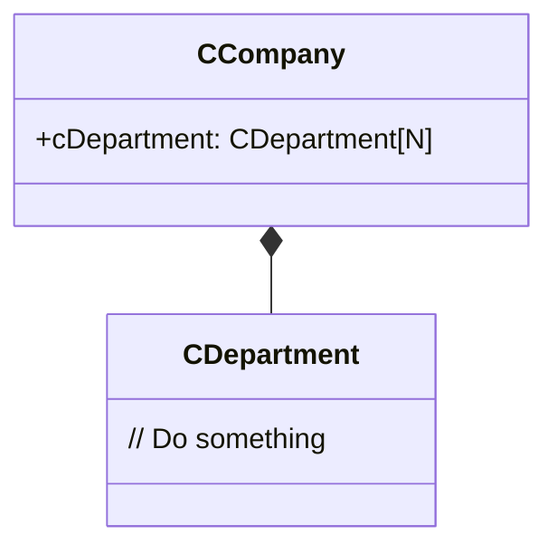

# 设计模式复习文档

[TOC]


## 一、课程概述

- 面对对象是软件开发领域的主流技术：**OOM - Object-Oriented Method(面向对象方法)贯穿于软件开发生命周期的各个阶段**   
  - OOA - Object-Oriented Analysis(面向对象分析)   
  - OOD - Object-Oriented Design(面向对象设计)   
  - OOP - Object-Oriented Programming (面象对象编程)   
  - OOT - Object-Oriented Testing (面向对象测试)   
  - OOSM - Object-Oriented Software Maintenance(面向对象软件维护)
- 可维护、可复用、可扩展、灵活性
- 面对对象设计原则：SRP, OCP, LSP, DIP, ISP, CRP, LoD
- 创建型模式：Simple Factory, Factory Method, Abstract Factory, Builder, Prototype, Singleton
- 结构型模式：Adapter, Bridge, Composite, Decorator, Facade, Flyweight, Proxy
- 行为型模式：Chain of Responsibility, Command, Interpreter, Iterator, Mediator, Memento, Observer, State, Strategy, Template Method, Visitor

## 二、面对对象设计与复用

- 面对对象设计的层次
  - 框架级设计-框架模式
  - 类设计-软件设计模式（设计模式：以设计复用为目的，采用一种良好定义、正规的、一致的方式记录的软件设计经验）
  - 代码设计-微模式
- 包设计的6个原则
  - 包的创建、相互关系的管理以及包的使用
- 一个设计良好的面向对象应用程序应具有高内聚、耦合的特点
- 复用手段
  - **黑箱复用**通常指的是**对象组合**。在这种复用中，内部实现细节被隐藏，只通过公开的接口与外界交互。这种方式被认为是更安全的，因为它不依赖于对象的内部结构和实现。
  - **白箱复用**则是指**类继承**。在这种复用中，子类继承父类的属性和方法，因此对父类的内部实现有一定的了解。这种方法可能导致较高的耦合度，因为子类与其父类紧密相关。

- 包的内聚性3个原则
  - 重用发布等价原则、共同重用原则、共同封闭原则，用来指导如何把类划分到包中的
- 包的耦合性3个原则
  - 无环依赖原则、稳定依赖原则、稳定抽象原则，用来处理包之间的相互关系的。
- 代码形式
  - 源代码，.cpp .c .java等等
  - 二进制代码，.lib  .obj .class等等
  - 可执行代码，.exe .dll等等
- 关系模型是复用的基础
  - 关系模型是工具基础 - 设计模式要使用或者借助这些关系模型
  - 设计原则是行为准则 - 设计模式要尽可能遵守这些设计原则


### 类的设计

- 对象(object)是问题域中一些事物的抽象
- 类是对象特征的描述，一个类刻画了一组具有相同属性特征和行为特征的对象
- 类的设计包括
  - 类的组织与表示
    - 类的发现 - 果篮里装了苹果、香蕉、葡萄、桃
    - 聚类分析 - 苹果、香蕉、葡萄、桃
    - 类的再抽象 - 水果，链表模板
    - 类的拆分 - 果篮里的鲜花类的可见性 - 果篮的编织材料
    - 类的复用性 - 内紧外松，降低类间的耦合度，提高内聚度
  - 行为的组织与表示
    - 行为的参与者 - 动物吃各种水果
    - 行为的分组与接口 - 吃苹果、吃香蕉... 吃水果
    - 行为的分解 - 剥皮、吃果肉、吐核
    - 行为的可见性 - 吐核，应用程序加载文件
    - 行为的返回结果 - 吃水果返回空、吃没吃、吃多少
    - 行为的差异 - 吃不同水果有什么不同
  - 属性的组织与表示
    - 只读/只写属性 - setter、getter
    - 不变属性 - 中国公民的身份证
    - 类属性与实例属性 - 扑克牌的背面图案
    - 属性的可见性 - 通常不可见（属性的概念通常还要结合编程语言来考虑）

### 类设计中的变化

- 职责的变化（接口、功能的变化，如：功能的增加，参数个数及类型的变化，可访问性的变化等等）

- 实现的变化（数据表示的变化，如数据的类型、数量、可访问性、组织形式等；行为的变化，如行为过程、行为结果等）


### 类设计中的适应

#### 适应方式

- 修改既有代码的缺点
  - 既有代码的获取问题
  - 改变实现的顾虑
  - 改变接口的顾虑
- 扩展既有代码 - 面向对象设计的基本原则
  - 继承方式扩展
  - 关联方式扩展
  - 依赖方式扩展
  - 聚合方式扩展
  - 组合方式扩展

设计模式的两大主题：系统复用与系统扩展

## 三、类间关系及UML表示

### 3.1 依赖关系（水平关系，实例级关系）

UML 表示方法：虚线箭头，类 A 指向类 B。


类 B 被类 A 在某个方法中使用，例如：局部变量，方法中的参数，对静态方法的调用等。

对于两个相对独立的对象，当一个对象负责构造另一个对象的实例，或者依赖另一个对象的服务时，这两个对象之间主要体现为依赖关系。可以简单的理解，就是一个类 A 使用到了另一个类 B，而这种使用关系是具有偶然性的、临时性的、非常弱的，但是 B 类的变化会影响到 A。

- 扩展 1：


```c++
class Parent;
class A{
public:
	virtual ~A( );
	void Func(Parent * p);
};
```

例：Mouse (eat) Fruit （）             （child1：apple,child2：peach）

例：Student ( Do ) Homework（）

- 扩展 2：


例：Human (read) Book

```c++
class Human { 
public:
	virtual ~Human( ) {	}
	virtual void read( Book* );
};
class Student : public Human { } 
class Robot:	public Human { }

class Book {
public:
	virtual ~Book( ) { }
	// …..
};
class Novel:public Book { } 
class Cartoon:public Book {	}
```

- 自身依赖

  ```c++
  //回合制怪物相互攻击
  //(Speed)、生命值(hitpoint)、攻击力值(damage)和防御力值(defense)；
  class Monster {
  public:
      Monster(int spd, int hp, int dam, int def);
      bool Fight(Monster& other);
  private:
      virtual int Attacked(Monster& other) const;
      virtual bool PriorTo(const Monster& other) const;
  private:
      int speed;
      int hitpoint;
      int damage;
      int defense;
  };
  
  Monster::Monster(int spd, int hit, int dam, int def):speed(spd), hitpoint(hit), damage(dam), defense(def){ }
  
  bool Monster::Fight(Monster& other){
      if (PriorTo(other))
          if (Attacked(other) == 0)
              return true;
      
      while (true) {
          if (other.Attacked(*this) == 0)
              return false;
          if (Attacked(other) == 0)
              return true;
      }
  }
  
  int Monster::Attacked(Monster& other) const {
      int harm = damage*2-other.defense;
      if (harm < 1)
          harm = 1;
      other.hitpoint -= harm;
      if (other.hitpoint < 0)
          other.hitpoint = 0;
      return other.hitpoint;
  }
  
  bool Monster::PriorTo(const Monster& other) const
  {
      //战斗时，由速度快的一方首先发起攻击；若速度一样，比较生命值，由高者首先攻击；若生命值也相等，比较攻击力，由高者首先攻击；若攻击力还相等，比较防御力，由高者首先攻击；若四项都相等，则选择任一方首先攻击
      if (speed != other.speed)
          return speed>other.speed;
      if (hitpoint != other.hitpoint)
          return hitpoint > other.hitpoint;
      if (damage != other.damage)
          return damage > other.damage;
      if (defense != other.defense)
          return defense > other.defense;
      return true;
  }
  
  int main()
  {
      Monster a(10,200,7,8);
      Monster b(10,150,8,7); //改成(10,180,8,7)则战斗失败
      if (a.Fight(b))
          cout<<"A Win!"<<endl;
      else
          cout<<"A Lose!"<<endl;
      return 0;
  }
  ```

  - 扩展1：

  

  ```c++
  //新增怪物子类：重写attack方法
  class Cat:public Monster {
      private:
      virtual bool Attack(Monster& other) { //略 }
  };
  class Dog:public Monster {
      private:
      virtual bool Attack(Monster& other) { //略 }
  };
  
  ```

  

  - 扩展2：

  

  ```c++
  //新增怪物子类，新增行为kill
  class Crocodile:public Monster { private:
  	virtual bool Attack(Monster& other) {	//略 }
  	kill(Monster & other) {	//略 }
  };
  // Monster、Dog、Cat 没有 kill 接口
  // Crocodile 新增 Kill 接口
  ```

  

- 双向依赖

```c++
//警察抓好人和坏人，影响分数
class Police { 
public:
	Police() {totalAward = 0;} void	Catch(Person * p);
	int	GetAward( ) const { return totalAward;} 
private:
	int	totalAward;
};
class Person { 
public:
	virtual ~Person() {}
	virtual void BeCatched(Police * cop){ }
};
class Thief: public Person { 
	virtual void BeCatched(Police * cop){ //略 }
}
class Walker: public Person { 
	virtual void BeCatched(Police * cop){ //略 } 
}
```


### 3.2 关联关系（实例级关系）

UML 表示方法：实线箭头，类 A 指向类 B，表示单向关联。如果使用双箭头或不使用箭头表示双向关联。

对于两个相对独立的对象，当一个对象的实例与另一个对象的一些特定实例存在固定的对应关系时，这两个对象之间为关联关系。关联关系体现的是两个类、或者类与接口之间语义级别的一种强依赖关系，比如我和我的朋友；这种关系比依赖更强、不存在依赖关系的偶然性、关系也不是临时性的，一般是长期性的，而且双方的关系一般是平等的。

- 单向关联

指只有某一方拥有另一方的引用，这样只有拥有对方者可以调用对方的公共属性和方法。


```c++
// Husband.h
class CHusband {
public:
	int nMoney;
	void GoShopping();
};

// Wife.h
#include "Husband.h" 
class CWife	{
public:
	CHusband* pHuband;
};
//类似的还有客户和订单(1:N)，公司和员工(1:N)，主人和汽车(1:N)，师傅和徒弟(1:N)，丈夫和妻子(1:1)，飞机和航班(1:N)，学生和课程(N:N)
```




- 自身关联

 自身关联是指拥有一个自身的引用。

```c++
template<class T>
class Node
{
public:
	T data; //存放数据
	Node(const T& item, Node<T>* next = 0);
	void insertAfter(Node<T>* p); //往指定节点后插入一个新的节点
	Node<T>* deleteAfter(); //删除当前节点后的节点
	Node<T>* nextNode();
	const Node<T>* nextNode() const; //返回下一个节点的指针和地址
private:
	Node<T>* next;//自身引用
};
```



"自身依赖"（self-dependency）和"自身关联"（self-association）是两个不同的概念，通常在面向对象编程和建模中用于描述不同类型的关系。

1.  **自身依赖（Self-Dependency）**：

    *   自身依赖是指一个对象或类依赖于自己的其他成员或方法。这意味着对象或类内的某个部分或方法需要访问自身的其他部分或方法。
    *   例如，在一个类中，一个方法可能需要调用该类的另一个方法，这就是自身依赖的一种形式。
    *   自身依赖通常用于实现内部逻辑或封装复杂性，而不是描述对象之间的关系。
2.  **自身关联（Self-Association）**：

    *   自身关联是指一个对象或类与自身的其他实例或对象之间存在某种关系或关联。这意味着一个对象可以与另一个相同类型的对象进行交互或建立关系。
    *   例如，考虑一个社交媒体应用中的用户对象。用户之间可以互相关注，这就是自身关联的一种形式。一个用户对象与其他用户对象建立了关联。
    *   自身关联通常用于描述同一类型的对象之间的关系，这种关系可以是一对一、一对多或多对多。

总之，自身依赖是指对象或类内部的成员或方法依赖于自身的其他部分，而自身关联是指对象或类与自身的其他实例或对象之间存在某种关系。这两个概念在不同的情境中使用，并用于不同的目的。

- 双向关联

**双向关联**是指双方都拥有对方的引用，都可以调用对方的公共属性和方法。


```c++
class CWife;
class CHusband{
public:
	CWife* pWife;
};
class CWife{
public:
	CHusband* pHuband;
};
```



- 部分/整体关联（垂直关系）

  聚集中的组合和聚合关系

  - 聚合/聚集

    UML 表示方法：尾部为空心菱形的实线箭头（也可以没箭头），类 A 指向类 B。

    当对象 B 被加入到对象 A 中，成为对象 A 的组成部分时，对象 A 和对象 B 之间为聚合关系。聚合是关联关系的一种特例。聚合指的是整体与部分之间的关系，体现的是整体与部分、拥有的关系，即 has-a 的关系，此时整体与部分之间是可分离的，可以具有各自的生命周期，部分可以属于多个整体对象，也可以为多个整体对象共享。

    

    

    ```c++
    //在代码层面，聚合和关联关系是一致的，只能从语义级别来区分；关联关系中两个类是处于相同的层次，而聚合关系中两个类是处于不平等的层次，一个表示整体，一个表示部分。
    class Dorm {
    public:
    	Dorm( Student * s[ ],int count):maxCount(count) {
    		mStudents = new Student*[maxCount];
    		for(int i=0;i<count;i++)
    			mStudents[i] = s[i];
    	}
        ~Dorm( ) { delete[] mStudents; }
    	void AddStudent(Student * s, int index){
            if ( mStudents[index] == NULL))
            	mStudents[index] = s;
            }
        void RemoveStudent(int index) {
        	mStudents[index] = NULL;
    	}
    private:
    	int maxCount;
    	Student ** mStudents;
    };
    ```

    ```mermaid
    classDiagram
        class Student
        class Dorm {
            +Dorm(Student* s[], int count)
            +~Dorm()
            +AddStudent(s: Student, index: int)
            +RemoveStudent(index: int)
            -maxCount: int
            -mStudents: Student**        
        }
    
        Dorm o-- Student
    
    ```

    - 扩展1：果篮与水果（A：果篮；Parent：水果；Child1：苹果）

    

    - 扩展2：防盗门和锁（left Parent：防盗门；right Parent：锁；left Child1：一种防盗门）

    

    - 扩展3：防盗门和报警器（left Parent：防盗门；right Parent：报警器；right Child1：一种防盗门的一种报警器）

    

    - 扩展4：某一个child是各种child的组合（child2：组合控件；Parent：控件基类）

    

    - 扩展5：套娃，按主题，情侣类、风光类、美少女类；按用途，迎宾类、收纳类等

    

    

    

  

  - 组合

  UML 表示方法：尾部为实心菱形的实线箭头（也可以没箭头），类 A 指向类 B

  组合也是关联关系的一种特例，体现的是一种 contains-a 的关系，这种关系比聚合更强，也称为强聚合；同样体现整体与部分间的关系，但此时整体与部分是不可分的，整体的生命周期结束也就意味着部分的生命周期结束。**整体类负责部分类对象的生存与消亡。**


```c++
//在代码层面，组合和关联关系是一致的，只能从语义级别来区分。组合跟聚合几乎相同，唯一的区别就是“部分”不能脱离“整体”单独存在，就是说， “部分”的生命期不能比“整体”还要长。
// Company.h
#include "Department.h"
class CCompany{ 
public:
	CDepartment cDepartment[N];
};

// Department.h 
class CDepartment{
	// Do something
};
```




### 3.3 泛化关系（垂直关系）(generalization)

UML 表示方法：空心三角形箭头的实线，子类指向父类

- 父类和子类
- 抽象类和具体类


```c++
// Animal.h
class CAnimal {
public:
	// implement
	virtual void EatSomething(){
		// Do something
	}
};


// Tiger.h
#include "Animal.h" 
class CTiger : public CAnimal{
	// Do something
};
```


### 3.4 实现关系(realization)

UML 表示方法：空心三角形箭头的虚线，实现类指向接口。

- 接口类和实现类
- 模板和模板类


### 3.5 总结

泛化和实现的区别就在于子类是否继承了父类的实现，如有继承则关系为泛化，反之为实现。

几种关系所表现的强弱程度依次为：泛化/实现>组合>聚合>关联>依赖。

**组合和聚合**都是关联的特殊种类。聚合表示整体和部分的关系，表示“拥有”。组合则是一种更强的“拥有”。组合的新的对象完全支配其组成部分，包括它们的创建和湮灭等。一个组合关系的成员对象是不能与另一个组合关系共享的。**组合是值的聚合**（Aggregation by Value），而一般说的**聚合是引用的聚合**（Aggregation by Reference）。

- 适应变化的基本方式
  - 修改代码
  - 通过派生子类

- **如何适应变化实现复用？**

  基于关系模型通过扩展既有代码来适应变化实现复用。

  若同时存在多种变化，解决方法：

  **1. 综合使用组合和继承，参考上面关系模型的各种扩展型**

  **2. 组合优先**

  如果还有其他实现和职责的变化，解决办法：

  **1.综合使用水平(依赖和管联)和公有继承**

  **2.针对特定场景，应用设计模式！！！！**

  

  

  

## 四、面对对象设计原则

基本原则包括了**类的设计原则**和**包的设计原则**，后者又分为包的内部关系方面（聚合性）的原则以及包之间的关系方面（耦合性）的原则。这里我们只讨论类的设计原则。

根本原则：

- 开闭原则

基本原则：

- 抽象与封装原则

  - 分离稳定与变化

  - 封装变化
  - 抽象变化接口

  ```c++
  class  Clock {
  public:
        void setDate() { }
        void setTime()  { }
        void draw( ) const{
           { drawDate( ) ; drawTime(); }
  protected:
        void drawDate() { }
        void drawTime() { }
  private:
        Date  dt;
        Time  tm;    
  };
  
  class  IClock {
  public:
     virtual ~Iclock() = default;
     virtual void setCurrent()=0;
     virtual void draw( ) const=0;
  };
  
  class  BaseClock : public IClock {
  public:
       void setCurrent() {
           	setDate();
  		setTime();
            }
        void setDate() { }
        void setTime()  { }
        void draw( ) const{
           	drawDate() ; 
  		drawTime(); 
  	  }
  protected:
        void drawDate() { }
        void drawTime() { }
  private:      
  	Date  dt;      
  	Time  tm;    
  };
  ```

  

- 针对接口编程而不是针对实现编程

```c++
class MyClass {
        …
private:
        IClock   *  mpClock;
        //不采用 BaseClock * mpClock；
};
```

- 组合优先原则而不是继承优先

```c++
class A {
   //…
}；
// 继承方式 复用A
class EA :public A {
};
//组合方式
class EA {
public:
      EA( ):mpA(new A()  {}
      ~EA() { delete mpA;}
private:
    A  *  mpA;
};
```

类的设计原则：

- 设计目标
  - 开闭原则
  - 里氏替换原则
  - 迪米特原则（委托而不是直接交互）
- 设计方法
  - 单一职责原则
  - 接口分隔原则
  - 依赖倒置原则
  - 组合/聚合复用原则

### 4.1 开闭原则（The Open-Closed Principle ，OCP）

软件实体（模块，类，方法等）应该**对扩展开放，对修改关闭**。

这也是**系统设计需要遵循开闭原则的原因：**

- 稳定性：开闭原则要求扩展功能不修改原来的代码，这可以让软件系统在变

化中保持稳定。

- 扩展性：开闭原则要求对扩展开放，通过扩展提供新的或改变原有的功能，让软件系统具有灵活的可扩展性。

遵循开闭原则的系统设计，可以让软件系统可复用，并且易于维护。

简单地说，软件系统是否有良好的接口（抽象）设计是判断软件系统是否满足开闭原则的一种重要的判断基准。现在多把开闭原则等同于面向接口的软件设计。


Client 对于 Server 提供的接口是修改关闭的

Client 对于 Server 的新的接口实现方法是扩展开放的

- shape例:


### 4.2 里氏替换原则（Liskov Substitution Principle ，LSP）

所有引用基类的地方必须能透明地使用其派生类的对象，只有满足以下 2 个条件的 OO 设计才可被认为是满足了 LSP 原则：

- **不应该在代码中出现 if/else之类对派生类类型进行判断的条件。（限制RTTI的使用）**

```c++
//C++通过以下的两个操作提供RTTI：
//（1）typeid运算符，该运算符返回其表达式或类型名的实际类型。
//（2）dynamic_cast运算符，该运算符将基类的指针或引用安全地转换为派生类类型的指针或引用。
//以下代码就违反了 LSP 定义。
void DrawShape(const Shape& s) {
    if (typeid(s) == typeid(Square))
    	DrawSquare(static_cast<Square&>(s));
    else if (typeid(s) == typeid(Circle))
    	DrawCircle(static_cast<Circle&>(s));
}
```

- **派生类对象应当可以替换基类对象并出现在基类对象能够出现的任何地方，或者说如果我们把代码中使用基类对象的地方用它的派生类对象来代替，代码还能正常工作。（任何出现父类的地方，均可用子类对象替换）**

里氏替换原则 LSP 是使代码符合开闭原则的一个重要保证。同时 LSP 体现了：

- 类的继承原则：如果一个派生类对象可能会在替换基类对象的地方出现运行错误，则该派生类不应该从该基类继承，或者说，应该重新设计它们之间的关系。

- 动作正确性保证：从另一个侧面上保证了符合 LSP 设计原则的类的扩展不会给已有的系统引入新的错误。

在进行设计的时候，我们**尽量从抽象类继承，而不是从具体类继承**。如果从继承等级树来看，所有叶子节点应当是具体类，而所有的树枝节点应当是抽象类或者接口。当然这只是一个一般性的指导原则，使用的时候还要具体情况具体分析。

### 4.3 迪米特原则（最少知道原则）（Law of Demeter，LoD/Least Knowledge Principle）

- 交互过多，将增加类的耦合度：一个软件实体应当尽可能少地与其他软件实体发生相互作用（只和你的”朋友” 通信）
- 引入中间类，负责交互工作，降低耦合度：每一个软件实体对其他软件实体都只有最少的知识，而且局限于那些与本软件实体密切相关的软件实体（跟”朋友”通信越少越好，具体来说就是一个类对自己依赖的其它类知道的越少越好）。

实现方法：

- 朋友间也是有距离的
  - 一个类公开的 public 属性或方法越多，修改时涉及的面也就越大，变更引起的风险扩散也就越大。因此，为了保持朋友类间的距离，在设计时需要反复衡量：是否还可以再减少 public 方法和属性，是否可以修改为 private 等。
  - 注意：迪米特原则要求类“羞涩”一点，尽量不要对外公布太多的 public 方法和非静态的 public 变量，尽量内敛，多使用 private、protected 等访问权限。
- 是自己的就是自己的，不要给别人
  - 如果一个方法放在本类中，既不增加类间关系，也对本类不产生负面影响，就放置在本类中。如果放在其他类中，反而可能增加类间关系。

### 4.4 单一职责原则（Single Responsibility Principle,SRP）

单一职责原则的**核心含意**是：只能让一个类有且仅有一个职责。这也是单一职责原则的命名含义。

换句话说，如果一个类需要改变，改变它的理由永远只有一个。如果存在多个改变它的理由，就需要重新设计该类。

**为什么一个类不能有多于一个以上的职责呢？**

如果一个类具有一个以上的职责，那么就会有多个不同的原因引起该类变化，而这种变化将影响到该类不同职责的使用者（不同用户）：

-  一方面，如果一个职责使用了外部类库，则使用另外一个职责的用户却也不得不包含这个未被使用的外部类库。

- 另一方面，某个用户由于某个原因需要修改其中一个职责，另外一个职责的用户也将受到影响，他将不得不重新编译和配置。这违反了设计的开闭原则，也不是我们所期望的。

**既然一个类不能有多个职责，那么怎么划分职责呢？**

- Robert.C Martin 给出了一个著名的定义：所谓一个类的一个职责是指引起该类变化的一个原因。

单一职责原则从职责（改变理由）的侧面上为我们对类（接口）的抽象的颗粒度建立了**判断基准**：在为系统设计类（接口）的时候应该保证它们的单一职责性。

### 4.5 （多）接口分隔原则（Interface Segregation Principle,ISP）

使用多个专门的接口比使用单一的总接口总要好（使变化更加灵活，提高移植性）。它包含了 2 层意思：

- 接口的设计原则：接口的设计应该遵循最小接口原则，不要把用户不使用的方法塞进同一个接口里。 如果一个接口的方法没有被使用到，则说明该接口过胖，应该将其分割成几个功能专一的接口。

- 接口的依赖（继承）原则：如果一个接口 a 继承另一个接口 b，则接口 a 相当于继承了接口 b 的方法，那么继承了接口 b 后的接口 a 也应该遵循上述原则：不应该包含用户不使用的方法。 反之，则说明接口 a 被 b 给污染了，应该重新设计它们的关系。


例：假如有一个 Door，有 lock，unlock 功能，另外，可以在 Door 上安装一个 Alarm而使其具有报警功能。用户可以选择一般的Door，也可以选择具有报警功能的Door。有以下几种设计方法：

- 通过多重继承实现：
- 在 Alarm 接口定义 alarm 方法，在 Door 接口定义 lock，unlock 方法。接口之间无继承关系。CommonDoor 实现 Door 接口，AlarmDoor 有 2 种实现方案：
  - 1. 同时实现 Door 和 Alarm 接口。
    2. 继承 CommonDoor，并实现 Alarm 接口，这种方案更具有实用性。


- 通过关联实现：
- 在这种方法里，AlarmDoor 实现了 Alarm 接口，同时把功能 lock 和 unlock 委让给 CommonDoor 对象完成。


接口分隔原则从对接口的使用上为我们对接口抽象的颗粒度建立了**判断基准**：在为系统设计接口的时候，使用多个专门的接口代替单一的胖接口。

Robert C. Martin：

- **单一职责原则与接口隔离原则的共同点**

  - 两者都是为了提高内聚性、降低耦合性，体现了封装的思想；

  - 最终表现出来的都是将接口约束到最小功能。

- **单一职责原则与接口隔离原则的区别**
  - 1. 针对内容不同：单一职责原则针对的是模块、类、接口的设计，接口隔离原则**更侧重于接口的设计**；
    2. 思考角度不同：单一职责原则是从软件实体本身的职责/功能是否单一来考虑，接口隔离原则主要是从用户的角度来考虑接口约束问题，它同时也提供了一种判断接口职责是否单一的标准：通过调用者如何使用接口来间接地判定，如果调用者只使用部分接口或接口的部分功能，那接口的设计就不够职责单一。
    3. 例如一个接口的职责可能包含多个方法，这多个方法都放在一个接口中，并且提供给多个模块访问，各个模块按照规定的权限来访问，**在系统外通过文档约束“不使用的方法不要访问”**，按照单一职责原则是允许的，按照接口隔离原则是不允许的，因为它要求“尽量使用多个专门的接口”。专门的接口就是指提供给每个模块的都应该是其需要调用的接口，而不是建立一个庞大的臃肿的接口，容纳所有的客户端访问。

### 4.6 依赖倒置原则（Dependency Inversion Principle,DIP）

- 1. 高层模块不应该依赖于低层模块，二者都应该依赖于抽象（结构化中依赖）
  2. 抽象不应该依赖于细节，细节应该依赖于抽象（OO中依赖）

- 倒转是指：与结构化设计方法正好相反；

启发：应用IOC（控制反转）

- 依赖于抽象

  - 任何对象都不应该持有一个指向具体类的指针或者引用

  ```c++
  class class1{
  	class2* cls2 = new class2();
  }
  class class2{
  	....... 
  }
  //下面进行基于依赖倒置原则的改进
  // 定义一个纯虚拟基类作为接口
  class IClass2 {
  public:
      virtual ~IClass2() {} // 虚析构函数以允许派生类的正确删除
      virtual void SomeFunction() = 0; // 纯虚函数作为接口
  };
  
  // class1 依赖于 IClass2 的接口
  class class1 {
  private:
      IClass2* cls2; // 指向接口的指针
  public:
      // 构造函数中通过参数传入具体实现，这是一种依赖注入
      class1(IClass2* cls) : cls2(cls) {}
      ~class1() {
          delete cls2; // 确保释放资源
      }
      
      void UseClass2() {
          cls2->SomeFunction(); // 使用接口中定义的方法
      }
  };
  
  // class2 实现了 IClass2 接口
  class class2 : public IClass2 {
  public:
      void SomeFunction() override {
          // 实现细节
      }
  };
  
  ```

  或者：

  ```java
  interface InterfaceForClass2 {
      // 定义方法
  }
  
  class Class1 {
      InterfaceForClass2 cls2;
  
      Class1(InterfaceForClass2 cls2) {
          this.cls2 = cls2;
      }
  }
  
  class Class2 implements InterfaceForClass2 {
      // 实现接口方法
  }
  ```

  - 任何类都不应该从具体类派生

- 设计接口而非实现

  - 使用继承/实现避免对具体类的直接绑定（例外：有些类不可能变化，在可以直接使用具体类的情况下，不需要插入抽象层。如：字符串类）

- 避免传递依赖

  - 避免高层依赖于低层

    

  - 使用抽象类/接口和继承/实现来有效地消除传递依赖

    

### 4.7 组合/聚合复用原则（合成复用原则）（Composite/Aggregate Reuse Principle CARP）（Composite Reuse Principle，CRP）

尽量使用组合/聚合而非继承来达到复用目的；或者说，是在一个新的对象中使用一些已有的对象，使之成为新对象的一部分，然后新的对象通过向这些对象委托功能达到复用这些对象的目的。

在面向对象设计中，有两种基本的办法可以实现复用：第一种是通过组合/聚合，第二种就是通过继承。

Coad 法则由 Peter Coad 提出，总结了一些什么时候使用继承作为复用工具的条件。只有当以下的 Coad 条件全部被满足时，才应当使用继承关系：：

- 1. 派生类是基类的一个特殊种类，而不是基类的一个角色，也就是区分"has a"和"is a"。只有"is a"关系才符合继承关系，"has a"关系应当用聚合来描述。
  2. 永远不会出现需要将派生类换成另外一个类的派生类的情况。如果不能肯定将来是否会变成另外一个派生类的话，就不要使用继承。
  3. 派生类具有扩展基类的责任，而不是具有置换掉（override）或注销掉（nullify）基类的责任。如果一个派生类需要大量的置换掉基类的行为，那么这个类就不应该是这个基类的派生类。
  4. 只有在分类学角度上有意义时，才可以使用继承。

如果语义上存在着明确的"is a"关系，并且这种关系是稳定的、不变的，则考虑使用**继承**；如果没有"is a"关系，或者这种关系是可变的，使用**组合/聚合**。

**通过组合/聚合复用的优缺点**

**优点：**

- 1. 新对象存取成员对象的唯一方法是通过成员对象的接口；
  2. 这种复用是黑箱复用，因为成员对象的内部细节是新对象所看不见的；
  3. 这种复用更好地支持封装性；
  4. 这种复用实现上的相互依赖性比较小；
  5. 每一个新的类可以将焦点集中在一个任务上；
  6. 这种复用可以在运行时间内动态进行，新对象可以动态的引用与子对象类型相同的对象。
  7. 作为复用手段可以应用到几乎任何环境中去。

**缺点：**

- 就是系统中会有较多的对象需要管理。

**通过继承来进行复用的优缺点**

**优点：**

- 1. 新的实现较为容易，因为基类的大部分功能可以通过继承的关系自动进入派生类。
  2. 修改和扩展继承而来的实现较为容易。

**缺点：**

- 1. 继承复用破坏封装性，因为继承将基类的实现细节暴露给派生类。由于基类的内部细节常常是对于派生类透明的，所以这种复用是透明的复用，又称“白箱” 复用。
  2. 如果基类发生改变，那么派生类的实现也不得不发生改变。
  3. 从基类继承而来的实现是静态的，不可能在运行时间内发生改变，没有足够的灵活性。


## 五、设计模式概述

Alexander给出了关于**模式**的经典定义：每个模式都描述了一个在我们的环境中不断出现的问题，然后描述了该问题的解决方案的核心，通过这种方式，我们可以无数次地重用那些已有的解决方案，无需再重复相同的工作。（模式是在特定环境中解决问题的一种方案）

模式的层次：

- 框架(Framework)
  - MVC及Document/View
  - COM/DCOM/EJB/…
  - 其它(Spring、Hibernate等)
- 设计模式
- 微模式

**设计模式**的定义：设计模式(Design Pattern)是一套被反复使用、多数人知晓的、经过分类编目的、代码设计经验的总结，使用设计模式是为了可复用代码、让代码更容易被他人理解、保证代码可靠性等。

**设计模式**是在特定环境下为解决某一通用软件设计问题提供的一套定制的解决方案，该方案描述了对象和类之间的相互作用。

分类：

根据其目的（模式是用来做什么的）可分为创建型(Creational)，结构型(Structural)和行为型(Behavioral)三种：

- 创建型模式主要用于创建对象。
- 结构型模式主要用于处理类或对象的组合。
- 行为型模式主要用于描述对类或对象怎样交互和怎样分配职责。


| **范围/目的** |                **创建型模式**                | **结构型模式**                                               | **行为型模式**                                               |
| ------------- | :------------------------------------------: | ------------------------------------------------------------ | ------------------------------------------------------------ |
| **类模式**    |                 工厂方法模式                 | （类）适配器模式                                             | 解释器模式、模板方法模式                                     |
| **对象模式**  | 抽象工厂模式、建造者模式、原型模式、单例模式 | （对象）适配器模式、桥接模式、组合模式、装饰模式、外观模式、享元模式、代理模式 | 职责链模式、命令模式、迭代器模式、中介者模式、备忘录模式、观察者模式、状态模式、策略模式、访问者模式 |

- 创建型模式
  - 抽象工厂模式(Abstract Factory)
  - 建造者模式(Builder)
  - 工厂方法模式(Factory Method)
  - 原型模式(Prototype)
  - 单例模式(Singleton) 

- 结构型模式
  - 适配器模式(Adapter)
  - 桥接模式(Bridge)
  - 组合模式(Composite)
  - 装饰模式(Decorator)
  - 外观模式(Facade)
  - 享元模式(Flyweight)
  - 代理模式(Proxy)

- 行为型模式
  - 职责链模式(Chain of Responsibility)
  - 命令模式(Command)
  - 解释器模式(Interpreter)
  - 迭代器模式(Iterator)
  - 中介者模式(Mediator)
  - 备忘录模式(Memento)
  - 观察者模式(Observer)
  - 状态模式(State)
  - 策略模式(Strategy)
  - 模板方法模式(Template Method)
  - 访问者模式(Visitor)

## 六、创建型模式（(Creational Pattern）

### 6.0 概述

- 创建型模式关注的是对象的创建，将创建对象(类的实例化)的过程进行了抽象和封装，分离了对象创建和对象使用。作为客户程序仅仅需要去使用对象，而不再关心创建对象过程中的逻辑。帮助一个系统独立于如何创建、组合和表示它的那些对象。一个类创建型模式使用继承改变被实例化的类，而一个对象创建型模式将实例化委托给另一个对象。
- 创建型模式有两个重要的特点：
  - 1. 客户不知道对象的具体类是什么（除非看源代码）
    2. 隐藏了对象实例是如何被创建和组织的
- 当想要使用new运算符的时候，就可以考虑创建型模式

### 6.1 简单工厂模式（Simple Factory Pattern）

**模式动机**

- 考虑一个简单的软件应用场景，一个软件系统可以提供多个外观不同的按钮（如圆形按钮、矩形按钮、菱形按钮等），这些按钮源自同一个基类，不过在继承基类后不同的子类修改了部分属性从而使得它们可以呈现不同的外观，如果我们希望在使用这些按钮时，不需要知道这些具体按钮类的名字，只需要知道表示该按钮类的一个参数，并提供一个调用方便的方法，把该参数传入方法即可返回一个相应的按钮对象，此时，就可以使用简单工厂模式。

**模式定义**

- 简单工厂模式：又称为**静态工厂方法(Static Factory Method)模式**。在简单工厂模式中，可以根据参数的不同返回不同类的实例。简单工厂模式专门定义一个类来负责创建其他类的实例，被创建的实例通常都具有共同的父类。

**模式结构**


简单工厂模式包含如下角色：

- Factory：工厂角色，负责实现创建所有实例的内部逻辑（核心）
- Product：抽象产品角色，是所创建的所有对象的父类，负责描述所有实例所共有的公共接口
- ConcreteProduct：具体产品角色是创建目标，所有创建的对象都充当这个角色的某个具体类的实例

```java
//抽象支付类
public abstract class AbstractPay
{
   public abstract void pay();
} 
//具体支付类
public class CashPay extends AbstractPay
{
    public void pay()
    {
        //现金支付处理代码
    }
} 
//支付工厂
public class PayMethodFactory
{
    public static AbstractPay getPayMethod(String type)
    {
        if(type.equalsIgnoreCase("cash"))
        {
            return new CashPay();       //根据参数创建具体产品
         }
        else if(type.equalsIgnoreCase("creditcard"))
        {
            return new CreditcardPay();   //根据参数创建具体产品
        }
        ……
    }
} 
```

**模式分析**

- **将对象的创建和对象本身业务处理分离可以降低系统的耦合度**，使得两者修改起来都相对容易。 
- 在调用工厂类的工厂方法时，由于工厂方法是**静态方法**，使用起来很方便，可通过类名直接调用，而且只需要传入一个简单的参数即可，在实际开发中，还可以在调用时将所传入的参数保存在XML等格式的配置文件中，修改参数时无须修改任何Java源代码。
- 简单工厂模式最大的问题在于**工厂类的职责相对过重**，增加新的产品需要修改工厂类的判断逻辑，这一点与开闭原则是相违背的。
- 简单工厂模式的要点在于：**当你需要什么，只需要传入一个正确的参数，就可以获取你所需要的对象，而无须知道其创建细节。** 

**模式优缺点**

- **优点：**

  - 工厂类含有必要的判断逻辑，可以决定在什么时候创建哪一个产品类的实例，客户端可以免除直接创建产品对象的责任，而仅仅“消费”产品；简单工厂模式通过这种做法**实现了对责任的分割，它提供了专门的工厂类用于创建对象。**（最大的优点）

  - **客户端无须知道所创建的具体产品类的类名，只需要知道具体产品类所对应的参数即可**，对于一些复杂的类名，通过简单工厂模式可以减少使用者的记忆量。（要点）

  - **通过引入配置文件，可以在不修改任何客户端代码的情况下更换和增加新的具体产品类**，在一定程度上提高了系统的灵活性。

- **缺点：**

  - 由于**工厂类集中了所有产品创建逻辑**，一旦不能正常工作，整个系统都要受到影响。

  - 使用简单工厂模式将会**增加系统中类的个数**，在一定程序上增加了系统的复杂度和理解难度。

  - **系统扩展困难，一旦添加新产品就不得不修改工厂逻辑**，在产品类型较多时，有可能造成工厂逻辑过于复杂，不利于系统的扩展和维护。（最大的缺点）

  - 简单工厂模式由于使用了静态工厂方法，造成**工厂角色无法形成基于继承的等级结构**。

**模式适用环境：**

- **工厂类负责创建的对象比较少**：由于创建的对象较少，不会造成工厂方法中的业务逻辑太过复杂。
- **客户端只知道传入工厂类的参数，对于如何创建对象不关心**：客户端既不需要关心创建细节，甚至连类名都不需要记住，只需要知道类型所对应的参数。
- （退化特例）一个产品有多个重载的构造函数，可应用简单工厂方法

**模式扩展：**

- 简化：在有些情况下工厂类可以由抽象产品角色扮演，一个抽象产品类同时也是子类的工厂，也就是说把静态工厂方法写到抽象产品类中。


**模式本质：**

- 实现简单工厂模式的难点就在于 “如何选择”实现，前面讲到了几种传递参数的方法，那都是静态的参数，还可以实现成为动态的参数。

### 6.2 工厂方法模式（Factory Method Pattern）

**模式动机：**

- 简单工厂模式的不足：**简单工厂模式最大的缺点是当有新产品要加入到系统中时，必须修改工厂类，加入必要的处理逻辑，这违背了“开闭原则”。**在简单工厂模式中，所有的产品都是由同一个工厂创建，工厂类职责较重，业务逻辑较为复杂，具体产品与工厂类之间的耦合度高，严重影响了系统的灵活性和扩展性，而工厂方法模式则可以很好地解决这一问题。
- 考虑这样一个系统，按钮工厂类可以返回一个具体的按钮实例，如圆形按钮、矩形按钮、菱形按钮等。在这个系统中，如果需要增加一种新类型的按钮，如椭圆形按钮，那么**除了增加一个新的具体产品类之外，还需要修改工厂类的代码，这就使得整个设计在一定程度上违反了“开闭原则”。** 
- 现在对该系统进行修改，不再设计一个按钮工厂类来统一负责所有产品的创建，而是**将具体按钮的创建过程交给专门的工厂子类去完成**，我们**先定义一个抽象的按钮工厂类，再定义具体的工厂类来生成圆形按钮、矩形按钮、菱形按钮等**，它们实现在抽象按钮工厂类中定义的方法。这种抽象化的结果使这种结构**可以在不修改具体工厂类的情况下引进新的产品**，如果出现新的按钮类型，只需要为这种新类型的按钮创建一个具体的工厂类就可以获得该新按钮的实例，这一特点无疑使得工厂方法模式具有超越简单工厂模式的优越性，**更加符合“开闭原则”。**

**模式定义：**

- 工厂方法模式又称为工厂模式，也叫**虚拟构造器(Virtual Constructor)模式或者多态工厂(Polymorphic Factory)模式**。在工厂方法模式中，工厂父类负责定义创建产品对象的公共接口，而工厂子类则负责生成具体的产品对象，这样做的目的是**将产品类的实例化操作延迟到工厂子类中完成，即通过工厂子类来确定究竟应该实例化哪一个具体产品类。**

**模式结构：**


工厂方法模式包含如下角色：

- Product：抽象产品是定义产品的接口，是工厂方法模式所创建对象的超类型，是产品对象的共同父类或接口（Log）
- ConcreteProduct：具体产品实现了抽象产品接口，某种类型的具体产品由专门的具体工厂创建（FileLog）
- Factory：抽象工厂声明了工厂方法，返回一个产品，与具体应用无关，是具体工厂的共同父类或接口（LogFactory）
- ConcreteFactory：具体工厂实现了抽象工厂中的工厂方法，返回一个具体产品类的实例，与应用密切相关（FileLogFactory）

**模式分析：**

- 工厂方法模式是简单工厂模式的进一步抽象和推广。由于使用了面向对象的多态性，工厂方法模式保持了简单工厂模式的优点，而且克服了它的缺点。**在工厂方法模式中，核心的工厂类不再负责所有产品的创建，而是将具体创建工作交给子类去做。**这个核心类仅仅负责给出具体工厂必须实现的接口，而不负责哪一个产品类被实例化这种细节，这使得**工厂方法模式可以允许系统在不修改工厂角色的情况下引进新产品。**
- 当系统扩展需要添加新的产品对象时，仅仅需要添加一个具体产品对象以及一个具体工厂对象，原有工厂对象不需要进行任何修改，也不需要修改客户端，**很好地符合了“开闭原则”**。而简单工厂模式在添加新产品对象后不得不修改工厂方法，扩展性不好。**工厂方法模式退化后可以演变成简单工厂模式。**

```java
//抽象工厂类
public abstract class PayMethodFactory
{
    public abstract AbstractPay getPayMethod();
}
//具体工厂类（也可以合并多个工厂方法到一个工厂）
public class CashPayFactory extends PayMethodFactory
{
    public AbstractPay getPayMethod()
    {
        return new CashPay();
    }
} 
//客户类代码片段
PayMethodFactory factory;
AbstractPay payMethod;
factory=new CashPayFactory();
payMethod =factory.getPayMethod();
payMethod.pay(); 
//为了提高系统的可扩展性和灵活性，在定义工厂和产品时都必须使用抽象层，如果需要更换产品类，只需要更换对应的工厂即可，其他代码不需要进行任何修改。 

//在实际的应用开发中，一般将具体工厂类的实例化过程进行改进，不直接使用new关键字来创建对象，而是将具体类的类名写入配置文件中，再通过Java的反射机制，读取XML格式的配置文件，根据存储在XML文件中的类名字符串生成对象。
//修改后的客户类代码片段
PayMethodFactory factory;
AbstractPay payMethod;
factory=(PayMethodFactory)XMLUtil.getBean(); //getBean()的返回类型为Object，此处需要进行强制类型转换
payMethod =factory.getPayMethod();
payMethod.pay(); 
```

**模式优缺点：**

- **优点：**
  - 在工厂方法模式中，工厂方法用来创建客户所需要的产品，同时还向客户隐藏了哪种具体产品类将被实例化这一细节，用户只需要关心所需产品对应的工厂，无须关心创建细节，甚至无须知道具体产品类的类名。
  - 基于工厂角色和产品角色的多态性设计是工厂方法模式的关键。它能够使工厂可以自主确定创建何种产品对象，而如何创建这个对象的细节则完全封装在具体工厂内部。工厂方法模式之所以又被称为多态工厂模式，是因为所有的具体工厂类都具有同一抽象父类。
  - 使用工厂方法模式的另一个优点是在系统中加入新产品时，无须修改抽象工厂和抽象产品提供的接口，无须修改客户端，也无须修改其他的具体工厂和具体产品，而只要添加一个具体工厂和具体产品就可以了。这样，系统的可扩展性也就变得非常好，**完全符合“开闭原则”。**

- **缺点：**
  - 在添加新产品时，需要编写新的具体产品类，而且还要提供与之对应的具体工厂类，系统中类的个数将成对增加（子类数量可能较多），在一定程度上增加了系统的复杂度，有更多的类需要编译和运行，会给系统带来一些额外的开销。（有时可用类模板减少子类书写数量）
  - 由于考虑到系统的可扩展性，需要引入抽象层，在客户端代码中均使用抽象层进行定义，增加了系统的抽象性和理解难度，且在实现时可能需要用到DOM、反射等技术，增加了系统的实现难度。

**模式适用环境：**

- **一个类不知道它所需要的对象的类**：在工厂方法模式中，客户端不需要知道具体产品类的类名，只需要知道所对应的工厂即可，具体的产品对象由具体工厂类创建；客户端需要知道创建具体产品的工厂类。
- **一个类通过其子类来指定创建哪个对象**：在工厂方法模式中，对于抽象工厂类只需要提供一个创建产品的接口，而由其子类来确定具体要创建的对象，利用面向对象的多态性和里氏代换原则，在程序运行时，子类对象将覆盖父类对象，从而使得系统更容易扩展。
- **将创建对象的任务委托给多个工厂子类中的某一个，客户端在使用时可以无须关心是哪一个工厂子类创建产品子类，需要时再动态指定**，可将具体工厂类的类名存储在配置文件或数据库中。

**模式扩展：**

- 使用多个工厂方法：在抽象工厂角色中可以定义多个工厂方法，从而使具体工厂角色实现这些不同的工厂方法，这些方法可以包含不同的业务逻辑，以满足对不同的产品对象的需求。
- 产品对象的重复使用：工厂对象将已经创建过的产品保存到一个集合（如数组、List等）中，然后根据客户对产品的请求，对集合进行查询。如果有满足要求的产品对象，就直接将该产品返回客户端；如果集合中没有这样的产品对象，那么就创建一个新的满足要求的产品对象，然后将这个对象在增加到集合中，再返回给客户端。
- 通常适用单例模式创建单例的工厂
-  多态性的丧失和模式的退化：如果工厂仅仅返回一个具体产品对象，便违背了工厂方法的用意，发生退化，此时就不再是工厂方法模式了。一般来说，工厂对象应当有一个抽象的父类型，如果工厂等级结构中只有一个具体工厂类的话，抽象工厂就可以省略，也将发生了退化。当只有一个具体工厂，在具体工厂中可以创建所有的产品对象，并且工厂方法设计为静态方法时，工厂方法模式就退化成简单工厂模式。 

**模式本质：**

- 工厂方法模式的本质是：**延迟到子类来选择实现。**
- 工厂方法模式与简单工厂模式是非常类似的，具体实现上都是在“选择实现”。但是也存在不同点，简单工厂是直接在工厂类里面进行“选择实现”；而工厂方法会把这个工作延迟到子类来实现，工厂类里面使用工厂方法的地方是依赖于抽象而不是具体的实现，从而使得系统更加灵活，具有更好的可维护性和可扩展性。所以，工厂方法模式很好的体现了“依赖倒置原则”。

工厂方法模式是简单工厂模式的进一步抽象和推广。由于使用了面向对象的多态性，工厂方法模式保持了简单工厂模式的优点，而且克服了它的缺点。在工厂方法模式中，核心的工厂类不再负责所有产品的创建，而是将具体创建工作交给子类去做。这个核心类仅仅负责给出具体工厂必须实现的接口，而不负责产品类被实例化这种细节，这使得工厂方法模式可以允许系统在不修改工厂角色的情况下引进新产品。

### 6.3 抽象工厂模式（Abstract Factory Pattern）

引入两个概念：

- **产品等级结构：**产品等级结构即产品的继承结构，如一个抽象类是电视机，其子类有海尔电视机、海信电视机、TCL电视机，则抽象电视机与具体品牌的电视机之间构成了一个产品等级结构，抽象电视机是父类，而具体品牌的电视机是其子类。
- **产品族：**在抽象工厂模式中，产品族是指由同一个工厂生产的，位于不同产品等级结构中的一组产品，如海尔电器工厂生产的海尔电视机、海尔电冰箱，海尔电视机位于电视机产品等级结构中，海尔电冰箱位于电冰箱产品等级结构中。 


（颜色：品牌；形状：产品种类）

**模式动机：**

- 在工厂方法模式中具体工厂负责生产具体的产品，每一个具体工厂对应一种具体产品，工厂方法也具有唯一性，一般情况下，一个具体工厂中只有一个工厂方法或者一组重载的工厂方法。但是有时候我们**需要一个工厂可以提供多个产品对象，而不是单一的产品对象。**
- 当系统所提供的工厂所需生产的具体产品并不是一个简单的对象，而是**多个位于不同产品等级结构中属于不同类型的具体产品**时需要使用抽象工厂模式。
- 抽象工厂模式是**所有形式的工厂模式中最为抽象和最具一般性的一种形态。**
- **抽象工厂模式与工厂方法模式最大的区别**在于，工厂方法模式针对的是一个产品等级结构，而抽象工厂模式则需要面对多个产品等级结构，一个工厂等级结构可以负责多个不同产品等级结构中的产品对象的创建 。当一个工厂等级结构可以创建出分属于不同产品等级结构的一个产品族中的所有对象时，抽象工厂模式比工厂方法模式更为简单、有效率。 

示意图：


**模式定义：**

- 抽象工厂模式：提供一个创建一系列相关或相互依赖对象的接口，而无须指定它们具体的类。抽象工厂模式又称为Kit模式，属于对象创建型模式。

**模式结构：**


- AbstractFactory：抽象工厂用于声明生成抽象产品的方法，在一个抽象工厂中可以定义一组方法，每一个方法对应一个产品等级结构（DBFactory）
- ConcreteFactory：具体工厂实现了抽象工厂声明的生成抽象产品的方法，生成一组具体产品，这些产品构成了一个产品族，每一个产品都位于某个产品等级结构中（MySQLFactory）
- AbstractProduct：抽象产品为每种产品声明接口，在抽象产品中定义了产品的抽象业务方法（Connection）
- ConcreteProduct：具体产品定义具体工厂生产的具体产品对象，实现抽象产品接口中定义的业务方法（MySQLConnection）


```java
//抽象工厂类
public abstract class AbstractFactory
{
    public abstract AbstractProductA createProductA();
    public abstract AbstractProductB createProductB();
}
//具体工厂类
public class ConcreteFactory1 extends AbstractFactory
{
    public AbstractProductA createProductA()
    {
        return new ConcreteProductA1();
    }
    public AbstractProductB createProductB()
    {
        return new ConcreteProductB1();
    } 
}
```

**模式优缺点：**

- **优点：**
  - 抽象工厂模式隔离了具体类的生成，使得客户并不需要知道什么被创建。由于这种隔离，更换一个具体工厂就变得相对容易。所有的具体工厂都实现了抽象工厂中定义的那些公共接口，因此只需改变具体工厂的实例，就可以在某种程度上改变整个软件系统的行为。另外，应用抽象工厂模式可以实现高内聚低耦合的设计目的，因此抽象工厂模式得到了广泛的应用。（主要优点）
  - 当一个产品族中的多个对象被设计成一起工作时，它能够保证客户端始终只使用同一个产品族中的对象。这对一些需要根据当前环境来决定其行为的软件系统来说，是一种非常实用的设计模式。
  - 增加新的具体工厂和产品族很方便，无须修改已有系统，符合“开闭原则”。
- **缺点：**
  - 在添加新的产品对象时，难以扩展抽象工厂来生产新种类的产品，这是因为在抽象工厂角色中规定了所有可能被创建的产品集合，要支持新种类的产品就意味着要对该接口进行扩展，而这将涉及到对抽象工厂角色及其所有子类的修改，显然会带来较大的不便。（主要缺点：增加新的产品等级结构很复杂）
  - 开闭原则的倾斜性（增加新的工厂和产品族容易，增加新的产品等级结构麻烦）

**模式适用环境：**

- 一个系统不应当依赖于产品类实例如何被创建、组合和表达的细节，这对于所有类型的工厂模式都是重要的。 
- 系统中有多于一个的产品族，而每次只使用其中某一产品族。
- 属于同一个产品族的产品将在一起使用，这一约束必须在系统的设计中体现出来。
- 系统提供一个产品类的库，所有的产品以同样的接口出现，从而使客户端不依赖于具体实现。

**模式扩展：**

- **“开闭原则”的倾斜性“**：开闭原则”要求系统对扩展开放，对修改封闭，通过扩展达到增强其功能的目的。对于涉及到多个产品族与多个产品等级结构的系统，其功能增强包括两方面：

  - 增加产品族：对于增加新的产品族，工厂方法模式很好的支持了“开闭原则”，对于新增加的产品族，只需要对应增加一个新的具体工厂即可，对已有代码无须做任何修改。

  - 增加新的产品等级结构：对于增加新的产品等级结构，需要修改所有的工厂角色，包括抽象工厂类，在所有的工厂类中都需要增加生产新产品的方法，不能很好地支持“开闭原则”。

  - 抽象工厂模式的这种性质称为“开闭原则”的倾斜性，抽象工厂模式以一种倾斜的方式支持增加新的产品，它为新产品族的增加提供方便，但不能为新的产品等级结构的增加提供这样的方便。

- **工厂模式的退化**：当抽象工厂模式中每一个具体工厂类只创建一个产品对象，也就是只存在一个产品等级结构时，抽象工厂模式退化成工厂方法模式；当工厂方法模式中抽象工厂与具体工厂合并，提供一个统一的工厂来创建产品对象，并将创建对象的工厂方法设计为静态方法时，工厂方法模式退化成简单工厂模式。

- 工厂方法与抽象工厂比较
  - 工厂方法
    - 灵活（易扩展平台，易扩展控件）  
    - 但使用易出错（应限定在同一平台中）

  - 抽象工厂
    - 易扩展(或更换)平台
    - 扩展控件困难
    - 可以限制用户只使用同一个平台的控件


**模式本质：**

- 抽象工厂模式的本质是：**选择产品簇的实现。**

- 工厂方法是选择单个产品的实现，虽然一个类里面可以有多个工厂方法，但是这些方法之间一般是没有联系的，即使看起来像有联系。（**抽象工厂模式与工厂方法模式**最大的区别在于，工厂方法模式针对的是一个产品等级结构，而抽象工厂模式则需要面对多个产品等级结构。）

- 但是抽象工厂着重的就是为一个产品簇选择实现，定义在抽象工厂里面的方法通常是有联系的，它们是产品的某一部分或者相互依赖的。如果抽象工厂里面只定义一个方法，直接创建产品，那么就退化称为工厂方法了。

### 6.4 建造者模式（Builder Pattern）

**模式动机：**

- 无论是在现实世界中还是在软件系统中，都存在一些复杂的对象，它们拥有多个组成部分，如汽车，它包括车轮、方向盘、发送机等各种部件。而对于大多数用户而言，无须知道这些部件的装配细节，也几乎不会使用单独某个部件，而是使用一辆完整的汽车，可以通过建造者模式对其进行设计与描述，**建造者模式可以将部件和其组装过程分开，一步一步创建一个复杂的对象。用户只需要指定复杂对象的类型就可以得到该对象，而无须知道其内部的具体构造细节。**
- 在软件开发中，也存在大量类似汽车一样的复杂对象，**它们拥有一系列成员属性，这些成员属性中有些是引用类型的成员对象。**而且在这些复杂对象中，还可能存在一些限制条件，如某些属性没有赋值则复杂对象不能作为一个完整的产品使用；有些属性的赋值必须按照某个顺序，一个属性没有赋值之前，另一个属性可能无法赋值等。 
- **复杂产品对象相当于一辆有待建造的汽车，而对象的属性相当于汽车的部件**，建造产品的过程就相当于组合部件的过程。由于组合部件的过程很复杂，因此，这些部件的组合过程往往被“外部化”到一个称作建造者的对象里，**建造者返还给客户端的是一个已经建造完毕的完整产品对象，而用户无须关心该对象所包含的属性以及它们的组装方式，**这就是建造者模式的模式动机。

**模式定义：**

- 建造者模式：**将一个复杂对象的构建与它的表示分离，使得同样的构建过程可以创建不同的表示。**
- 建造者模式是一步一步创建一个复杂的对象，它允许用户只通过指定复杂对象的类型就可以构建它们，用户不需要知道内部的具体构建细节。建造者模式属于对象创建型模式。根据中文翻译的不同，建造者模式又可以称为**生成器模式/构造器模式**。

**模式结构：**


- Builder：抽象建造者为创建一个产品对象的各个部件指定抽象接口
- ConcreteBuilder：具体建造者实现了抽象建造者接口，实现各个部件的构造和装配方法，定义并明确它所创建的复杂对象，也可以提供一个方法返回创建好的复杂产品对象
- Director：指挥者负责安排复杂对象的建造次序，指挥者与抽象建造者之间存在关联关系，可以在其construct方法中调用建造者对象的部件构造与装配方法，完成复杂对象的建造（该类的作用主要有两个：一方面它**隔离了客户与生产过程**；另一方面它**负责控制产品的生成过程**。指挥者针对抽象建造者编程，客户端只需要知道具体建造者的类型，即可通过指挥者类调用建造者的相关方法，返回一个完整的产品对象。 ）
- Product：产品角色是被构建的复杂对象，包含多个组成部件

```java
public abstract class Builder
{
	protected Product product=new Product();
	
	public abstract void buildPartA();
	public abstract void buildPartB();
	
	public Product getResult()
	{
		return product;
	}
} 
public class Director
{
	private Builder builder;
	public Director(Builder builder)
	{
		this.builder=builder;
	}
	public void setBuilder(Builder builder)
	{
		this.builder=builer;
	}
	public Product construct()
	{
		builder.buildPartA();
		builder.buildPartB();
		return builder.getResult();
	}
} 
public class Product 
{
	private String partA; //可以是任意类型
	private String partB;
	//partA、partB的Getter方法和Setter方法省略
}
//Client
Builder builder = new ConcreteBuilder();
Director director = new Director(builder);
Product product = director.construct();
```

**模式优缺点：**

- **优点：**
  - 在建造者模式中，客户端不必知道产品内部组成的细节，将产品本身与产品的创建过程解耦，**使得相同的创建过程可以创建不同的产品对象。**
  - 每一个具体建造者都相对独立，而与其他的具体建造者无关，因此可以很方便地替换具体建造者或增加新的具体建造者，**用户使用不同的具体建造者即可得到不同的产品对象。**
  - **可以更加精细地控制产品的创建过程**。将复杂产品的创建步骤分解在不同的方法中，使得创建过程更加清晰，也更方便使用程序来控制创建过程。
  - **增加新的具体建造者无须修改原有的代码，指挥者类针对抽象建造者类编程，系统扩展方便，符合“开闭原则”。**
- **缺点：**
  - 建造者模式所创建的产品一般具有较多的共同点，其组成部分相似，**如果产品之间的差异性很大，则不适合使用建造者模式，因此其使用范围受到一定的限制。**
  - **如果产品的内部变化复杂，可能会导致需要定义很多具体建造者类来实现这种变化，导致系统变得很庞大。**

**模式适用环境：**

- 需要生成的**产品对象有复杂的内部结构**，这些产品对象通常包含多个成员属性。
- 需要生成的**产品对象的属性相互依赖，需要指定其生成顺序**。
- **对象的创建过程独立于创建该对象的类**。在建造者模式中引入了指挥者类，将创建过程封装在指挥者类中，而不在建造者类中。
- **隔离复杂对象的创建和使用，并使得相同的创建过程可以创建不同的产品对象**。

**模式扩展：**

- 简化：
  - 省略抽象建造者角色：如果系统中只需要一个具体建造者的话，可以省略掉抽象建造者。 
  - 省略指挥者角色：在具体建造者只有一个的情况下，如果抽象建造者角色已经被省略掉，那么还可以省略指挥者角色。
  - 把指挥者类和抽象建造者进行合并，简化了系统结构，但同时也加重了抽象建造者类的职责，也不符合单一职责原则，如果construct()过于复杂，建议还是封装到指挥者类中。

建造者模式与抽象工厂模式的比较：

- 与抽象工厂模式相比，**建造者模式返回一个组装好的完整产品**，而**抽象工厂模式返回一系列相关的产品，这些产品位于不同的产品等级结构，构成了一个产品族。**
- 在抽象工厂模式中，**客户端实例化工厂类，然后调用工厂方法获取所需产品对象**，而在建造者模式中，**客户端可以不直接调用建造者的相关方法，而是通过指挥者类来指导如何生成对象**，包括对象的组装和建造过程，它侧重于一步步构造一个复杂对象，返回一个完整的对象。
- 如果将抽象工厂模式看成汽车配件生产工厂，生产一个产品族的产品，那么建造者模式就是一个汽车组装工厂，通过对部件的组装可以返回一辆完整的汽车。  

**模式本质：**

- 建造者模式的本质：**分离整体构建算法和部件构造。**
- 构建一个复杂的对象，本来就有构建的过程，以及构建过程中具体的实现，建造者模式就是用来分离这两个部分，从而使得程序结构更松散、扩展更容易、复用性更好，同时也会使得代码更清晰，意图更明确。

### 6.5 原型模式（Prototype Pattern）

**模式动机：**

- 在面向对象系统中，使用原型模式来复制一个对象的自身，从而克隆出多个与原型对象一模一样的对象。
- 在软件系统中，有些对象的创建过程较为复杂，而且有时候需要频繁创建，原型模式通过给出一个原型对象来指明所要创建的对象的类型，然后用复制这个原型对象的办法创建出更多同类型的对象，更方便、更高效且节省资源，这就是原型模式的意图所在。
- 对比拷贝构造，**通过原型对象创建新的对象，就不再需要关心/知道这个对象本身的类型**，如复印机。
- 对比拷贝构造，**原型模式有助于符合里氏替换原则**，如水果篮里放入水果副本。

**模式定义：**

- 原型模式：原型模式是一种对象创建型模式，**用原型实例指定创建对象的种类，并且通过复制这些原型创建新的对象**。原型模式允许一个对象再创建另外一个可定制的对象，无须知道任何创建的细节。
-  原型模式的基本工作原理是通过将一个原型对象传给那个要发动创建的对象，这个要发动创建的对象通过请求原型对象拷贝原型自己来实现创建过程。

**模式结构：**


- Prototype：抽象原型类是定义具有克隆自己的方法的接口
- ConcretePrototype：具体原型类实现具体的克隆方法，在克隆方法中返回自己的一个克隆对象
- Client：在客户类中只需要直接实例化或通过工厂方法等方式创建一个对象，再通过调用该对象的克隆方法复制得到多个相同的对象

**模式分析：**

```java
public class PrototypeDemo implements Cloneable
{
    ……
　　public Object clone( )
　　{
　　　　Object object = null;
　　　　try {
　　　　　　object = super.clone();
　　　　} catch (CloneNotSupportedException exception) {
　　　　　　System.err.println("Not support cloneable");
　　　　}
　　　　return object;
    }
    ……
}
//原型方法-登记式  Rectang:ConcretePrototypeA
public class PrototypeManager {
    private static Rectang aRect; // Assuming Rectang is a class that extends Shape and implements Cloneable
    private static Circle aCircle; // Assuming Circle is a class that extends Shape and implements Cloneable

    public static Shape create(int id) {
        if (id == 1) {
            return (Shape) aRect.clone(); // Cast to Shape if clone() returns Object
        } else if (id == 2) {
            return (Shape) aCircle.clone(); // Cast to Shape if clone() returns Object
        } else {
            return null;
        }
    }
    // ...
}
//可以通过一个”注册表”来记录全部实例对象
//增删注册表，就可以实现动态修改产品
//改变注册对象，可以相当于新定义一个产品类
//创建对象时，通过索引，从注册表中查找，再克隆
//这样PrototypeDemo中create方法就为
public Object create(int id) {
    return vec.get(id).clone();
}

```

- 通常情况下，一个类包含一些成员对象，在使用原型模式克隆对象时，**根据其成员对象是否也克隆，原型模式可以分为两种形式：深克隆和浅克隆。**

- 浅克隆复制对象的字段值：**对于基本数据类型，则复制值；对于复合数据类型，仅复制该字段值**，如数组变量则复制地址，对于对象变量则复制对象的reference

- 深克隆与浅克隆的区别在于对复合数据类型的复制。若对象中的某个字段为复合类型，在克隆对象的时候，需要为该字段重新创建一个对象。

  - 浅克隆例：

  

  - 深克隆例：

  

**模式优缺点：**

- **优点：**
  - 当创建新的对象实例较为复杂时，使用原型模式可以**简化对象的创建过程，通过一个已有实例可以提高新实例的创建效率**。（最大优点）
  - 扩展性较好，由于在原型模式中提供了抽象原型类，在客户端可以针对抽象原型类进行编程，而将具体原型类写在配置文件中，增加或减少产品类对原有系统都没有任何影响。
  - 原型模式提供了简化的创建结构，工厂方法模式常常需要有一个与产品类等级结构相同的工厂等级结构，而原型模式就不需要这样，原型模式中产品的复制是通过封装在原型类中的克隆方法实现的，无须专门的工厂类来创建产品。
  - 可以使用深克隆的方式保存对象的状态，使用原型模式将对象复制一份并将其状态保存起来，以便在需要的时候使用（如恢复到某一历史状态），可辅助实现撤销操作。
- **缺点：**
  - **需要为每一个类配备一个克隆方法**，而且这个克隆方法需要对类的功能进行通盘考虑，这对全新的类来说不是很难，但对已有的类进行改造时，不一定是件容易的事，必须修改其源代码，**违背了“开闭原则”。**
  - 在实现深克隆时需要编写较为复杂的代码，而且当对象之间存在多重的嵌套引用时，为了实现深克隆，每一层对象对应的类都必须支持深克隆，实现起来可能会比较麻烦。
  - clone操作的实现问题
    - clone的可行性
    - 修改的难易程度

**模式适用环境：**

- **创建新对象成本较大**，如创建对象的构造函数非常的复杂，在执行这个构造函数时会消耗较多的CPU或内存资源，同时，这个构造函数中的一些信息又没有什么变化，新的对象可以通过原型模式对已有对象进行复制来获得，如果是相似对象，则可以对其属性稍作修改。
- **如果系统要保存对象的状态**，而对象的状态变化很小，或者对象本身占内存不大的时候，也可以使用原型模式配合备忘录模式来应用。相反，如果对象的状态变化很大，或者对象占用的内存很大，那么采用状态模式会比原型模式更好。

- **需要避免创建一个与产品类层次平行的工厂类层次时**，并且类的实例对象只能有几个不同状态组合中的一种时，建立相应数目的原型并克隆它们可能比每次用合适的状态手工实例化该类更方便一些。

**模式扩展：**

- 带原型管理器的原型模式

  - 原型管理器(Prototype Manager)是将多个原型对象存储在一个集合中供客户端使用，它是一个专门负责克隆对象的工厂，其中定义了一个集合用于存储原型对象，如果需要某个原型对象的一个克隆，可以通过复制集合中对应的原型对象来获得。在原型管理器中针对抽象原型类进行编程，以便扩展。

  

- 相似对象的复制

  - 很多情况下，复制所得到的对象与原型对象并不是完全相同的，它们的某些属性值存在异同。**通过原型模式获得相同对象后可以再对其属性进行修改，从而获取所需对象**。如多个学生对象的信息的区别在于性别、姓名和年龄，而专业、学院、学校等信息都相同，为了简化创建过程，可以通过原型模式来实现相似对象的复制。 

**模式本质：**

- 原型模式的本质：**克隆生成对象**。
- 克隆是手段，目的还是生成新的对象实例。正是因为原型的目的是为了生成新的对象实例，原型模式通常是被归类为创建型的模式。

### 6.6 单例模式（Singleton Pattern）

**模式动机：**

- 对于**系统中的某些类来说，只有一个实例很重要**，例如，一个系统只有一个文件系统、一个任务管理器。
- 如何保证一个类只有一个实例并且这个实例易于被访问呢？定义一个全局变量可以确保对象随时都可以被访问，但不能防止我们实例化多个对象。
- 使用全局变量的不足：
  - 存储位置(不在堆区，而在数据区）
  - 生命周期控制(不能随时释放和重新实例化）
  - 安全性（多线程的实例化安全性，异常安全性)
- 一个更好的解决办法是**让类自身负责保存它的唯一实例**。这个类可以保证没有其他实例被创建，并且它可以提供一个访问该实例的方法。这就是单例模式的模式动机。 

**模式定义：**

- 单例模式：单例模式**确保某一个类只有一个实例，而且自行实例化并向整个系统提供这个实例**，这个类称为单例类，它提供全局访问的方法。
- 单例模式有三个要点：**一是某个类只能有一个实例；二是它必须自行创建这个实例；三是它必须自行向整个系统提供这个实例。**单例模式是一种对象创建型模式。单例模式又名单件模式或单态模式。

**模式结构：**


- Singleton：单例

**模式分析：**

- 单例模式的目的是保证一个类仅有一个实例，并提供一个访问它的全局访问点。单例模式包含的角色只有一个，就是单例类Singleton。**单例类拥有一个私有构造函数，确保用户无法通过new关键字直接实例化它**。除此之外，该模式中包含一个静态私有成员变量与静态公有的工厂方法，**该工厂方法负责检验实例的存在性并实例化自己，然后存储在静态成员变量中，以确保只有一个实例被创建。**

```java
//单例类的构造函数为私有；
//提供一个自身的静态私有成员变量；
//提供一个公有的静态工厂方法。
public class Singleton
{
	private static Singleton instance=null;  //静态私有成员变量
	//私有构造函数
	private Singleton(){	}
	
       //静态公有工厂方法，返回唯一实例
	public static Singleton getInstance()
	{
		if(instance==null)
		    instance=new Singleton();	
		return instance;
	}
}
```

**模式优缺点：**

- **优点：**
  - 提供了对唯一实例的受控访问。因为单例类封装了它的唯一实例，所以它可以严格控制客户怎样以及何时访问它，并为设计及开发团队提供了共享的机制。
  - 由于在系统内存中只存在一个对象，因此可以节约系统资源，对于一些需要频繁创建和销毁的对象，单例模式无疑可以提高系统的性能。
  - 允许可变数目的实例。我们可以基于单例模式进行扩展，使用与单例控制相似的方法来获得指定个数的对象实例。
- **缺点：**
  - 由于单例模式中没有抽象层，因此**单例类的扩展有很大的困难。**
  - **单例类的职责过重**，在**一定程度上违背了“单一职责原则”**。因为单例类既充当了工厂角色，提供了工厂方法，同时又充当了产品角色，包含一些业务方法，将产品的创建和产品的本身的功能融合到一起。
  - 滥用单例将带来一些负面问题，如为了节省资源将数据库连接池对象设计为单例类，可能会导致共享连接池对象的程序过多而出现连接池溢出。

**模式适用环境：**

- **系统只需要一个实例对象**，如系统要求提供一个唯一的序列号生成器，或者需要考虑资源消耗太大而只允许创建一个对象。
- 客户调用类的单个实例**只允许使用一个公共访问点**，除了该公共访问点，不能通过其他途径访问该实例。（全局访问资源）
- **在一个系统中要求一个类只有一个实例时才应当使用单例模式。反过来，如果一个类可以有几个实例共存，就需要对单例模式进行改进，使之成为多例模式。（多例模式：确保一个类至多N个实例）**

**模式扩展：**

- ##### 全局变量模式


```C++
extern Singleton instance;  //全局变量声明
Singleton instance;  //全局变量定义
```

- ##### 单例的类模板


```c++
//单例的类模板
template <typename T>
class Singleton{
public:
    static T & getInstance(){
            static std::shared_ptr<T> instance;
            if ( !instance ){
                instance = std::shared_ptr<T>(new T );
                instance->initialize();
            }
            return *instance;
    }
protected:
    Singleton() = default;
    void initialize( ) { }
private:
    Singleton( const Singleton & ) = delete;
    Singleton(Singleton && ) = delete;
    Singleton & operator = (const Singleton & ) = delete;
}
```

- ##### 单例模式（C++最简单形式）


```c++
class Singleton{
public:
	static Singleton & getInstance(）{
        static Singleton instance;
        return instance;
    }  
public:
    void functions(){}//实例方法
    //使用  Singleton::getInstance().functions();
public:
    ~Singleton()=default;//可省略
private:
    Singleton(){}//禁止类外访问
    Singleton(const Singleton & ) = delete;//禁止拷贝
    Singleton(Singleton && ) = delete;//禁止转移拷贝
    Singleton & operator=(const Singleton & ) = delete;//禁止赋值
}
```

​		满足了多线程实例化安全性

- ##### 单例模式（C++指针形式）


```c++
class Singleton {
public:
    static Singleton * getInstance(){
        if (spInstance == nullptr)
            spInstance = new Singleton();
        return spInstance;
    }
    static void releaseInstance(){
        delete spInstance;
        spInstance = nullptr;
    }
private:
    inline static Singleton * spInstance = nullptr;//C++17支持
public:
    void functions( ) { }//实例方法
public:
    ~Singleton( ) = default;//可省略
private:
    Singleton( ) { }//禁止类外访问
    Singleton (const Singleton & ) = delete;//禁止拷贝
    Singleton(Singleton && ) = delete;//禁止转移拷贝
    Singleton & operator = (const Singleton & ) = delete;//禁止赋值
};
```

​		满足存储位置可在数据区，控制生命周期（不能随时释放和重新实例化），异常安全性，多线程实例化安全性可以通过lock解决。

- ##### 单例模式（加入线程安全锁的C++指针形式）


```C++
class Singleton {
public:
    static Singleton * getInstance(){
        lock();//采用具体的锁机制
        if (spInstance == nullptr)
            spInstance = new Singleton();
        unlock();//解锁
        return spInstance;
    }
    static void releaseInstance(){
        delete spInstance;
        spInstance = nullptr;
    }
private:
    inline static Singleton * spInstance = nullptr;//C++17支持
public:
    void functions( ) { }//实例方法
public:
    ~Singleton( ) = default;//可省略
private:
    Singleton( ) { }//禁止类外访问
    Singleton (const Singleton & ) = delete;//禁止拷贝
    Singleton(Singleton && ) = delete;//禁止转移拷贝
    Singleton & operator = (const Singleton & ) = delete;//禁止赋值
};
```

- ##### 单例模式（C++的一般形式）


效果：

1. 存储位置-大对象存堆区
2. 生命周期控制-就一次
3. 安全性：多线程时实例化单例安全性可加lock；异常安全性满足
4. 不需要显式调用releaseInstance( )

```C++
#include <memory>
class Singleton{
public:
    static std::shared_ptr<Singleton>getInstance(){
        static std::shared_ptr<Singleton>instance = nullptr;
        if (instance == nullptr ){
            instance = std::shared_ptr<Singleton>(new Singleton());            
        }
        return instance;        
    }
public:
    void functions( ){ }//实例方法
    //使用:Singleton::getInstance()->functions();
public:
    ~Singleton() = default;//可省略
private:
    Singleton( ) { }//禁止类外访问
    Singleton(const Singleton &)=delete;//禁止拷贝
    Singleton(Singleton &&)=delete;//禁止转移拷贝
    Singleton & operator=(const Singleton & )=delete;//禁止赋值
};

```

- ##### 单例模式的Java实现（饥饿式）


```java
public class Singleton {

    private static final Singleton instance = new Singleton;

    private Singleton() { }

    public static Singleton getInstance() {
        return instance;
    }
}
```

- ##### 单例模式的Java实现（注册式）


```java
//import java.util.HashMap;    
public class Singleton {
    static private HashMap<String, Singleton> reg = new HashMap<>();

    {
        reg.put("MyClassName", new Singleton());
    }

    protected Singleton() {
    }

    public static Singleton getInstance(String name) {
        if (name == null) {
            name = "DefaultClassName";
        }

        if (!reg.containsKey(name)) {
            try {
                Class<?> cls = Class.forName(name);
                Singleton instance = (Singleton)                          														cls.getDeclaredConstructor().newInstance();
                reg.put(name, instance);
            } catch (ReflectiveOperationException e) {
                e.printStackTrace();
            }
        }

        return reg.get(name);
    }
}
```

- ##### 单例模式的Java实现（延迟式）（lazy）

常用指针，多线程时考虑实例化的安全性。

```java
//以静态内部类方式实现lazy式单例模式的线程安全
public class Singleton  {
    //静态内部类   InstanceHolder
    private static class InstanceHolder  {
        public static final Singleton instance = new Singleton();
    }
    //单例方法       
    public static Singleton getInstance()  {
        return InstanceHolder.instance;
    }

    private Singleton()  {  }
}
```

多线程中延迟式Java实现

```java
//多线程中的Java实现
    public class Singleton {
        private static Singleton instance;

        private Singleton() {
        }

        public static Singleton getInstance() {
            if (null == instance) {
                synchronized (Singleton.class) {
                    instance = new Singleton();
                }
            }
            return instance;
        }
    }
```

延迟式中的Java双重检查锁

```java
//双重检查锁定的volatile实现
    public class Singleton {
        private volatile  static Singleton instance;
        private Singleton() { }
        public static Singleton getInstance()
        {
            if (null == instance) {
                synchronized (Singleton.class) {
                    if (null == instance) {
                        instance = new Singleton();
                    }
                }
            }
            return instance;
        }
    }
```

延迟式（懒汉式）单例与饥饿式（饿汉式）单例类比较

- **饿汉式单例类**在自己被加载时就将自己实例化。单从资源利用效率角度来讲，这个比懒汉式单例类稍差些。从速度和反应时间角度来讲，则比懒汉式单例类稍好些。
- **懒汉式单例类**在实例化时，必须处理好在多个线程同时首次引用此类时的访问限制问题，特别是当单例类作为资源控制器，在实例化时必然涉及资源初始化，而资源初始化很有可能耗费大量时间，这意味着出现多线程同时首次引用此类的机率变得较大，需要通过同步化机制进行控制。

- ##### 多例模式

限定某个类具体实例的数量至多为N个。

1. 通常创建和销毁这样的实例对象非常耗费资源
2. 实例对象的总数量应受到限制
3. 但一个实例对象使用完毕后，通常不释放，只标记为空闲，并可为下一个对象申请获得。
4. 常见例子-线程池，连接池

```c++
class Thread {
public:
	Thread();
	~Thread();
public:
	bool isIdle() const;
	//...
private:
	//...
}
```

```c++
//ThreadPool.h
#include <vector>
#include "Thread.h"
class ThreadPool {
public:
    static ThreadPool & getInstance(){
        static std::shared_ptr<ThreadPool> pool = nullptr;
        if (  pool == nullptr ){
            pool = std::shared_ptr<ThreadPool>(new ThreadPool( ) );
        }
        return *pool;
        }
public:
    Thread getThread(){
        //或 for(auto & pt:mThreads)
        for (Thread *& pt : mThreads )
        if ( pt == nullptr ){
            pt=new Thread();//新建线程
            return pt;
        } else if(pt->isIdle()){//空闲线程
            return pt;
        }
        return nullptr;//无可用线程
    }
public:
    ~ThreadPool() {for (Thread * pt : mThreads ) delete pt;}
protected:
    //线程池大小默认为10
    ThreadPool(int maxsize = 10 ) : mThreads(maxSize,nullptr ){ }
    ThreadPool(const ThreadPool & ) = delete;
    ThreadPool(ThreadPool &&) = delete;
    ThreadPool operator = (const ThreadPool &)delete;
private:
    std::vector<Thread *> mThreads;//线程集

}
```

**模式本质：**

- 单例模式的本质：**控制实例数目。**
- 单例模式是为了在运行期间控制某些类的实例数目只能有一个。那么能不能控制实例数目为2个，3个或者是任意多个呢？目的都是一样的：节省资源，有些时候单个实例不能满足实际的需要，会忙不过来，需要将实例数目控制为实际需要的数目，就可以对单例模式进行扩展，使之成为多例模式。

## 七、结构型模式（Structural Pattern）

### 7.0 概述

- 结构型模式描述如何将类或者对象结合在一起形成更大的结构，就像搭积木，可以通过简单积木的组合形成复杂的、功能更为强大的结构。
- 结构型模式可以分为类结构型模式和对象结构型模式：
  - **类结构型模式**关心类的组合，由多个类可以组合成一个更大的系统，在类结构型模式中一般只存在继承关系和实现关系。
  - **对象结构型模式**关心类与对象的组合，通过关联关系使得在一个类中定义另一个类的实例对象，然后通过该对象调用其方法。根据“合成复用原则”，在系统中尽量使用关联关系来替代继承关系，因此大部分结构型模式都是对象结构型模式。

### 7.1 适配器模式（Adapter Pattern）

**模式动机：**

- 在软件开发中采用类似于电源适配器的设计和编码技巧被称为适配器模式。
- 通常情况下，**客户端可以通过目标类的接口访问它所提供的服务**。有时，现有的类可以满足客户类的功能需要，但是它所提供的接口不一定是客户类所期望的，这可能是因为现有类中方法名与目标类中定义的方法名不一致等原因所导致的。在这种情况下，现有的接口需要转化为客户类期望的接口，这样保证了对现有类的重用。如果不进行这样的转化，客户类就不能利用现有类所提供的功能，适配器模式可以完成这样的转化。 
- 在适配器模式中可以定义一个包装类，包装不兼容接口的对象，**这个包装类指的就是适配器(Adapter)，它所包装的对象就是适配者(Adaptee)，即被适配的类。**
- 适配器提供客户类需要的接口，**适配器的实现就是把客户类的请求转化为对适配者的相应接口的调用。**也就是说：**当客户类调用适配器的方法时，在适配器类的内部将调用适配者类的方法，而这个过程对客户类是透明的，客户类并不直接访问适配者类。因此，适配器可以使由于接口不兼容而不能交互的类可以一起工作。**这就是适配器模式的模式动机。

**模式定义：**

- 适配器模式 ：**将一个接口转换成客户希望的另一个接口**，适配器模式**使接口不兼容的那些类可以一起工作**，其**别名为包装器(Wrapper)**。适配器模式既可以作为类结构型模式，也可以作为对象结构型模式。（描述如何将类或者对象结合在一起形成更大的结构。）

**模式结构：**

- 类适配器


- 对象适配器


- Target：目标抽象类定义客户所需接口，可以是一个抽象类或接口，也可以是具体类
- Adapter：适配器类可以调用另一个接口，作为一个转换器，对Adaptee和Target进行适配，适配器类是适配器模式的核心，在对象适配器中，它通过继承Target并关联一个Adaptee对象使二者产生联系
- Adaptee：适配者类即被适配的角色，它定义了一个已经存在的接口，这个接口需要适配，适配者类一般是一个具体类，包含了客户希望使用的业务方法，在某些情况下可能没有适配者类的源代码
- Client：客户类

```java
//类适配器
public class Adapter extends Adaptee implements Target
{
	public void request()
	{
		specificRequest();
	}
}
//对象适配器
public class Adapter extends Target
{
	private Adaptee adaptee;
	public Adapter(Adaptee adaptee)
	{
		this.adaptee=adaptee;
	}
	public void request()
	{
		adaptee.specificRequest();
	}
} 
```

**模式优缺点：**

- **优点：**
  - **将目标类和适配者类解耦**，通过引入一个适配器类来重用现有的适配者类，而无须修改原有代码。
  - **增加了类的透明性和复用性**，将具体的实现封装在适配者类中，对于客户端类来说是透明的，而且提高了适配者的复用性。
  - **灵活性和扩展性都非常好**，通过使用配置文件，可以很方便地更换适配器，也可以在不修改原有代码的基础上增加新的适配器类，完全符合“开闭原则”。
- 类适配器：
  - 优点：由于适配器类是适配者类的子类，因此可以在适配器类中置换一些适配者的方法，使得适配器的灵活性更强。
  - 缺点：对于Java、C#等不支持多重继承的语言，一次最多只能适配一个适配者类，而且目标抽象类只能为抽象类，不能为具体类，**其使用有一定的局限性**，不能将一个适配者类和它的子类都适配到目标接口。需要源码，且允许派生。只能适配基类 （如Singer，不能是Singer子类）
- 对象适配器：
  - 优点：一个对象适配器可以把多个不同的适配者适配到同一个目标，也就是说，**同一个适配器可以把适配者类和它的子类都适配到目标接口。**
  - 缺点：与类适配器模式相比，**要想置换适配者类的方法就不容易**。如果一定要置换掉适配者类的一个或多个方法，就只好先做一个适配者类的子类，将适配者类的方法置换掉，然后再把适配者类的子类当做真正的适配者进行适配，实现过程较为复杂。

**模式适用环境：**

- 系统需要使用现有的类，而这些类的接口不符合系统的需要。
- 想要建立一个可以重复使用的类(适配器类)，用于与一些彼此之间没有太大关联的一些类(目标类和适配者类)，包括一些可能在将来引进的类(适配者类的子类)一起工作。

**模式扩展：**

- 默认适配器模式(Default Adapter Pattern)或缺省适配器模式
- 接口适配器模式
- 双向适配器
- 智能适配器：在转换匹配的过程中，适配器还可以在转换调用的前后实现一些功能处理，进一步还可以按需复用不同的适配者，称为智能适配器。
- 适配多个适配者：在转换匹配的过程中，可以适配多个适配者，也就是说在实现目标接口时，需要调用多个模块的功能，适配多个适配者才能满足目标接口要求。

**模式本质：**

- 适配器模式的本质：**转换匹配，复用功能。**
- 适配器通过转换调用已有的实现，从而把已有的实现匹配成为需要的接口，使之能满足客户端的需求，即转换匹配是手段，复用已有功能才是目的。

### 7.2 桥接模式（Bridge Pattern）

**模式动机：**

- 假设要开发一个软件，绘制矩形、圆形、椭圆、正方形，我们至少需要4个形状类，同时如果绘制的图形还需要填充不同的颜色，如白色、灰色、黑色等，此时至少有如下两种设计方案： 
- 第一种设计方案是为每一种形状都提供一套各种颜色的版本。第二种设计方案是根据实际需要对形状和颜色进行组合。 
- 方案一采用多重继承或多层继承，导致系统中类的个数急剧增加，需要提供了12个具体类，加上各级抽象层的类，系统中类的总个数要17到21个。
- 方案一扩展麻烦，无论是增加新的图形还是新的颜色，都需要增加大量的具体类，导致系统变得非常庞大，增大运行和维护开销。究其原因，是将图形的形状和颜色两种职责集中在一个具体类中，违反了“单一职责原则”，任意一个职责发生改变都需要一个新类。
- 方案二采用关联关系解耦，类个数更少，扩展更方便。

**模式定义：**

- 桥接模式：将抽象部分与它的实现部分分离，使它们都可以独立地变化。它是一种对象结构型模式，又称为**柄体(Handle and Body)模式或接口(Interface)模式。**
- 如果软件系统中某个类存在两个独立变化的维度，通过桥接模式可以将这两个维度分离出来，使两者可以独立扩展，让系统更加符合“单一职责原则”。
- 与多重/多层继承方案不同，桥接模式将两个独立变化的维度设计为两个独立的继承等级结构，并且在抽象层建立一个抽象关联，该关联关系类似一条连接两个独立继承结构的桥，故名桥接模式。
- 桥接模式用抽象关联取代了传统的多重/多层继承，将类之间的静态继承关系转换为动态的对象组合关系，使得系统更加灵活，并易于扩展，同时有效控制了系统中类的个数。

**模式结构：**


- Abstraction：抽象类，用于定义抽象类的接口，一般是抽象类而不是接口，其中定义了一个Implementor（实现类接口）类型的对象并可以维护该对象，它与Implementor之间具有关联关系，它既可以包含抽象业务方法，也可以包含具体业务方法。
- RefinedAbstraction：**扩充抽象类，扩充由Abstraction定义的接口**，通常情况下它不再是抽象类而是具体类，它实现了在Abstraction中声明的抽象业务方法，也可以调用在Implementor中定义的业务方法。（可以适应接口的变化）
- Implementor：实现类接口，定义实现类的接口，这个接口不一定要与Abstraction的接口完全一致，事实上这两个接口可以完全不同，一般而言，Implementor接口仅提供基本操作，对这些基本操作进行了声明，而具体实现交给其子类。通过关联关系，Abstraction中不仅拥有自己的方法，还可以调用到Implementor中定义的方法，使用关联关系来替代继承关系。
- ConcreteImplementor：具体实现类，具体实现Implementor接口，在不同的具体实现类中提供基本操作的不同实现，在程序运行时，具体实现类对象将替换其父类对象，提供给抽象类具体的业务操作方法。

```java
//实现类接口
public interface Implementor
{
	public void operationImpl();
} 
//抽象类
public abstract class Abstraction
{
	protected Implementor impl;     //定义实现类接口对象
	public void setImpl(Implementor impl)
	{
		this.impl=impl;
	}
	public abstract void operation();    //声明抽象业务方法
} 
//扩充抽象类
public class RefinedAbstraction extends Abstraction
{
	public void operation()
	{
		//业务代码
		impl.operationImpl();    //调用实现类的方法
		//业务代码
	}
} 
```

**模式分析：**

- 在使用桥接模式时，我们首先应该识别出一个类所具有的两个独立变化的维度，将它们设计为两个独立的继承等级结构，为两个维度都提供抽象层，并建立抽象耦合。（在桥接模式中，抽象化(Abstraction)与实现化(Implementation)脱耦，它们可以沿着各自的维度独立变化。）
- 通常情况下，我们将具有两个独立变化维度的类的一些普通业务方法和与之关系最密切的维度设计为“抽象类”层次结构（抽象部分），而将另一个维度设计为“实现类”层次结构（实现部分）。


**模式优缺点：**

- **优点：**
  - **分离抽象接口及其实现部分**。桥接模式使用“对象间的关联关系”解耦了抽象和实现之间固有的绑定关系，使得抽象和实现可以沿着各自的维度来变化。所谓抽象和实现沿着各自维度的变化，也就是说抽象和实现不再在同一个继承层次结构中，而是各自都具有自己的子类，以便任何组合子类，从而获得多维度组合对象。
  - 使得各部分可独立变化、扩展；可对客户隐藏实现部分
  - 在很多情况下，桥接模式可以取代多重/多层继承方案，多重/多层继承方案违背了“单一职责原则”，复用性较差，且类的个数非常多，桥接模式是比继承方案更好的解决方法，它极大减少了子类的个数。
  - 桥接模式提高了系统的可扩展性，在两个变化维度中任意扩展一个维度，都不需要修改原有系统，**符合“开闭原则”。**
- **缺点：**
  - 桥接模式的使用会增加系统的理解与设计难度，由于关联关系建立在抽象层，要求开发者一开始就针对抽象层进行设计与编程。
  - 桥接模式要求正确识别出系统中两个独立变化的维度，因此其使用范围具有一定的局限性，如何正确识别两个独立维度也需要一定的经验积累。

**模式适用环境：**

- 如果一个系统需要在抽象化和具体化之间增加更多的灵活性，避免在两个层次之间建立静态的继承关系，通过桥接模式可以使它们在抽象层建立一个关联关系。
- **“抽象部分”和“实现部分”可以以继承的方式独立扩展而互不影响**，在程序运行时可以动态将一个抽象化子类的对象和一个实现化子类的对象进行组合，即系统需要对抽象化角色和实现化角色进行动态耦合。
- 一个类存在两个（或多个）独立变化的维度，且这两个（或多个）维度都需要独立进行扩展。
- 对于那些不希望使用继承或因为多重/多层继承导致系统类的个数急剧增加的系统，桥接模式尤为适用。

**模式扩展：**适配器模式与桥接模式的联用

- 桥接模式和适配器模式用于设计的不同阶段，桥接模式用于系统的初步设计，对于存在两个独立变化维度的类可以将其分为抽象化和实现化两个角色，使它们可以分别进行变化；而在初步设计完成之后，当发现系统与已有类无法协同工作时，可以采用适配器模式。但有时候在设计初期也需要考虑适配器模式，特别是那些涉及到大量第三方应用接口的情况。


**模式本质：**

- 桥接模式的本质：**分离抽象和实现。**
- 桥接模式**最重要的工作就是分离抽象部分和实现部分，这是解决问题的关键。**只有把抽象和实现分离开了，才能够让它们可以独立的变化；只有抽象和实现可以独立的变化，系统才会有更好的可扩展性、可维护性。 
- 至于其它的好处，比如：可以动态切换实现、可以减少子类个数等，都是把抽象部分和实现部分分离过后，带来的，如果不把抽象部分和实现部分分离开，那一切就无从谈起。所以综合来说，桥接模式的本质在于“分离抽象和实现”。

### 7.3 组合模式（Composite Pattern）

**模式动机：**

- 树形结构在软件中随处可见，例如操作系统中的目录结构、应用软件中的菜单、办公系统中的公司组织结构等等，如何运用面向对象的方式来**处理这种树形结构**是组合模式需要解决的问题。
- 对于树形结构，当容器对象（如文件夹）的某一个方法被调用时，将遍历整个树形结构，寻找也包含这个方法的成员对象（可以是容器对象，也可以是叶子对象，如子文件夹和文件）并调用执行。（递归调用）
- 由于容器对象和叶子对象在功能上的区别，在使用这些对象的客户端代码中必须有区别地对待容器对象和叶子对象，而实**际上大多数情况下我们希望一致地处理它们**，因为对于这些对象的区别对待将会使得程序非常复杂。
- 组合模式就是为解决此类问题而诞生，它通过一种巧妙的设计方案**使得客户端可以一致性地处理整个树形结构或者树形结构的一部分**，也可以一致性地处理树形结构中的叶子节点（不包含子节点的节点）和容器节点（包含子节点的节点）。

**模式定义：**

- 组合模式：**组合多个对象形成树形结构以表示“整体-部分”关系的层次结构**。组合模式对单个对象（即叶子对象）和组合对象（即容器对象）的使用具有一致性。
- 组合模式又可以称为**“整体-部分”(Part-Whole)模式/合成模式**，属于对象结构型模式，它将对象组织到树结构中，可以用来描述整体与部分的关系。

**模式结构：**


- Component：抽象组件，可以是接口或抽象类，为叶子组件和容器组件对象声明接口，在该角色中可以包含所有子类共有行为的声明和实现。在抽象组件中定义了访问及管理它的子组件的方法，如增加子组件、删除子组件、获取子组件等。
- Leaf：叶子组件，在组合结构中表示叶子节点对象，叶子节点没有子节点，它实现了在抽象组件中定义的行为。对于那些访问及管理子组件的方法，可以通过异常等方式进行处理。
- Composite：容器组件，在组合结构中表示容器节点对象，容器节点包含子节点，其子节点可以是叶子节点，也可以是容器节点，它提供一个集合用于存储子节点，实现了在抽象组件中定义的行为，包括那些访问及管理子组件的方法，在其业务方法中可以递归调用其子节点的业务方法。
- Client：客户类，针对Component抽象组件类进行编程

```java
public abstract class Component
{   //用于访问和管理成员子组件的方法
	public abstract void add(Component c); //增加成员
	public abstract void remove(Component c); //删除成员
	public abstract Component getChild(int i); //获取成员
     
     //业务方法
	public abstract void operation(); 
} 
public class Leaf extends Component
{
	public void add(Component c)
	{ //异常处理或错误提示 }	
	public void remove(Component c)
	{ //异常处理或错误提示 }
	public Component getChild(int i)
	{ //异常处理或错误提示 }
	public void operation()
	{  //叶子组件具体业务方法的实现 } 
} 
public class Composite extends Component {
	private ArrayList list = new ArrayList();
	public void add(Component c)	{       list.add(c);	}
	public void remove(Component c)   {      list.remove(c);     }
	public Component getChild(int i	)    {      (Component)list.get(i);      }
	public void operation()
	{   //容器组件具体业务方法的实现  
           //递归调用成员组件的业务方法    
          for(Object obj:list) {   ((Component)obj).operation();   }
     } 	
} 
```

**模式分析：**

- 组合模式的**关键是定义了一个抽象组件类**，它既可以代表叶子，又可以代表容器，而客户端针对该抽象组件类进行编程，无须知道它到底表示的是叶子还是容器，可以对其进行统一处理。
- 同时容器对象与抽象组件类之间还建立一个聚合关联关系，在容器对象中既可以包含叶子，也可以包含容器，以此实现递归组合，形成一个树形结构。
- 如果不使用组合模式，客户端代码将过多地依赖于容器对象复杂的内部实现结构，容器对象内部实现结构的变化将引起客户代码的频繁变化，带来了代码维护复杂、可扩展性差等弊端。组合模式的引入将在一定程度上解决这些问题。
- 在容器组件中实现了在抽象组件中声明的所有方法，既包括业务方法，也包括用于访问和管理成员子组件的方法，如add()、remove()和getChild()等方法。**需要注意的是在实现具体业务方法时，由于容器组件充当的是容器角色，包含成员组件，因此它将调用其成员组件的业务方法**。在组合模式结构中，由于容器组件中仍然可以包含容器组件，因此在对容器组件进行处理时需要使用递归算法，即在容器组件的operation()方法中递归调用其成员组件的operation()方法。


**模式优缺点：**

- **优点：**
  - 定义了包含基本对象和组合对象的类层次结构，在组合模式中，基本对象可以被组合成更复杂的组合对象，而组合对象又可以组合成更复杂的组合对象，可以不断地递归组合下去，从而构成一个统一的组合对象的类层次结构。
  - 统一了组合对象和叶子对象，在组合模式中，可以把叶子对象当作特殊的组合对象看待，为它们定义统一的父类，从而把组合对象和叶子对象的行为统一起来。
  - 简化了客户端调用，组合模式通过统一组合对象和叶子对象，使得客户端在使用它们的时候，就不需要再去区分它们，客户不关心使用的到底是什么类型的对象，这就大大简化了客户端的使用。
  - 更容易扩展，由于客户端是统一的面对Component来操作，因此，新定义的Composite或Leaf子类能够很容易的与已有的结构一起工作，而客户端不需要为增添了新的组件类而改变。
- **缺点：**
  - 很难限制组合中的组件类型，容易增加新的组件也会带来一些问题，比如很难限制组合中的组件类型。这在需要检测组件类型的时候，使得我们不能依靠编译期的类型约束来完成，必须在运行期间动态检测。

**模式适用环境：**

- 如果想表示对象的整体-部分层次结构，可以选用组合模式，把整体和部分的操作统一起来，使得层次结构实现更简单，从外部来使用这个层次结构也简单。
- 如果希望统一的使用组合结构中的所有对象，可以选用组合模式，这正是组合模式提供的主要功能。

**模式扩展：**

- 透明组合模式：

  - 透明组合模式，也是组合模式的标准形式，即在抽象组件**Component**中声明了所有用于管理成员对象的方法，包括add()、remove()以及getChild()等方法，这样做的好处是确保所有的组件类都有相同的接口。在客户端看来，叶子对象与容器对象所提供的方法是一致的，客户端可以相同地对待所有的对象。
  - 透明组合模式的缺点是不够安全，因为叶子对象和容器对象在本质上是有区别的。叶子对象不可能有下一个层次的对象，即不可能包含成员对象，因此为其提供add()、remove()以及getChild()等方法是没有意义的，这在编译阶段不会出错，但在运行阶段如果调用这些方法可能会出错（如果没有提供相应的错误处理代码）。

  

- 安全组合模式：

  - 安全组合模式，在抽象组件Component中没有声明任何用于管理成员对象的方法，而是在**Composite类**中声明并实现这些方法。这种做法是安全的，因为根本不向叶子对象提供这些管理成员对象的方法，对于叶子对象，客户端不可能调用到这些方法。
  - 安全组合模式的缺点是不够透明，因为叶子组件和容器组件具有不同的方法，且容器组件中那些用于管理成员对象的方法没有在抽象组件类中定义，因此客户端不能完全针对抽象编程，必须有区别地对待叶子组件和容器组件。在实际应用中安全组合模式的使用频率也非常高。

  

- 更复杂的组合模式。可以对叶子节点和容器节点进行抽象，得到抽象叶子节点和抽象容器节点组件，在JAVA AWT/Swing中存在类似结构，很多叶子组件和容器组件都拥有子类，如叶子组件TextComponent又有子类TextField、TextArea等，而容器组件Container又有Panel、Windows等子类；

  

**模式本质：**

- 组合模式的本质：**统一叶子对象和组合对象。**
- 组合模式把叶子对象和组合对象统统当成了组件对象，统一了叶子对象和组合对象，在将对象构建成树形结构时，才不需要做区分，使得对于树形结构的操作变得简单，不管对象类型，统一操作。

### 7.4 装饰模式（Decorator Pattern）

**模式动机：**

- 在软件设计中，一般有两种方式可以实现给一个类或对象增加行为（新功能）：
  - 继承机制，使用继承机制是给现有类添加功能的一种有效途径，通过继承一个现有类可以使得子类在拥有自身方法的同时还拥有父类的方法。但是这种方法是静态的，用户不能控制增加行为的方式和时机。
  - 关联机制，即将一个类的对象嵌入另一个对象中，由另一个对象来调用嵌入对象的行为同时扩展其行为，我们称这另一个对象为**装饰器**(Decorator)。 
- 装饰器使用对象之间的关联关系取代类之间的继承关系，在装饰器中既可以调用原有类的方法，还可以增加新的方法，以扩充原有类的功能。它通过一种无须定义子类的方式来给对象动态增加职责，符合合成复用原则。
- 一般化表示：

  - 

  - 只使用组合的不足：

    - 1. NewDog与Animal不再有父子关系。

      2. Client需要修改。

  - 只使用继承的不足：

    - 1. 当Eat和Sleep同时变化，有多种组合时，子类数量激增。

      2. 只能改变单个类的功能，例如这里只能改变Dog的，不能改变Tiger的。

      3. 不能统一改变全部类型的功能。如不能同时改变Tiger和Dog的Eat。


**模式定义：**

- 装饰模式：动态地给一个对象增加一些额外的职责(Responsibility)，就增加对象功能来说，装饰模式比生成子类实现更为灵活。其别名也可以称为**包装器**(Wrapper)，与适配器模式的别名相同，但它们适用于不同的场合。根据翻译的不同，装饰模式也有人称之为“油漆工模式”，它是一种对象结构型模式。
- 在装饰模式中，为了让系统具有更好的灵活性和可扩展性，我们通常会定义一个抽象装饰类，而将具体的装饰类作为它的子类，同时，也还会引入一个抽象组件类。

**模式结构：**

- 无抽象装饰器


- 有抽象装饰器


- Component：抽象组件，它是具体组件和抽象装饰类的共同父类，声明了在具体组件中实现的业务方法，它的引入可以使客户端以一致的方式处理未被装饰的对象以及装饰之后的对象，实现客户端的透明操作。
- ConcreteComponent：具体组件，它是抽象组件类的子类，用于定义具体的组件对象，实现了在抽象组件中声明的方法，装饰器可以给它增加额外的职责（方法）。
- Decorator：抽象装饰类，它也是抽象组件类的子类，用于给具体组件增加职责，但是具体职责在其子类中实现。它维护一个指向抽象组件对象的引用，通过该引用可以调用装饰之前组件对象的方法，并通过其子类扩展该方法，以达到装饰的目的。
- ConcreteDecorator：具体装饰类，它是抽象装饰类的子类，负责向组件添加新的职责。每一个具体装饰类都定义了一些新的行为，它可以调用在抽象装饰类中定义的方法，并可以增加新的方法用以扩充对象的行为。

```java
public class Decorator extends Component
{
	private Component component;    //维持一个对抽象组件对象的引用
	public Decorator(Component component) //注入一个抽象组件类型的对象
	{
		this.component=component;
	}
	public void operation()
	{
		component.operation();    //调用原有业务方法
	}
} 
public class ConcreteDecorator extends Decorator
{
	public ConcreteDecorator(Component component)
	{
		super(component);
	}
	public void operation()
	{
		super.operation();     //调用原有业务方法
		addedBehavior();      //调用新增业务方法
	}
	public void addedBehavior() //新增业务方法
	{
          ……
        }
} 
```

**模式分析：**

- 由于具体组件类和装饰类都实现了相同的抽象组件接口，因此装饰模式以对客户透明的方式动态地给一个对象附加上更多的责任，换言之，客户端并不会觉得对象在装饰前和装饰后有什么不同。装饰模式可以在不需要创造更多子类的情况下，将对象的功能加以扩展。
- 在抽象装饰类Decorator中定义了一个Component类型的对象component，维持一个对抽象组件对象的引用，并可以通过构造方法或Setter方法将一个Component类型的对象注入进来，同时由于Decorator类实现了抽象组件Component接口，因此需要实现在其中声明的业务方法operation()，需要注意的是在Decorator中并未真正实现operation()方法，而只是调用原有component对象的operation()方法，它没有真正实施装饰，而是提供一个统一的接口，将具体装饰过程交给子类完成。
- 在具体装饰类中可以调用到抽象装饰类的operation()方法，同时可以定义新的业务方法，如addedBehavior()。由于在抽象装饰类Decorator中注入的是Component类型的对象，因此我们可以将一个具体组件对象注入其中，再通过具体装饰类来进行装饰；此外，我们还可以将一个已经装饰过的Decorator子类的对象再注入其中进行多次装饰，从而对原有功能的多次扩展。

- 例：变形金刚


- 例：多重加密系统


**模式优缺点：**

- **优点：**
  - 比继承更灵活，从为对象添加功能的角度来看，装饰模式比继承来得更灵活。继承是静态的，而且一旦继承是所有子类都有一样的功能。而装饰模式采用把功能分离到每个装饰器当中，然后通过对象组合的方式，在运行时动态的组合功能，每个被装饰的对象，最终有哪些功能，是由运行期动态组合的功能来决定的。（**比单独使用组合或继承灵活**）
  - 更容易复用功能，装饰模式把一系列复杂的功能，分散到每个装饰器当中，一般一个装饰器只实现一个功能，这样实现装饰器变得简单，更重要的是这样有利于装饰器功能的复用，可以给一个对象增加多个同样的装饰器，也可以把一个装饰器用来装饰不同的对象，从而复用装饰器的功能。（**保持抽象层上关系的稳定**）
  - 简化高层定义，装饰模式可以通过组合装饰器的方式，给对象增添任意多的功能，因此在进行高层定义的时候，不用把所有的功能都定义出来，而是定义最基本的就可以了，可以在使用的时候，组合相应的装饰器来完成需要的功能。（**随时扩展功能或职责**）
- **缺点：**
  - 装饰模式是把一系列复杂的功能，分散到每个装饰器当中，一般一个装饰器只实现一个功能，这样会产生很多细粒度的对象，而且功能越复杂，需要的细粒度对象越多。大量细粒度对象的产生势必会占用更多的系统资源，在一定程序上影响程序的性能。（可能产生许多更小的子类）
  - 装饰模式提供了一种比继承更加灵活机动的解决方案，但同时也意味着比继承更加易于出错，排错也很困难，对于多次装饰的对象，调试时寻找错误可能需要逐级排查，较为繁琐。
  - **Component类过大时，效率较低，此时可考虑使用策略模式**

**模式适用环境：**

- 在不影响其他对象的情况下，以动态、透明的方式给单个对象添加职责。
- 当不能采用继承的方式对系统进行扩展或者采用继承不利于系统扩展和维护时可以使用装饰模式。不能采用继承的情况主要有两类：第一类是系统中存在大量独立的扩展，为支持每一种扩展或者扩展之间的组合将产生大量的子类，使得子类数目呈爆炸性增长；第二类是因为类已定义为不能被继承（如Java语言中的final类）。

**模式扩展：**

- 透明装饰模式（多重加密系统）
  - 在透明装饰模式中，要求客户端完全针对抽象编程，装饰模式的透明性要求客户端程序不应该声明具体组件类型和具体装饰类型，而应该**全部声明为抽象组件类型**。
- 半透明装饰模式（变形金刚）
  - 大多数装饰模式都是半透明(semi-transparent)的装饰模式，而不是完全透明(transparent)的。即**允许用户在客户端声明具体装饰者类型的对象，调用在具体装饰者中新增的方法**。

```java
//透明装饰模式：多重加密系统
Cipher sc,cc,ac;
sc=new SimpleCipher();
cc=new ComplexCipher(sc);	
ac=new AdvancedCipher(cc); 

//半透明装饰模式：变形金刚
Transform camaro;    //雪佛兰科迈罗
camaro=new Car();
camaro.move();
Robot bumblebee=new Robot(camaro); //机器人大黄蜂
bumblebee.move();
bumblebee.say(); 
```

- 装饰模式的简化-需要注意的问题
  - 尽量保持装饰类的接口与被装饰类的接口相同，这样，对于客户端而言，无论是装饰之前的对象还是装饰之后的对象都可以一致对待。这也就是说，在可能的情况下，我们应该尽量使用透明装饰模式。
  - 尽量保持具体组件类ConcreteComponent是一个“轻”类，也就是说不要把太多的行为放在具体组件类中，我们可以通过装饰类对其进行扩展。如果只有一个具体组件类，那么抽象装饰类可以作为该具体组件类的直接子类。

**模式本质：**

- 装饰模式的本质：**动态组合。**
- **动态是手段，组合才是目的**。这里的组合有两个意思，一个是动态功能的组合，也就是动态进行装饰器的组合；另外一个是指对象组合，通过对象组合为被装饰对象透明的增加功能。
- 装饰模式不仅仅可以增加功能，也可以控制功能的访问，可以完全实现新的功能，还可以控制装饰的功能是在被装饰功能之前还是之后来运行等。
- 装饰模式是通过把复杂功能简单化，分散化，然后在运行期间，根据需要来动态组合。

### 7.5 外观模式（Facade Pattern）

**模式动机：**

- 我们把组装电脑的过程抽象一下：如果把电子市场看成是一个系统，而各个卖配件的公司看成是子系统的话，就类似于出现了这样一种情况：客户端为了完成某个功能，需要去调用某个系统中的多个子系统，简称为子系统A、子系统B和子系统C，对于客户端而言，那就需要知道A、B、C这三个子系统的功能，还需要知道如何组合A、B、C这三个子系统所提供的功能来实现自己所需要的功能，非常麻烦。方案二提供了一种简单的方法，能让客户端实现相同的功能却不需要跟系统中的多个模块交互。
- 方案二引入的装机公司，就是所谓的外观角色，用户只需要直接与外观角色交互，用户与子系统之间的复杂关系由外观角色来实现，从而降低了系统的耦合度。

**模式定义：**

- 外观模式：为子系统中的一组接口提供一个统一的入口。外观模式定义了一个高层接口，这个接口使得这一子系统更加容易使用。
- 外观模式中，一个子系统的外部与其内部的通信通过一个统一的外观类进行，外观类将客户类与子系统的内部复杂性分隔开，使得客户类只需要与外观角色打交道，而不需要与子系统内部的很多对象打交道。
- 外观模式又称为**门面模式**，它是一种对象结构型模式。
- 外观模式是迪米特原则的一种具体实现，通过引入一个新的外观角色可以降低原有系统的复杂度，同时降低客户类与子系统的耦合度。

**模式结构：**


- Facade：外观角色，客户端可以调用它的方法，在外观角色中可以知道相关的（一个或者多个）子系统的功能和责任；在正常情况下，它将所有从客户端发来的请求委派到相应子系统去，传递给相应的子系统对象处理。
- SubSystem：子系统角色，在软件系统中可以有一个或者多个子系统角色，每一个子系统可以不是一个单独的类，而是一个类的集合，它实现子系统的功能；每一个子系统都可以被客户端直接调用，或者被外观角色调用，它处理由外观类传过来的请求；子系统并不知道外观的存在，对于子系统而言，外观角色仅仅是另外一个客户端而已。

**模式分析：**

- 外观模式的主要目的在于降低系统的复杂程度，在面向对象软件系统中，类与类之间的关系越多，不能表示系统设计得越好，反而表示系统中类之间的耦合度太大，这样的系统在维护和修改时都缺乏灵活性，因为一个类的改动会导致多个类发生变化，而外观模式的引入在很大程度上降低了类与类之间的耦合关系。引入外观模式之后，增加新的子系统或者移除子系统都非常方便，客户类无须进行修改（或者极少的修改），只需要在外观类中增加或移除对子系统的引用即可。从这一点来说，外观模式在一定程度上并不符合开闭原则，增加新的子系统需要对原有系统进行一定的修改，虽然这个修改工作量可能不大。
- 外观模式中所指的子系统是一个广义的概念，它可以是一个类、一个功能模块、系统的一个组成部分或者一个完整的系统。子系统类通常是一些业务类，实现了一些具体的、独立的业务功能，例如：

```java
//子系统角色代码
class SubSystemA  
{  
    public void MethodA()  
    {  
        //业务实现代码  
    }  
} 
class SubSystemB  
{  
    public void MethodB()  
    {  
        //业务实现代码  
    }  
} 
class SubSystemC
{  
    public void MethodC()  
    {  
        //业务实现代码  
    }  
} 
//在引入外观类之后，与子系统业务类之间的交互统一由外观类来完成
public class Facade
{
    private SubSystemA obj1 = new SubSystemA();
    private SubSystemB obj2 = new SubSystemB();
    private SubSystemC obj3 = new SubSystemC();
    public void Method()
    {
        obj1.MethodA();
        obj2.MethodB();
        obj3.MethodC();
    }
} 
//由于在外观类中维持了对子系统对象的引用，客户端可以通过外观类来间接调用子系统对象的业务方法，而无须与子系统对象直接交互。
class Program  
{  
    static void Main(string[] args)  
    {  
        Facade facade = new Facade();  
        facade.Method();  
    }  
} 
```

- 例1：**文件加密：**现在需要提供一个统一的加密外观类，用户可以直接使用该加密外观类完成文件的读取、加密和保存三个操作，而不需要与每一个类进行交互，使用外观模式设计该加密模块。


- 例2：**JDBC数据库操作：**在JDBC数据库操作中，首先需要创建连接Connection对象，然后通过Connection对象创建语句Statement对象或其子类的对象，如果是数据查询语句，通过Statement对象可以获取结果集ResultSet对象。在大部分数据操作代码中都多次定义了这三个对象，使用外观模式可以简化客户端JDBC操作代码，见示例代码。客户端在使用时无须与这些数据库对象一一交互，只需要直接使用该外观类即可。

```java
public class JDBCFacade {
    private Connection conn=null;
    private Statement statement=null;
    public void open(String driver,String jdbcUrl,String userName,String userPwd) {
       ......
    }
    public int executeUpdate(String sql) {
        ......
    }
    public ResultSet executeQuery(String sql) {
        ......
    }
    public void close() {
        ......
    }
}
```

**模式优缺点：**

- **优点：**
  - 外观模式对客户端屏蔽了子系统组件，减少了客户端所需处理的对象数目，并使得子系统使用起来更加容易。
  - 通过引入外观模式，客户端代码将变得很简单，与之关联的对象也很少。
  - 外观模式实现了子系统与客户端之间的松耦合关系，这使得子系统的变化不会影响到调用它的客户端，只需要调整外观类即可。只是提供了一个访问子系统的统一入口，并不影响用户直接使用子系统类。
  - 通过合理使用外观模式，可以帮助我们更好的划分访问的层次。有些方法是提供系统外使用的，有些方法是系统内部使用的。把需要暴露给外部的功能集中到外观中，这样既方便客户端使用，也很好的隐藏了内部的细节。
- **缺点：**
  - 外观模式**不能很好地限制客户端直接使用子系统类**，如果对客户端访问子系统类做太多的限制则减少了可变性和灵活性。
  - 如果设计不当，**增加新的子系统可能需要修改外观类的源代码，违背了开闭原则。**

**模式适用环境：**

- 当要**为一个复杂子系统提供一个简单接口时**可以使用外观模式。该接口可以满足大多数用户的需求，而且用户也可以越过外观类直接访问子系统。
- 客户端程序与多个子系统之间存在很大的依赖性。为多个子系统提供统一的“门面”，引入外观类可以将子系统与客户端解耦，从而提高子系统的独立性和可移植性。
- 在层次化结构中，可以使用外观模式定义系统中每一层的入口，层与层之间不直接产生联系，而通过外观类建立联系，降低层之间的耦合度。

**模式扩展：**

- **一个系统有多个外观类：**在外观模式中，通常只需要一个外观类，并且此外观类只有一个实例，换言之它是一个单例类。**在很多情况下为了节约系统资源，一般将外观类设计为单例类**。当然这并不意味着在整个系统里只能有一个外观类，在一个系统中可以设计多个外观类，每个外观类都负责和一些特定的子系统交互，向用户提供相应的业务功能。
- **不要试图通过外观类为子系统增加新行为：**不要通过继承一个外观类在子系统中加入新的行为，这种做法是错误的。外观模式的用意是为子系统提供一个集中化和简化的沟通渠道，而不是向子系统加入新的行为，新的行为的增加应该通过修改原有子系统类或增加新的子系统类来实现，不能通过外观类来实现。
- **外观模式与迪米特法则：**外观模式创造出一个外观对象，将客户端所涉及的属于一个子系统的协作伙伴的数量减到最少，使得客户端与子系统内部的对象的相互作用被外观对象所取代。外观类充当了客户类与子系统类之间的“第三者”，降低了客户类与子系统类之间的耦合度，可以在不影响客户类的情况下，实现子系统内部的维护和扩展。外观模式是实现代码重构以达到“迪米特法则”要求的一个强有力的武器。
- **抽象外观类的引入：**在标准的外观模式结构图中，如果需要增加、删除或更换与外观类交互的子系统类，必须修改外观类或客户端的源代码，这将**违背开闭原则**，因此可以**通过引入抽象外观类来对系统进行改进，在一定程度上可以解决该问题**。在引入抽象外观类之后，客户端可以针对抽象外观类进行编程，对于新的业务需求，不需要修改原有外观类，而对应增加一个新的具体外观类，由新的具体外观类来关联新的子系统对象，同时通过修改配置文件来达到不修改任何源代码并更换外观类的目的。

**模式本质：**

- 外观模式的本质：**封装交互，简化调用。**
- 外观类封装了子系统外部和子系统内多个模块的交互过程，从而简化外部的调用。通过外观，子系统为外部提供一些高层接口，以方便它们的使用。

### 7.6 享元模式（Flyweight Pattern）

**模式动机：**

- 通过享元模式实现相同或相似对象的重用。在逻辑上每一个出现的字符都有一个对象与之对应，然而在物理上它们却共享同一个享元对象，这个对象可以出现在一个字符串的不同地方，相同的字符对象都指向同一个实例。
- 在享元模式中，存储这些共享实例对象的地方称为享元池(Flyweight Pool)。我们可以针对每一个不同的字符创建一个享元对象，将其放在享元池中，需要时再从享元池取出。
- 享元模式以共享的方式高效地支持大量细粒度对象的重用，享元对象能做到共享的关键是区分了内部状态(Intrinsic State)和外部状态(Extrinsic State)。下面将对享元的内部状态和外部状态进行简单的介绍：
- **内部状态是存储在享元对象内部并且不会随环境改变而改变的状态，内部状态可以共享。**如字符的内容，不会随外部环境的变化而变化，无论在任何环境下字符“a”始终是“a”，都不会变成“b”。
- **外部状态是随环境改变而改变的、不可以共享的状态。**享元对象的外部状态通常由客户端保存，并在享元对象被创建之后，需要使用的时候再传入到享元对象内部。一个外部状态与另一个外部状态之间是相互独立的。如字符的颜色，可以在不同的地方有不同的颜色，例如有的“a”是红色的，有的“a”是绿色的，字符的大小也是如此，有的“a”是五号字，有的“a”是四号字。而且字符的颜色和大小是两个独立的外部状态，它们可以独立变化，相互之间没有影响，客户端可以在使用时将外部状态注入享元对象中。
- 正因为区分了内部状态和外部状态，我们可以将具有相同内部状态的对象存储在享元池中，享元池中的对象是可以实现共享的，需要的时候就将对象从享元池中取出，实现对象的复用。通过向取出的对象注入不同的外部状态，可以得到一系列相似的对象，而这些对象在内存中实际上只存储一份。

**模式定义：**

- 享元模式：运用共享技术有效地支持大量细粒度对象的复用。系统只使用少量的对象，而这些对象都很相似，状态变化很小，可以实现对象的多次复用。由于享元模式要求能够共享的对象必须是细粒度对象，因此它又称为轻量级模式，它是一种对象结构型模式。
- 享元模式一般结合工厂模式一起使用，在它的结构图中包含了一个享元工厂类，其结构图如图所示：

**模式结构：**


- Flyweight: 抽象享元类，通常是一个接口或抽象类，在抽象享元类中声明了具体享元类公共的方法，这些方法可以向外界提供享元对象的内部数据（内部状态），同时也可以通过这些方法来设置外部数据（外部状态）。
- ConcreteFlyweight: 具体享元类，实现了抽象享元类，其实例称为享元对象；在具体享元类中为内部状态提供了存储空间。通常我们可以结合单例模式来设计具体享元类，为每一个具体享元类提供唯一的享元对象。
- UnsharedConcreteFlyweight: 非共享具体享元类，并不是所有的抽象享元类的子类都需要被共享，不能被共享的子类可设计为非共享具体享元类；当需要一个非共享具体享元类的对象时可以直接通过实例化创建。
- FlyweightFactory: 享元工厂类，用于创建并管理享元对象，它针对抽象享元类编程，将各种类型的具体享元对象存储在一个享元池中，享元池一般设计为一个存储“键值对”的集合（也可以是其他类型的集合），可以结合工厂模式进行设计；当用户请求一个具体享元对象时，享元工厂提供一个存储在享元池中已创建的实例或者创建一个新的实例（如果不存在的话），返回新创建的实例并将其存储在享元池中。

```java
public class FlyweightFactory
{       //定义一个HashMap用于存储享元对象，实现享元池
	 private HashMap flyweights = newHashMap();

	public Flyweight getFlyweight(String key)
	{
		if(flyweights.containsKey(key))  //如果对象存在，则直接从享元池获取
		{
		          return (Flyweight)flyweights.get(key);
		}
		else   //如果对象不存在，先创建一个新的对象添加到享元池中，然后返回
		{
		          Flyweight fw = new ConcreteFlyweight();
		          flyweights.put(key,fw);
		          return fw;
		}
	}
} 
public class Flyweight
{
       //内部状态intrinsicState作为成员变量，同一个享元对象其内部状态是一致的
	private String intrinsicState;
	
	public Flyweight(String intrinsicState)
	{
		this.intrinsicState = intrinsicState;
	}
	 //外部状态extrinsicState在使用时由外部设置，不保存在享元对象中，即使是同一个对象，在每一次调用时也可以传入不同的外部状态
	public void operation(String extrinsicState)
	{
		......
	}	
}
```

**模式分析：**

- 享元模式的核心在于享元工厂类，在享元模式中引入了享元工厂类，享元工厂类的作用在于提供一个用于存储享元对象的享元池，当用户需要对象时，首先从享元池中获取，如果享元池中不存在，则创建一个新的享元对象返回给用户，并在享元池中保存该新增对象。 

- 享元类的设计是享元模式的要点之一，在享元类中要将内部状态和外部状态分开处理，通常将内部状态作为享元类的成员变量，而外部状态通过注入的方式添加到享元类中。 

- 例：共享网络设备

  - 无外部状态

  

  - 有外部状态：将端口从网络设备中抽取出来作为外部状态，需要时再进行设置。

  

**模式优缺点：**

- **优点：**
  - 可以极大减少内存中对象的数量，使得相同或相似对象在内存中只保存一份，从而可以节约系统资源，提高系统性能。
  - 享元模式的外部状态相对独立，而且不会影响其内部状态，从而使得享元对象可以在不同的环境中被共享。
- **缺点：**
  - 享元模式使得系统变得复杂，需要分离出内部状态和外部状态，这使得程序的逻辑复杂化。
  - 为了使对象可以共享，享元模式需要将享元对象的部分状态外部化，而读取外部状态将使得运行时间变长。

**模式适用环境：**

- 一个系统有大量相同或者相似的对象，造成内存的大量耗费。
- 对象的大部分状态都可以外部化，可以将这些外部状态传入对象中。
- 在使用享元模式时需要维护一个存储享元对象的享元池，而这需要耗费一定的系统资源，因此，应当在需要多次重复使用享元对象时才值得使用享元模式。

**模式扩展：**

- **单纯享元模式**：在单纯享元模式中，所有的享元对象都是可以共享的，即所有抽象享元类的子类都可共享，不存在非共享具体享元类。 


- **复合享元模式**：将一些单纯享元使用组合模式加以组合，可以形成复合享元对象，如果希望为多个内部状态不同的享元对象设置相同的外部状态，可以考虑使用复合享元模式。


- 享元模式与其他模式的联用
  - 在享元模式的享元工厂类中通常提供一个静态的工厂方法用于返回享元对象，使用简单工厂模式来生成享元对象。
  - 在一个系统中，通常只有唯一一个享元工厂，因此享元工厂类可以使用单例模式进行设计。
  - 享元模式可以**结合组合模式**形成复合享元模式，统一对享元对象设置外部状态。

**模式本质：**

- 享元模式的本质：**分离与共享。**
- 分离的是对象状态中变与不变的部分，共享的是对象中不变的部分。享元模式的关键之处就在于分离变与不变，把不变的部分作为享元对象的内部状态，而变化部分则作为外部状态，由外部来维护，这样享元对象就能够被共享，从而减少对象数量，并节省大量的内存空间。

### 7.7 代理模式（Proxy Pattern）

**模式动机：**

- 在软件开发中，也有一种设计模式可以提供与代购网站类似的功能。由于某些原因，客户端不想或不能直接访问一个对象，此时可以通过一个称之为“代理”的第三者来实现间接访问，该方案对应的设计模式被称为代理模式。

**模式定义：**

- 代理模式：给某一个对象提供一个代理，并由代理对象控制对原对象的引用。代理模式的英文叫做Proxy或Surrogate，它是一种对象结构型模式。
- 在代理模式中引入了一个新的代理对象，代理对象在客户端对象和目标对象之间起到中介的作用，它去掉客户不能看到的内容和服务或者增添客户需要的额外的新服务。
- 代理模式是一种应用很广泛的结构型设计模式，而且变化形式非常多，常见的代理形式包括远程代理、保护代理、虚拟代理、缓冲代理、智能引用代理等，后面将学习这些不同的代理形式。

**模式结构：**


- Subject：抽象主题角色，声明了真实主题和代理主题的共同接口，这样一来在任何使用真实主题的地方都可以使用代理主题，客户端通常需要针对抽象主题角色进行编程。
- RealSubject：真实主题角色，定义了代理角色所代表的真实对象，在真实主题角色中实现了真实的业务操作，客户端可以通过代理主题角色间接调用真实主题角色中定义的操作。
- Proxy：代理主题角色，它包含了对真实主题的引用，从而可以在任何时候操作真实主题对象；在代理主题角色中提供一个与真实主题角色相同的接口，以便在任何时候都可以替代真实主题；代理主题角色还可以控制对真实主题的使用，负责在需要的时候创建和删除真实主题对象，并对真实主题对象的使用加以约束。通常，在代理主题角色中，客户端在调用所引用的真实主题操作之前或之后还需要执行其他操作，而不仅仅是单纯调用真实主题对象中的操作。

```java
public interface AbstractSubject
{
	public void request();
}
public class RealSubject implements AbstractSubject
{  
    public void request()
    {  
        //业务方法具体实现代码  
    }  
} 
public class Proxy implements AbstractSubject
{  private RealSubject realsubject = new RealSubject(); //维持一个对真实主题对象的引用  
    public void prerequest()   
    {       …...      }  
    public void request()   
    {  
        prerequest();  
        realsubject.request(); //调用真实主题对象的方法  
        postrequest();  
    }  
    public void postrequest()   
    {       ……     }  
} 
```

**模式分析：**

- 抽象主题类声明了真实主题类和代理类的公共方法，它可以是接口、抽象类或具体类，客户端针对抽象主题类编程，一致性地对待真实主题和代理主题
- 真实主题类继承了抽象主题类，提供了业务方法的具体实现
- 代理类也是抽象主题类的子类，它维持一个对真实主题对象的引用，调用在真实主题中实现的业务方法，在调用时可以在原有业务方法的基础上附加一些新的方法来对功能进行扩充或约束
- 在实际开发过程中，代理类的实现比上述代码要复杂很多，代理模式根据其目的和实现方式不同可分为很多种类，其中常用的几种代理模式简要说明如下：
  - 1. 远程代理(Remote Proxy)：为一个位于不同的地址空间的对象提供一个本地的代理对象，这个不同的地址空间可以是在同一台主机中，也可是在另一台主机中，远程代理又称为大使(Ambassador)。远程代理是一种常用代理模式，它使得客户端程序可以访问在远程主机上的对象，远程主机可能具有更好的计算性能与处理速度，可以快速响应并处理客户端的请求。远程代理可以将网络的细节隐藏起来，使得客户端不必考虑网络的存在。客户完全可以认为被代理的远程业务对象是在本地而不是在远程，而远程代理对象承担了大部分的网络通信工作，并负责对远程业务方法的调用。（隐藏目标对象的位置信息）
    2. 虚拟代理(Virtual Proxy)：如果需要创建一个资源消耗较大的对象，先创建一个消耗相对较小的对象来表示，真实对象只在需要时才会被真正创建。一个很常见的虚拟代理应用实例就是对大图浏览的控制。（隐藏具体的访问过程及具体实现细节）
    3. 保护代理(Protect Proxy)：控制对一个对象的访问，可以给不同的用户提供不同级别的使用权限。（保证访问的安全性）
    4. 缓冲代理(Cache Proxy)：为某一个目标操作的结果提供临时的存储空间，以便多个客户端可以共享这些结果。
    5. 智能引用代理(Smart Reference Proxy)：当一个对象被引用时，提供一些额外的操作，例如将对象被调用的次数记录下来等。
    6. 防火墙代理(Firewall Proxy)：控制网络资源的访问，保护主题免于“坏客户”的侵害。常用在公司的防火墙系统。
    7. 同步代理(Synchronization Proxy)：在多线程的情况下为主题提供安全的访问。常用在JavaSpaces，为分散式环境内的潜在对象集合提供同步访问控制。
    8. 写入时复制代理(Copy-On-Write Proxy)：用来控制对象的复制，方法是延迟对象的复制，直到客户真的需要为止。这是虚拟代理的变体。
    9. 灵巧(智能)指针(Smart Pointer)
- 例：权限代理：使用代理模式来设计该权限管理模块。在本实例中我们使用代理模式中的保护代理，该代理用于控制对一个对象的访问，可以给不同的用户提供不同级别的使用权限。


**模式优缺点：**

- **优点：**
  - 代理模式能够协调调用者和被调用者，在一定程度上降低了系统的耦合度。
  - 客户端可以针对抽象主题进行编程，增加和更换代理类无须修改源代码，符合开闭原则，系统具有较好的灵活性和可扩展性。
  - 此外，不同类型的代理模式也具有独特的优点，例如：
    - 远程代理为位于两个不同地址空间对象的访问提供了一种实现机制，可以将一些消耗资源较多的对象和操作移至性能更好的计算机上，提高系统的整体运行效率。
    - 虚拟代理通过一个消耗资源较少的对象来代表一个消耗资源较多的对象，在一定程度上节省系统的运行开销。
    - 缓冲代理为某一个操作的结果提供临时的缓存存储空间，以便在后续使用中能够共享这些结果，优化系统性能，缩短执行时间。
    - 保护代理可以控制对一个对象的访问权限，为不同用户提供不同级别的使用权限。
- **缺点：**
  - 由于在客户端和真实主题之间增加了代理对象，因此有些类型的代理模式可能会造成请求的处理速度变慢。
  - 实现代理模式需要额外的工作，有些代理模式的实现非常复杂。

**模式适用环境：**

- 代理模式的类型较多，不同类型的代理模式有不同的优缺点，它们应用于不同的场合：
- 当客户端对象需要访问远程主机中的对象时可以使用远程代理。
- 当需要用一个消耗资源较少的对象来代表一个消耗资源较多的对象，从而降低系统开销、缩短运行时间时可以使用虚拟代理，例如一个对象需要很长时间才能完成加载时。
- 当需要为某一个被频繁访问的操作结果提供一个临时存储空间，以供多个客户端共享访问这些结果时可以使用缓冲代理。通过使用缓冲代理，系统无须在客户端每一次访问时都重新执行操作，只需直接从临时缓冲区获取操作结果即可。
- 当需要控制对一个对象的访问，为不同用户提供不同级别的访问权限时可以使用保护代理。当
- 需要为一个对象的访问（引用）提供一些额外的操作时可以使用智能引用代理。

**模式扩展：**

- 在标准代理模式中，客户端通过Proxy调用RealSubject类的request()方法，还在Proxy中封装了其他方法(如preRequest()和postRequest())，可以处理一些其他问题。
- 标准代理模式中，各个角色在编译前就已存在，并且指定好了谁代理谁，执行效率高。因此也被称为静态代理模式。
- 当有多个真实主题对象需要代理时，需要建立多个代理类。编译前就确定了谁代理谁，系统的灵活性差。
- 可以基于反射技术采用Java JDK提供的相应机制实现**动态代理模式**。当有多个真实主题对象时，只需要一个动态代理类即可， 避免了创建多个静态代理类的麻烦。可以在运行时根据实际需要为某个真实主题对象动态地创建一个代理对象，系统更加灵活。缺点是效率低，比静态代理慢一点，可读性差，不好理解。JDK动态代理只能对实现了接口的类进行代理。（**动态代理：在运行时，决定被代理的对象，并自动生成代理类对象。**实现上，通常使用反射机制(如Java)如：基于接口的动态代理（Invoke）、基于子类的动态代理（CGLib））
- 基于接口的动态代理

```java

class Dog implements IAnimal {
@override
public void eat( ) { 
      system.out.println(“狗在吃饭”);
	}
@override
public void sleep( ) { 
    system.out.println(“狗在睡觉”);
	}
}

class Cat implements IAnimal {
@override
public void eat( ) { 
      system.out.println(“猫在吃饭”);
	}
@override
public void sleep( ) { 
    system.out.println(“猫在睡觉”);
	}
}

class MyProxy implements InvocationHandler {
    private Object proxyTarget; //被代理对象
    public Object getProxyInstance(Object target) {
        this.proxyTarget = target;
        return Proxy.newProxyInstance(
            proxyTarget.getClass().getClassLoader(), proxyTarget.getClass().getInterfaces(), this);
    }

    @Override
    public Object invoke(Object proxy, Method method, Object[] args) throws Throwable {
        Object returnObject = null;  //方法返回的对象
        //扩展的操作
        // ...
        returnObject = method.invoke(proxyTarget, args);
        //扩展的操作
        // ...
        return returnObject;
    }        
}

// 使用动态代理
MyProxy proxy = new MyProxy();
IAnimal ani = (IAnimal) proxy.getProxyInstance(new Dog());
ani.eat();
ani.sleep();
```

**模式本质：**

- 代理模式的本质：**控制对象访问。**
- 代理模式通过代理目标对象，把代理对象插入到客户和目标对象之间，从而为客户和目标对象引入一定的间接性，正是这个间接性，给了代理对象很多的活动空间，代理对象可以在调用具体的目标对象前后，附加很多操作，从而实现新的功能或是扩展目标对象的功能，甚至代理对象还可以不去创建和调用目标对象，也就是说，目标对象被完全代理掉了，或是被替换掉了。

## 八、行为型模式（Behavioral Pattern）

### 8.0 概述

- 行为型模式是**对在不同的对象之间划分责任和算法的抽象化**。
- 行为型模式不仅仅关注类和对象的结构，而且重点关注它们之间的相互作用。
- 通过行为型模式，可以更加清晰地划分类与对象的职责，并研究系统在运行时实例对象之间的交互。在系统运行时，对象并不是孤立的，它们可以通过相互通信与协作完成某些复杂功能，一个对象在运行时也将影响到其他对象的运行。 
- 行为型模式分为类行为型模式和对象行为型模式两种：
  - 类行为型模式：类的行为型模式使用继承关系在几个类之间分配行为，类行为型模式主要通过多态等方式来分配父类与子类的职责。
  - 对象行为型模式：对象的行为型模式则使用对象的聚合关联关系来分配行为，对象行为型模式主要是通过对象关联等方式来分配两个或多个类的职责。根据“合成复用原则”，系统中要尽量使用关联关系来取代继承关系，因此大部分行为型设计模式都属于对象行为型设计模式。

### 8.1 职责链模式（Chain of Responsibility Pattern）

**模式动机：**


- 在设计模式中，也有一种专门用于处理这种请求链式传递的模式，它就是将要介绍的职责链模式。很多情况下，在一个软件系统中可以处理某个请求的对象不止一个，例如上面例子中的申请表，辅导员、系主任、院长和校长都可以处理申请表，他们可以构成一条处理申请表的链式结构，申请表沿着这条链进行传递，这条链就称为职责链。

**模式定义：**

- 职责链模式：避免请求发送者与接收者耦合在一起，让多个对象都有可能接收请求，将这些对象连接成一条链，并且沿着这条链传递请求，直到有对象处理它为止。职责链模式是一种对象行为型模式。由于英文翻译的不同，职责链模式又称为责任链模式。

**模式结构：**


- Handler：抽象处理者角色，它定义了一个处理请求的接口，一般设计为抽象类，由于不同的具体处理者处理请求的方式不同，因此在其中定义了抽象请求处理方法。因为每一个处理者的下家还是一个处理者，因此在抽象处理者中定义了一个抽象处理者类型的对象（如结构图中的successor），作为其对下家的引用。通过该引用，处理者可以连成一条链。
- ConcreteHandler：具体处理者角色，它是抽象处理者的子类，可以处理用户请求，在具体处理者类中实现了抽象处理者中定义的抽象请求处理方法，**在处理请求之前需要进行判断，看是否有相应的处理权限，如果可以处理请求就处理它，否则将请求转发给后继者**；在具体处理者中可以访问链中下一个对象，以便请求的转发。

```java
//职责链模式的核心在于抽象处理者类的设计
public abstract class Handler
{     //维持对下家的引用
	protected Handler successor;
	
	public void setSuccessor(Handler successor)
	{
		this.successor=successor;
	}
	
	public abstract void handleRequest(String request);
} 
//具体处理者是抽象处理者的子类，它具有两大作用：第一是处理请求，不同的具体处理者以不同的形式实现抽象请求处理方法handleRequest()；第二是转发请求，如果该请求超出了当前处理者类的权限，可以将该请求转发给下家。
public class ConcreteHandler extends Handler
{
	public void handleRequest(String request)
	{
		if(请求request满足条件)
		{......  //处理请求；    }
		else
		{       this.successor.handleRequest(request); //转发请求	}
	}
} 
//职责链模式并不创建职责链，一般是在使用该职责链的客户端中创建职责链。
class Client {  
    public static void main(String[] args) { 
	Handler ha, hb, hc;
	ha = new ConcreteHandlerA( );
       hb = new ConcreteHandlerB( );
       hc = new ConcreteHandlerC( );
       ha.setSuccessor(hb);    //创建职责链
       hb.setSuccessor(hc);
       String req = new String(“some request”);
       ha.handleRequest(req);
    }
} 
```

**模式分析：**

- 在职责链模式里，很多对象由每一个对象对其下家的引用而连接起来形成一条链。
- 请求在这条链上传递，直到链上的某一个对象决定处理此请求。
- 发出这个请求的客户端并不知道链上的哪一个对象最终处理这个请求，这使得系统可以在不影响客户端的情况下动态地重新组织链和分配责任。
- 例：审批假条


**模式优缺点：**

- **优点：**
  - 职责链模式使得一个对象无须知道是其他哪一个对象处理其请求，对象仅需知道该请求会被处理即可，接收者和发送者都没有对方的明确信息，且链中的对象不需要知道链的结构，由客户端负责链的创建，降低了系统的耦合度。（避免请求发送者与接收者耦合在一起，让多个对象都有可能接收请求，将这些对象连接成一条链，并且沿着这条链传递请求，直到有对象处理它为止。）
  - 请求处理对象仅需维持一个指向其后继者的引用，而不需要维持它对所有的候选处理者的引用，可简化对象的相互连接。
  - 在给对象分派职责时，职责链可以给我们更多的灵活性，可以通过在运行时对该链进行动态的增加或修改来增加或改变处理一个请求的职责。
  - 在系统中增加一个新的具体请求处理者时无须修改原有系统的代码，只需要在客户端重新建链即可，从这一点来看是符合“开闭原则”的。
- **缺点：**
  - 由于一个请求没有明确的接收者，那么就不能保证它一定会被处理，该请求可能一直到链的末端都得不到处理；一个请求也可能因职责链没有被正确配置而得不到处理。
  - 对于比较长的职责链，请求的处理可能涉及到多个处理对象，系统性能将受到一定影响，而且在进行代码调试时不太方便。
  - 如果建链不当，可能会造成循环调用，将导致系统陷入死循环。

**模式适用环境：**

- 有多个对象可以处理同一个请求，具体哪个对象处理该请求待运行时刻再确定，客户端只需将请求提交到链上，而无须关心请求的处理对象是谁以及它是如何处理的。
- 在不明确指定接收者的情况下，向多个对象中的一个提交一个请求。
- 可动态指定一组对象处理请求，客户端可以动态创建职责链来处理请求，还可以改变链中处理者之间的先后次序。

**模式扩展：**

- 职责链模式分为纯的职责链模式和不纯的职责链模式两种。
- 一个纯的职责链模式要求一个具体处理者对象只能在两个行为中选择一个：要么承担全部责任，要么将责任推给下家，不允许出现某一个具体处理者对象在承担了一部分或全部责任后又将责任向下传递的情况。而且在纯的职责链模式中，要求一个请求必须被某一个处理者对象所接收，不能出现某个请求未被任何一个处理者对象处理的情况。在前面的假条审批实例中应用的是纯的职责链模式。 
- 在一个不纯的职责链模式中允许某个请求被一个具体处理者部分处理后再向下传递，或者一个具体处理者处理完某请求后其后继处理者可以继续处理该请求，而且一个请求可以最终不被任何处理者对象所接收。Java AWT 1.0中的事件处理模型应用的是不纯的职责链模式，基本原理如下：
- 由于窗口组件（如按钮、文本框等）一般都位于容器组件中，因此当事件发生在某一个组件上时，先通过组件对象的handleEvent()方法将事件传递给相应的事件处理方法，该事件处理方法将处理此事件，然后决定是否将该事件向上一级容器组件传播；上级容器组件在接到事件之后可以继续处理此事件并决定是否继续向上级容器组件传播，如此反复，直到事件到达顶层容器组件为止；如果一直传到最顶层容器仍没有处理方法，则该事件不予处理。**每一级组件在接收到事件时，都可以处理此事件，而不论此事件是否在上一级已得到处理，还存在事件未被处理的情况。**（Java AWT 1.0中的这种事件处理机制又叫事件浮升(Event Bubbling)机制。从Java.1.1以后，JDK使用观察者模式代替职责链模式来处理事件。目前，在JavaScript中仍然可以使用这种事件浮升机制来进行事件处理。）

**模式本质：**

- 职责链模式的本质：**分离职责，动态组合。**
- 分离职责是前提，先把复杂功能拆分成很多的步骤和小的功能处理，让不同的类负责处理功能的某一个方面，在运行期间进行动态组合，形成一个处理的链，把这个链运行完，那么功能也就处理完了。
- 动态组合是关键，因为要实现请求对象和处理对象的解耦，请求对象不知道谁才是真正的处理对象，因此要动态的把可能的处理对象组合起来，由于组合的方式是动态的，这就意味着可以很方便的修改和添加新的处理对象，从而让系统更加灵活和具有更好的扩展性。

### 8.2 命令模式（Command Pattern）

**模式动机：**

- 在软件开发中也存在很多与开关和电器类似的请求发送者和接收者对象，例如一个按钮，它可能是一个“关闭窗口”请求的发送者，而按钮点击事件处理类则是该请求的接收者。此时，我们特别希望能够以一种松耦合的方式来设计软件，使得请求发送者与请求接收者能够消除彼此之间的耦合，让对象之间的调用关系更加灵活，可以灵活地指定请求接收者以及被请求的操作。命令模式为此类问题提供了一个较为完美的解决方案。
- 命令模式可以将请求发送者和接收者完全解耦，发送者与接收者之间没有直接引用关系，发送请求的对象只需要知道如何发送请求，而不必知道如何完成请求。

**模式定义：**

- 命令模式：将一个请求封装为一个对象，从而让我们可用不同的请求对客户进行参数化；对请求排队或者记录请求日志，以及支持可撤销的操作。命令模式是一种对象行为型模式，其别名为**动作(Action)模式或事务(Transaction)模式。**
- 命令模式的定义比较复杂，提到了很多术语，例如“用不同的请求对客户进行参数化”、“对请求排队”，“记录请求日志”、“支持可撤销操作”等，在后面我们将对这些术语进行一一讲解。
- 命令模式的核心在于引入了命令类，通过命令类来降低发送者和接收者的耦合度，请求发送者只需指定一个命令对象，再通过命令对象来调用请求接收者的处理方法，其结构如图所示：


**模式结构：**

- Command：抽象命令类一般是一个抽象类或接口，在其中声明了用于执行请求的execute()等方法，通过这些方法可以调用请求接收者的相关操作。
- ConcreteCommand：具体命令类是抽象命令类的子类，实现了在抽象命令类中声明的方法，它对应具体的接收者对象，将接收者对象的动作绑定其中。在实现execute()方法时，将调用接收者对象的相关操作(Action)。
- Invoker：调用者，即请求发送者，它通过命令对象来执行请求。一个调用者并不需要在设计时确定其接收者，因此它只与抽象命令类之间存在关联关系。在程序运行时可以将一个具体命令对象注入其中，再调用具体命令对象的execute()方法，从而实现间接调用请求接收者的相关操作。
- Receiver：接收者执行与请求相关的操作，它具体实现对请求的业务处理。

```java
public abstract class Command
{
	public abstract void execute();
} 
public class ConcreteCommand extends Command
{
	private Receiver receiver;       //维持一个对请求接收者对象的引用
	public void execute()
	{
		receiver.action();         //调用请求接收者的业务处理方法
	}
} 
public class Invoker
{
	private Command command;       //维持一个对命令对象的引用
	public Invoker(Command command)                        //构造注入 
	{          this.command=command;          }
	public void setCommand(Command command)       //设值注入 
	{          this.command=command;          }
	public void call()    //业务方法，用于调用命令类的方法
	{         command.execute();         }
    //构建可记录、撤销的Command
    public void undoAction(){
		command.undo();
    }
} 
public class Receiver
{
	public void action()
	{
		//具体操作
	}
}
```

**模式分析：**

- **命令模式的本质是对请求进行封装**，一个请求对应于一个命令，将发出请求的职责和执行请求的职责分割开。
- 每一个请求都对应一个操作：**发送者发出请求，要求执行一个操作；接收者收到请求，并执行操作。**
- 命令模式允许请求者和接收者相互独立，使得请求者不必知道接收者的接口，更不必知道请求是怎么被接收，以及操作是否被执行、何时被执行，以及是怎么被执行的。
- 命令模式使请求本身成为一个对象，这个对象和其他对象一样可以被存储和传递。 
- 命令模式的**关键在于引入了抽象命令类**，请求发送者针对抽象命令类编程，只有实现了抽象命令类的具体命令才与请求接收者相关联。

**模式优缺点：**

- **优点：**
  - 更松散的耦合，请求者与接收者实现完全解耦，相同的请求者可以对应不同的接收者，相同的接收者也可以供不同的请求者使用，两者都具有良好的独立性。
  - 更动态的控制，把请求封装起来，可以动态对它进行参数化、队列化和日志化等操作，使系统更灵活。(便于以日志形式记录命令的执行情况)
  - 更容易的组合命令，**能够很容易的设计一个命令队列或宏命令**，使系统操作更简单，功能更强大。
  - 更好的扩展性，**新命令可以很容易地加入到系统中**，无须修改原有代码，甚至客户类代码，满足“开闭原则”的要求。
- **缺点：**
  - 使用命令模式可能会导致某些系统**有过多的具体命令类**。因为针对每一个对请求接收者的调用操作都需要设计一个具体命令类，因此在某些系统中可能需要提供大量的具体命令类，这将影响命令模式的使用。

**模式适用环境：**

- 如果需要抽象出需要执行的动作，并参数化这些对象，可以选用命令模式，把这些需要执行的动作抽象成为命令，然后实现命令的参数化配置。（将请求调用者和请求接收者解耦，使得调用者和接收者不直接交互）
- 如果需要在不同的时刻指定、排列和执行请求，可以选用命令模式，把这些请求封装成为命令对象，然后实现把请求队列化。
- 如果需要支持取消操作，可以选用命令模式，通过管理命令对象，能很容易的实现命令的恢复和重做的功能。
- 如果需要支持当系统崩溃时，能把对系统的操作功能重新执行一遍，可以选用命令模式，把这些操作功能的请求封装成命令对象，然后实现日志命令，就可以在系统恢复后，通过日志获取命令列表，从而重新执行一遍功能。（支持命令的撤销操作和恢复操作）
- 在需要事务的系统中，命令模式提供了对事务进行建模的方法，例如，建立一个由支持可撤销操作的命令对象组成的链表，正向遍历，即执行事务处理操作集合；一旦某个事务操作出现异常，便改为反向遍历，即执行事务回滚操作集合，这样就实现了一种具体的事务模式。（将一组操作组合在一起，即支持宏命令。）

**模式扩展：**

- 命令队列：有时候一个请求发送者不止发送一个请求，将不止一个请求接收者产生响应，我们需要将多个请求排队，当发送请求时，这些请求接收者将逐个执行业务方法，完成对请求的处理。此时，我们可以通过命令队列来实现。命令队列的实现方法有多种形式，其中最常用、灵活性最好的一种方式是增加一个CommandQueue类，由该类来负责存储多个命令对象，而不同的命令对象可以对应不同的请求接收者。

```java
class CommandQueue {  
    //定义一个ArrayList来存储命令队列  
    private ArrayList<Command> commands = new ArrayList<Command>();  
    public void addCommand(Command command) {  commands.add(command);   }  
    public void removeCommand(Command command) {  commands.remove(command);  }  
    //循环调用每一个命令对象的execute()方法  
    public void execute() {  
        for (Object command : commands) {  
            ((Command)command).execute();  
        }  
    }  
} 
class Invoker {  
    private CommandQueue commandQueue; //维持一个CommandQueue对象的引用  
    //构造注入
    public Invoker(CommandQueue commandQueue) {  this.commandQueue =commandQueue;  }  
    //设值注入  
    public void setCommandQueue(CommandQueue commandQueue) {  
        this.commandQueue = commandQueue;  
    }       
    //调用CommandQueue类的execute()方法  
    public void call() {    commandQueue.execute();     }  
} 
```

- 请求日志：请求日志就是将请求的历史记录保存下来，通常以日志文件(Log File)的形式永久存储在计算机中。很多系统都提供了日志文件，例如Windows日志文件、Oracle日志文件等，日志文件可以记录用户对系统的一些操作（例如对数据的更改）。请求日志文件可以实现很多功能，常用功能如下：

  - 一旦系统发生故障，日志文件可以为系统提供一种恢复机制，在请求日志文件中可以记录用户对系统的每一步操作，从而让系统能够顺利恢复到某一个特定的状态；
  - 请求日志也可以用于实现批处理，在一个请求日志文件中可以存储一系列命令对象，例如一个命令队列；
  - 可以将命令队列中的所有命令对象都存储在一个日志文件中，每执行一个命令则从日志文件中删除一个对应的命令对象，防止因为断电或者系统重启等原因造成请求丢失，而且可以避免重新发送全部请求时造成某些命令的重复执行，只需读取请求日志文件，再继续执行文件中剩余的命令即可。
  - 例：通过一个可视化界面对配置文件进行增删改等操作，同时，将对配置文件的操作请求记录在日志文件中，如果重新创建配置文件，只需要执行保存在日志文件中的命令对象即可修改配置文件。使用命令模式进行设计。

  

- 撤销操作：

  - 在命令模式中，可以通过调用一个命令对象的execute()方法来实现对请求的处理，如果需要撤销(Undo)请求，可通过在命令类中增加一个逆向操作来实现。
  - 除了通过一个逆向操作来实现撤销(Undo)外，还可以通过保存对象的历史状态来实现撤销，后者可使用备忘录模式(Memento Pattern)来实现。
  - 例：开发一个简易计算器，该计算器可以实现简单的数学运算，还可以对运算实施撤销操作。

  

- 宏命令：

  - 宏命令又称为组合命令，它是命令模式和组合模式联用的产物。
  - 宏命令是一个具体命令类，它拥有一个集合属性，在该集合中包含了对其他命令对象的引用。通常宏命令不直接与请求接收者交互，而是通过它的成员来调用接收者的方法。当调用宏命令的execute()方法时，将递归调用它所包含的每个成员命令的execute()方法，一个宏命令的成员可以是简单命令，还可以继续是宏命令。执行一个宏命令将触发多个具体命令的执行，从而实现对命令的批处理。

  

- 其他实例：

  - 电视机遥控器：视机是请求的接收者，遥控器是请求的发送者，遥控器上有一些按钮，不同的按钮对应电视机的不同操作。抽象命令角色由一个命令接口来扮演，有三个具体的命令类实现了抽象命令接口，这三个具体命令类分别代表三种操作：打开电视机、关闭电视机和切换频道。显然，电视机遥控器就是一个典型的命令模式应用实例。

  

  - 功能键设置：用户可以自定义功能键的功能，如功能键FunctionButton可以用于退出系统(SystemExitClass)，也可以用于打开帮助界面(DisplayHelpClass)。用户可以通过修改配置文件来改变功能键的用途，现使用命令模式来设计该系统，使得功能键类与功能类之间解耦，相同的功能键可以对应不同的功能。

  

  

**模式本质：**

- 命令模式的本质：**封装请求。**
- 命令模式的关键就是把请求封装成为命令对象，然后就可以对这个对象进行一系列的处理了，比如上面讲到的参数化配置、可撤销操作、宏命令、队列请求、日志请求等功能处理。

### 8.3 迭代器模式（Iterator Pattern）

**模式动机：**

- 在软件开发中，也存在大量类似电视机一样的类，它们可以存储多个成员对象（元素），这些类通常称为聚合类(Aggregate Classes)，对应的对象称为聚合对象。
- 聚合对象拥有两个职责：一是存储数据；二是遍历数据。从依赖性来看，前者是聚合对象的基本职责；而后者既是可变化的，又是可分离的。
- 因此，我们比照电视机遥控器的功能角色，将遍历数据的行为从聚合对象中分离出来，封装在一个被称之为“迭代器”的对象中，由迭代器来提供遍历聚合对象内部数据的行为，这将简化聚合对象的设计，更符合“单一职责原则”的要求。**（迭代器模式是“单一职责原则”的完美体现。）**
- 同时还可以灵活地为聚合对象增加不同的遍历方法，还可以访问一个聚合对象中的元素但又不需要暴露它的内部结构。

**模式定义：**

- 迭代器模式：提供一种方法来访问聚合对象，而不用暴露这个对象的内部表示，其别名为**游标(Cursor)**。迭代器模式是一种对象行为型模式。
- 在迭代器模式结构中包含聚合和迭代器两个层次结构，考虑到系统的灵活性和可扩展性，在迭代器模式中应用了工厂方法模式，其模式结构如图所示：

**模式结构：**


- Iterator：抽象迭代器，定义了访问和遍历元素的接口，声明了相应方法，例如：用于获取第一个元素的first()方法，用于访问下一个元素的next()方法，用于判断是否还有下一个元素的hasNext()方法，用于获取当前元素的currentItem()方法等，在具体迭代器中将实现这些方法。
- ConcreteIterator：具体迭代器，实现了抽象迭代器接口，完成对聚合对象的遍历，同时在具体迭代器中通过游标来记录在聚合对象中所处的当前位置，在具体实现时，游标通常是一个表示位置的非负整数。
- Aggregate：抽象聚合类，用于存储和管理元素对象，声明一个createIterator()方法用于创建一个迭代器对象，充当抽象迭代器工厂角色。
- ConcreteAggregate：具体聚合类，实现了在抽象聚合类中声明的createIterator()方法，该方法返回一个与该具体聚合类对应的具体迭代器ConcreteIterator实例。

**模式分析：**

- 聚合对象的类型很多，如果对聚合对象的迭代访问跟聚合对象本身融合在一起的话，会严重影响到聚合对象的可扩展性和可维护性。
- 因此迭代器模式的关键思想就是把对聚合对象的遍历和访问从聚合对象中分离出来，放入到单独的迭代器中，这样聚合对象会变得简单一些；而且迭代器和聚合对象可以独立的变化和发展，会大大加强系统的灵活性。
- 下面我们结合代码来对迭代器模式的结构进行进一步分析。在迭代器模式中应用了工厂方法模式，抽象迭代器对应于抽象产品角色，具体迭代器对应于具体产品角色，抽象聚合类对应于抽象工厂角色，具体聚合类对应于具体工厂角色。

```java
interface Iterator {  
    public void first(); //将游标指向第一个元素  
    public void next(); //将游标指向下一个元素  
    public boolean hasNext(); //判断是否存在下一个元素  
    public Object currentItem(); //获取游标指向的当前元素  
} 
//需要注意的是抽象迭代器接口的设计非常重要，一方面需要充分满足各种遍历操作的要求，尽量为各种遍历方法都提供声明，另一方面又不能包含太多方法，接口中方法太多将给子类的实现带来麻烦。因此，可以考虑使用抽象类来设计抽象迭代器，在抽象类中为每一个方法提供一个空的默认实现。如果需要在具体迭代器中为聚合对象增加全新的遍历操作，则必须修改抽象迭代器和具体迭代器的源代码，这将违反“开闭原则”，因此在设计时要考虑全面，避免之后修改接口。
class ConcreteIterator implements Iterator {  
    private ConcreteAggregate objects; //维持一个对具体聚合对象的引用，以便于访问存储在聚合对象中的数据  
    private int cursor; //定义一个游标，用于记录当前访问位置  
    public ConcreteIterator(ConcreteAggregate objects) {  
        this.objects=objects;  
    }  
    public void first() {  ......  }  
    public void next() {  ......  }  
    public boolean hasNext() {  ......  }  
    public Object currentItem() {  ......  }  
} 
//聚合类用于存储数据并负责创建迭代器对象，最简单的抽象聚合类代码
interface Aggregate {  
    Iterator createIterator();  
} 
//具体聚合类作为抽象聚合类的子类，一方面负责存储数据，另一方面实现了在抽象聚合类中声明的工厂方法createIterator()，用于返回一个与该具体聚合类对应的具体迭代器对象
class ConcreteAggregate implements Aggregate {    
    ......    
    public Iterator createIterator() {  
         return new ConcreteIterator(this);  
    }  
    ......  
} 
```

- 在迭代器模式结构图中，我们可以看到具体迭代器类和具体聚合类之间存在双重关系，其中一个关系为关联关系，在具体迭代器中需要维持一个对具体聚合对象的引用，该关联关系的目的是访问存储在聚合对象中的数据，以便迭代器能够对这些数据进行遍历操作。
- 除了使用关联关系外，为了能够让迭代器可以访问到聚合对象中的数据，我们还可以将迭代器类设计为聚合类的内部类，例：自定义迭代器。
- 例：电视机遥控器


**模式优缺点：**

- **优点：**
  - 支持以不同的方式遍历一个聚合对象，在同一个聚合对象上可以定义多种遍历方式。在迭代器模式中只需要用一个不同的迭代器来替换原有迭代器即可改变遍历算法，我们也可以自己定义迭代器的子类以支持新的遍历方式。
  - 迭代器简化了聚合类。由于引入了迭代器，在原有的聚合对象中不需要再自行提供数据遍历等方法，这样可以简化聚合类的设计。
  - 在迭代器模式中，由于引入了抽象层，增加新的聚合类和迭代器类都很方便，无须修改原有代码，满足“开闭原则”的要求。

- **缺点：**
  - 由于迭代器模式将存储数据和遍历数据的职责分离，增加新的聚合类需要对应增加新的迭代器类，类的个数成对增加，这在一定程度上增加了系统的复杂性。
  - 抽象迭代器的设计难度较大，需要充分考虑到系统将来的扩展，例如JDK内置迭代器Iterator就无法实现逆向遍历，如果需要实现逆向遍历，只能通过子类ListIterator等来实现，而ListIterator迭代器无法用于操作Set类型的聚合对象。在自定义迭代器时，创建一个考虑全面的抽象迭代器并不是件很容易的事情。


**模式适用环境：**

- 访问一个聚合对象的内容而无须暴露它的内部表示。将聚合对象的访问与内部数据的存储分离，使得访问聚合对象时无须了解其内部实现细节。
- 需要为一个聚合对象提供多种遍历方式。
- 为遍历不同的聚合结构提供一个统一的接口，在该接口的实现类中为不同的聚合结构提供不同的遍历方式，而客户端可以一致性地操作该接口。

**模式扩展：**

- **内部迭代器和外部迭代器**

  - 内部迭代器指的是由迭代器自己来控制迭代下一个元素的步骤，客户端无法干预，因此，如果想要在迭代的过程中完成工作的话，客户端就需要把操作传给迭代器，迭代器在迭代的时候会在每个元素上执行这个操作。
  - 外部迭代器指的是由客户端来控制迭代下一个元素的步骤，像前面的示例一样，客户端必须显示的调用next来迭代下一个元素。
  - 总体来说外部迭代器比内部迭代器要灵活一些，因此我们常见的实现多属于外部迭代器，前面的例子也是实现的外部迭代器。

  ```java
  List<String> alphabets = Arrays.asList(new String[]{"a", "b", "c", "d"});
  //外部迭代器1
  Iterator<String> iterator = alphabets.listIterator();
  while(iterator.hasNext()){
      System.out.println(iterator.next().toUpperCase());
  }
  //外部迭代器2
  for(String letter: alphabets){
      System.out.println(letter.toUpperCase());
  }
  
  //内部迭代器
  List<String> alphabets = Arrays.asList(new String[]{"a", "b", "c", "d"});
  //将具体操作传递给方法以遍历列表
  alphabets.forEach(a -> a.toUpperCase());  
  ```

- 带迭代策略的迭代器

  - 由于迭代器模式把聚合对象和访问聚合的机制实现了分离，所以可以在迭代器上实现不同的迭代策略，最为典型的就是实现过滤功能的迭代器。
  - 在实现过滤功能的迭代器中，又有两种常见的需要过滤的情况，一种是对数据进行整条过滤，比如只能查看自己部门的数据；另外一种情况是对数据进行部分过滤，比如某些人不能查看工资数据。
  - 带迭代策略的迭代器实现的一个基本思路，就是先把聚合对象的聚合数据获取到，并存储到迭代器里面来，这样迭代器就可以按照不同的策略来迭代数据了。

- 双向迭代器

  - 双向迭代器，可以同时向前和向后遍历数据的迭代器。
  - 在Java util包中的ListIterator接口就是一个双向迭代器，自己实现只要Iterator接口中添加向前的判断和向前获取值的方法，然后在具体迭代器中实现即可。

  ```java
  public interface Iterator {
      public void first();
      public void next();
      public boolean isDone();
      public Object currentItem();
      // 判断是否为第一个元素，是返回true，否返回false
      public boolean isFirst();
      // 移动到聚合对象的上一个位置
      public void previous();
  }  
  ```

**模式本质：**

- 迭代器模式的本质：**控制访问聚合对象中的元素。**
- 迭代器能实现“无需暴露聚合对象的内部实现，就能够访问到聚合对象中各个元素”的功能，同时，由于迭代器模式把聚合对象和访问聚合的机制实现了分离，所以可以在迭代器上实现不同迭代策略，最为典型的就是实现过滤功能的迭代器。因此，综合来看，迭代器模式的本质是“控制访问聚合对象中的元素”，而非单纯的“透明”。

### 8.4 中介者模式（Mediator Pattern）

**模式动机：**

- 通过引入群的机制，将极大减少系统中用户之间的两两通信，用户与多个用户之间的联系可以通过群来实现。
- 在有些软件中，某些类/对象之间的相互调用关系错综复杂，类似QQ用户之间的关系，此时，我们特别需要一个类似“QQ群”一样的中间类来协调这些类/对象之间的复杂关系，以降低系统的耦合度。有一个设计模式正为此而诞生，它就是将要介绍的中介者模式。
- 果在一个系统中对象之间的联系呈现为网状结构，如图所示。对象之间存在大量的多对多联系，将导致系统非常复杂，这些对象既会影响别的对象，也会被别的对象所影响，这些对象称为**同事对象**，它们之间通过彼此的相互作用实现系统的行为。在网状结构中，几乎每个对象都需要与其他对象发生相互作用，而**这种相互作用表现为一个对象与另外一个对象的直接耦合，这将导致一个过度耦合的系统。新对象的引入将带来大量的修改工作**。
- 如果在一个系统中对象之间存在多对多的相互关系，我们可以将对象之间的一些交互行为从各个对象中分离出来，并集中封装在一个**中介者对象**中，并由该中介者进行统一协调，这样对象之间多对多的复杂关系就转化为相对简单的一对多关系。可以将系统的网状结构变成以中介者为中心的星形结构，如图所示。在这个星形结构中，同事对象不再直接与另一个对象联系，它通过中介者对象与另一个对象发生相互作用。中介者模式是“迪米特法则”的一个典型应用。

**模式定义：**

- 中介者模式定义：用一个中介对象来封装一系列的对象交互，中介者使各对象不需要显式地相互引用，从而使其耦合松散，而且可以独立地改变它们之间的交互。中介者模式又称为**调停者模式**，它是一种对象行为型模式。

**模式结构：**


- Mediator: 抽象中介者，它定义一个接口，该接口用于与各同事对象之间进行通信。
- ConcreteMediator: 具体中介者，它是抽象中介者的子类，通过协调各个同事对象来实现协作行为，它维持了对各个同事对象的引用。
- Colleague: 抽象同事类，它定义各个同事类公有的方法，并声明了一些抽象方法来供子类实现，同时它维持了一个对抽象中介者类的引用，其子类可以通过该引用来与中介者通信。
- ConcreteColleague: 具体同事类，它是抽象同事类的子类；每一个同事对象在需要和其他同事对象通信时，先与中介者通信，通过中介者来间接完成与其他同事类的通信；在具体同事类中实现了在抽象同事类中声明的抽象方法。

```java
abstract class Mediator {  
    protected ArrayList<Colleague> colleagues; //用于存储同事对象  
  
    //注册方法，用于增加同事对象  
    public void register(Colleague colleague) {  
        colleagues.add(colleague);  
    }  
  
    //声明抽象的业务方法  
    public abstract void operation();  
} 
class ConcreteMediator extends Mediator {  
    //实现业务方法，封装同事之间的调用  
    public void operation() {  
        ......  
        ((Colleague)(colleagues.get(0))).method1(); //通过中介者调用同事类的方法  
        ......  
    }  
} 
abstract class Colleague {  
    protected Mediator mediator; //维持一个抽象中介者的引用  
      
    public Colleague(Mediator mediator) {  
        this.mediator=mediator;  
    }  
      
    public abstract void method1(); //声明自身方法，处理自己的行为  
      
} 
class ConcreteColleague extends Colleague {
       public ConcreteColleague(Mediator mediator) {
	super(mediator);
       }
       //实现自身方法 	
       public void method1()  {
	......
       }
       //定义依赖方法，与中介者进行通信
       public void method2() {
                 mediator.operation();  
      }  
} 
```

**模式分析：**

- 模式的核心在于中介者类的引入，它承担两方面职责：
  - 中转作用（结构性）：通过中介者提供的中转作用，各个同事对象就不再需要显式引用其他同事，当需要和其他同事进行通信时，可通过中介者来实现间接调用。该中转作用属于中介者在结构上的支持。（中介）
  - 协调作用（行为性）：中介者可以更进一步的对同事之间的关系进行封装，同事可以一致的和中介者进行交互，而不需要指明中介者需要具体怎么做，中介者根据封装在自身内部的协调逻辑，对同事的请求进行进一步处理，将同事成员之间的关系行为进行分离和封装。该协调作用属于中介者在行为上的支持。（调停）

- 例：虚拟聊天室：某论坛系统欲增加一个虚拟聊天室，允许论坛会员通过该聊天室进行信息交流，普通会员可以给其他会员发送文本信息，钻石会员既可以给其他会员发送文本信息，还可以发送图片信息。该聊天室可以对指定字符进行过滤，如“C”等字符；还可以对发送的图片大小进行控制。用中介者模式设计该虚拟聊天室。


**模式优缺点：**

- **优点：**
  - **松散耦合**，中介者模式通过把多个同事对象之间的交互封装到中介者对象里面，从而使得同事对象之间松散耦合，基本上可以做到互不依赖，同事对象就可以独立的变化和复用，而不再像以前那样“牵一发而动全身”了。
  - **集中控制交互**，多个同事对象的交互，被封装在中介者对象里面集中管理，使得这些交互行为发生变化的时候，只需要修改中介者对象就可以，如果是已经做好的系统，那就扩展中介者对象，而各个同事类不需要修改。
  - **多对多变成一对多**，没有使用中介者模式的时候，同事对象之间的关系通常是多对多的，引入中介者对象后，中介者对象和同事对象的关系变成了一对多，这让对象间的关系更容易理解和实现。

- **缺点：**
  - **过度集中化**，中介者模式中，如果同事对象的交互非常多，而且比较复杂，当这些交互全部集中到中介者的时候，会导致中介者对象变得十分的复杂，而且难于管理和维护。


**模式适用环境：**

- 如果一组对象之间的**通信方式比较复杂**，导致相互依赖、结构混乱，可以采用中介者模式，把这些对象相互的交互管理起来，各个对象都只需要和中介者交互，从而使得各个对象松散耦合，结构也更清晰易懂。
- **如果一个对象引用很多的对象，并直接跟这些对象交互，导致难以复用该对象**。可以采用中介者模式，把这个对象跟其它对象的交互封装到中介者对象里面，这个对象就只需要和中介者对象交互就可以了。
-  **想通过一个中间类来封装多个类中的行为，而又不想生成太多的子类。**可以通过引入中介者类来实现，在中介者中定义对象交互的公共行为，如果需要改变行为则可以增加新的具体中介者类。

**模式扩展：**

- 中介者模式和外观模式的区别
  - 外观模式多用来封装一个子系统内部的多个模块，目的是向子系统外部提供简单易用的接口，也就是说外观模式封装的是子系统外部和子系统内部模块间的交互；而中介者模式是提供多个平等的同事对象之间交互关系的封装，一般是用在内部实现上。
  - 外观模式是实现单向的交互，是从子系统外部来调用子系统内部，不会反着来，而中介者模式实现的是内部多个模块间多向的交互。
  - 中介者模式的目的主要是松散多个模块之间的耦合，把这些耦合关系全部放到中介者中去实现；而外观模式的目的是简化客户端的调用，这点和中介者模式也不同。

**模式本质：**

- 中介者模式的本质：**封装交互。**
- 中介者模式就是用来封装多个对象的交互，这些交互的处理多在中介者对象里面实现，因此中介者对象的复杂程度，取决于它封装的交互的复杂程度。

### 8.5 备忘录模式（Memento Pattern）

**模式动机：**

- 为了使软件的使用更加人性化，对于误操作，我们需要提供一种类似“后悔药”的机制，让软件系统可以回到误操作前的状态，因此需要保存用户每一次操作时系统的状态，一旦出现误操作，可以把存储的历史状态取出即可回到之前的状态。
- 现在大多数软件都有撤销(Undo)的功能，快捷键一般都是Ctrl+Z，目的就是为了解决这个后悔的问题。
- 备忘录模式是一种给我们的软件提供后悔药的机制，通过它可以使系统恢复到某一特定的历史状态。

**模式定义：**

- 备忘录模式：在不破坏封装的前提下，捕获一个对象的内部状态，并在该对象之外保存这个状态，这样可以在以后将对象恢复到原先保存的状态。它是一种对象行为型模式，其别名又叫做**Token模式或快照模式(Snapshot Pattern) 。**
- 备忘录模式的核心是备忘录类以及用于管理备忘录的负责人类的设计，其结构如下图所示。

**模式结构：**


- Originator：原发器，它是一个普通类，可以创建一个备忘录，并存储它的当前内部状态，也可以使用备忘录来恢复其内部状态，一般将需要保存内部状态的类设计为原发器。
- Memento：备忘录，存储原发器的内部状态，根据原发器来决定保存哪些内部状态。备忘录的设计一般可以参考原发器的设计，根据实际需要确定备忘录类中的属性。需要注意的是，除了原发器本身与负责人类之外，备忘录对象不能直接供其他类使用，原发器的设计在不同的编程语言中实现机制会有所不同。
- Caretaker：负责人又称为管理者，它负责保存备忘录，但是不能对备忘录的内容进行操作或检查。在负责人类中可以存储一个或多个备忘录对象，它只负责存储对象，而不能修改对象，也无须知道对象的实现细节。
- 理解备忘录模式并不难，但**关键在于如何设计备忘录类和负责人类**。由于在备忘录中存储的是原发器的中间状态，因此需要**防止原发器以外的其他对象访问备忘录，特别是不允许其他对象来修改备忘录。**如果不考虑封装性，允许其他类调用setState()等方法，将导致在备忘录中保存的历史状态发生改变，通过撤销操作所恢复的状态就不再是真实的历史状态，备忘录模式也就失去了本身的意义。

```java
package dp.memento;  
public class Originator {  
    private String state;  
    public Originator(){  }  
    // 创建一个备忘录对象  
    public Memento createMemento() {  　return new Memento(this);      }  
    // 根据备忘录对象恢复原发器状态  
    public void restoreMemento(Memento m) {    state = m.state;      }  
    public void setState(String state) {       this.state=state;      }  
    public String getState() {      return this.state;      }  
} 

package dp.memento;  
class Memento {  
    private String state;  
    public Memento(Originator o) {  
　　　　state = o.getState();  
    }  
    public void setState(String state) {  
        this.state=state;  
    }  
    public String getState() {  
        return this.state;  
    }  
} 

package dp.memento;  
public class Caretaker {  
    private Memento memento;  
  
    public Memento getMemento() {  
        return memento;  
    }  
  
    public void setMemento(Memento memento) {  
        this.memento=memento;  
    }  
} 
```

**模式分析：**

- 在C++中可以使用friend关键字，让原发器类和备忘录类成为友元类，互相之间可以访问对象的一些私有的属性；
- 在使用Java语言实现备忘录模式时，一般通过将Memento类与Originator类定义在同一个包(package)中来实现封装，在Java语言中可使用默认访问标识符来定义Memento类，让它们之间满足默认的包内可见性，也可以将备忘录类作为原发器类的内部类，使得只有原发器才可以访问备忘录中的数据，其他对象都无法使用备忘录中的数据。
- 例：用户信息操作撤销：某系统提供了用户信息操作模块，用户可以修改自己的各项信息。为了使操作过程更加人性化，现使用备忘录模式对系统进行改进，使得用户在进行了错误操作之后可以恢复到操作之前的状态。


**模式优缺点：**

- **优点：**
  - 它提供了一种状态恢复的实现机制，使得用户可以方便地回到一个特定的历史步骤，当新的状态无效或者存在问题时，可以使用暂时存储起来的备忘录将状态复原。
  - 备忘录实现了对信息的封装，一个备忘录对象是一种原发器对象状态的表示，不会被其他代码所改动。备忘录保存了原发器的状态，采用列表、堆栈等集合来存储备忘录对象可以实现多次撤销操作。

- **缺点：**
  - 资源消耗过大，如果需要保存的原发器类的成员变量太多，就不可避免需要占用大量的存储空间，每保存一次对象的状态都需要消耗一定的系统资源。


**模式适用环境：**

- 保存一个对象在某一个时刻的全部状态或部分状态，这样以后需要时它能够恢复到先前的状态，实现撤销操作。
- 防止外界对象破坏一个对象历史状态的封装性，避免将对象历史状态的实现细节暴露给外界对象。

**模式扩展：**

- 实现多次撤销：在负责人类中定义一个集合来存储多个备忘录，每个备忘录负责保存一个历史状态，在撤销时可以对备忘录集合进行逆向遍历，回到一个指定的历史状态，而且还可以对备忘录集合进行正向遍历，实现重做(Redo)操作，即取消撤销，让对象状态得到恢复。
- 例：通过使用备忘录模式实现了中国象棋棋子的撤销操作


- 备忘录模式和命令模式的比较
  - 这两个模式可以组合使用。
  - 命令模式实现中，在实现命令的撤销和重做的时候，可以使用备忘录模式，在命令操作的时候记录下操作前后的状态，然后在命令撤销和重做的时候，直接使用相应的备忘录对象来恢复状态就可以了。
  - 在这种撤销的执行顺序和重做执行顺序可控的情况下，备忘录对象还可以采用增量式记录的方式，可以减少缓存的数据量。
- 备忘录模式和原型模式
  - 这两个模式可以组合使用。
  - 在原发器对象创建备忘录对象的时候，如果原发器对象中全部或者大部分的状态都需要保存，一个简洁的方式就是直接克隆一个原发器对象。也就是说，这个时候备忘录对象里面存放的是一个原发器对象的实例。

**模式本质：**

- 备忘录模式的本质：**保存和恢复内部状态。**
- 保存是手段，恢复才是目的。

### 8.6 观察者模式（Observer Pattern）

**模式动机：**

- 订阅者类向出版者类订阅报纸，很明显不会只有一个订阅者对象订阅报纸，订阅者对象可以有很多；当出版者对象出版新报纸的时候，多个订阅者对象如何知道呢？还有订阅者对象如何得到新报纸的内容呢？
- 进一步抽象描述这个问题：当一个对象的状态发生改变的时候，如何让依赖于它的所有对象得到通知，并进行相应的处理呢？
- 解决上述问题的一个合理的解决方案就是观察者模式

**模式定义：**

- 观察者模式：定义对象间的一种一对多依赖关系，使得每当一个对象状态发生改变时，其相关依赖对象皆得到通知并被自动更新。
- 观察者模式又叫做**发布-订阅(Publish/Subscribe)模式、模型-视图(Model/View)模式、源-监听器(Source/Listener)模式或从属者(Dependents)模式**。观察者模式是一种对象行为型模式。
- 观察者模式是**使用频率最高的设计模式之一**，它用于建立一种对象与对象之间的依赖关系，一个对象发生改变时将自动通知其他对象，其他对象将相应作出反应。在观察者模式中，发生改变的对象称为观察目标，而被通知的对象称为观察者，一个观察目标可以对应多个观察者，而且这些观察者之间可以没有任何相互联系，可以根据需要增加和删除观察者，使得系统更易于扩展。

**模式结构：**


- Subject：目标又称为主题，它是指被观察的对象。在目标中定义了一个观察者集合，一个观察目标可以接受任意数量的观察者来观察，它提供一系列方法来增加和删除观察者对象，同时它定义了通知方法notify()。目标类可以是接口，也可以是抽象类或具体类。
- ConcreteSubject：具体目标是目标类的子类，通常它包含有经常发生改变的数据，当它的状态发生改变时，向它的各个观察者发出通知；同时它还实现了在目标类中定义的抽象业务逻辑方法（如果有的话）。如果无须扩展目标类，则具体目标类可以省略。
- Observer：观察者将对观察目标的改变做出反应，观察者一般定义为接口，该接口声明了更新数据的方法update()，因此又称为抽象观察者。
- ConcreteObserver：具体观察者中维护一个指向具体目标对象的引用，它存储具体观察者的有关状态，这些状态需要和具体目标的状态保持一致；它实现了在抽象观察者中定义的update()方法。通常在实现时，可以调用具体目标类的attach()方法将自己添加到目标类的集合中或通过detach()方法将自己从目标类的集合中删除。

```java
import java.util.*;  
abstract class Subject {  
    //定义一个观察者集合用于存储所有观察者对象  
    protected ArrayList<Observer>  observers= new ArrayList<Observer> ( );  
    //注册方法，用于向观察者集合中增加一个观察者  
    public void attach(Observer observer) {   observers.add(observer);  }  
    //注销方法，用于在观察者集合中删除一个观察者  
    public void detach(Observer observer) {   observers.remove(observer);  }  
  //声明抽象通知方法  
    public abstract void notify();  
} 

class ConcreteSubject extends Subject { 
    private String name;
    public ConcreteSubject(String name) {
        this.name = name;
    }
    //实现通知方法  
    @Override
    public void notify() {  
        //遍历观察者集合，调用每一个观察者的响应方法  
        for(Object obs:observers) {  
            ((Observer)obs).update();  
        }  
    }     
} 

interface Observer {  
    //声明响应方法  
    public void update();  
} 

class ConcreteObserver implements Observer {  
    //实现响应方法  
    public void update() {  
     //具体响应代码  
    }  
} 

//客户端调用
public class Client {
    public static void main(String[] args) {
        ConcreteSubject mConcreteSubject = new ConcreteSubject();
        //创建具体用户
        ConcreteSubject subject1 = new ConcreteSubject("用户1");
        ConcreteSubject subject2 = new ConcreteSubject("用户2");
        //订阅
        mConcreteSubject.attach(subject1);
        mConcreteSubject.attach(subject2);
        //通知
        mConcreteSubject.notify();
    }
}
```

**模式分析：**

- 观察者模式描述了如何建立对象与对象之间的依赖关系，如何构造满足这种需求的系统。
- 这一模式中的**关键对象是观察目标和观察者**，一个目标可以有任意数目的与之相依赖的观察者，一旦目标的状态发生改变，所有的观察者都将得到通知。
- 作为对这个通知的响应，每个观察者都将监视观察目标的状态以使其状态与目标状态同步，这种交互也称为**发布-订阅(Publish-Subscribe)**。观察目标是通知的发布者，它发出通知时并不需要知道谁是它的观察者，可以有任意数目的观察者订阅它并接收通知。
- 在有些更加复杂的情况下，具体观察者类的update()方法在执行时需要使用到具体目标类中的状态属性，因此在具体观察者类与具体目标类之间有时候还存在关联或依赖关系，在具体观察者类中定义一个具体目标类实例，通过该实例获取存储在具体目标类中的状态。
- 如果具体观察者类的update()方法不需要使用到具体目标类中的状态属性，则可以对观察者模式的标准结构进行简化，在具体观察者和具体目标之间无须维持对象引用。
- 例：猫、狗、老鼠：假设猫是观察目标，老鼠和狗是观察者，猫叫，则老鼠跑，狗也跟着叫，使用观察者模式描述该过程。


**模式优缺点：**

- **优点：**
  - **实现了观察者和目标之间的抽象耦合**，原本目标对象在状态改变时，需要直接调用所有的观察者对象，但是抽象出观察者接口后，目标和观察者就只是在抽象层面上耦合了，即目标只是知道观察者接口，并不知道具体的观察者的类，从而实现目标类和具体观察者类之间解耦。（不需要依赖于具体）
  - 实现了动态联动，所谓联动，就是做一个操作会引起其它相关的操作。由于观察者模式对观察者注册实行管理，那就可以在运行期间，通过动态的控制注册的观察者，来控制某个动作的联动范围，从而实现动态联动。
  - 支持广播通信，由于目标发送通知给观察者是面向所有注册的观察者，所以每次目标通知的信息就要对所有注册的观察者进行广播。当然，也可以通过在目标上添加新的功能来限制广播的范围。（提供了稳定的信息更新传递机制）
  - 观察者模式满足“开闭原则”的要求，增加新的具体观察者无须修改原有系统代码，在具体观察者与观察目标之间不存在关联关系的情况下，增加新的观察目标也很方便。（良好扩展性）

- **缺点：**
  - 由于观察者模式每次都是广播通信，不管观察者需不需要，每个观察者都会被调用update方法，如果观察者不需要执行相应处理，要及时解注册。
  - 若两个对象互为观察者和目标对象，要注意避免相互广播造成死循环、有可能导致系统崩溃的问题。
  - 当观察者过多时，挨个通知观察者消息可能会花费较长时间。
  - 某个观察者出现卡顿，可能影响整个进程，一般采用异步机制解决，但同时也要注意程序安全。


**模式适用环境：**

- 模式适用环境一个抽象模型有两个方面，其中一个方面依赖于另一个方面，将这两个方面封装在独立的对象中使它们可以各自独立地改变和复用。
- 一个对象的改变将导致一个或多个其他对象也发生改变，而并不知道具体有多少对象将发生改变，也不知道这些对象是谁。
- 需要在系统中创建一个触发链，A对象的行为将影响B对象，B对象的行为将影响C对象……，可以使用观察者模式创建一种链式触发机制。

**模式扩展：**

- 观察者模式在Java语言中的地位非常重要。在java.util包中，提供了Observable类以及Observer接口，它们构成了JDK对观察者模式的支持。
- 我们可以直接使用Observer接口和Observable类来作为观察者模式的抽象层，再自定义具体观察者类和具体观察目标类，通过使用JDK中的Observer接口和Observable类，可以更加方便地在Java语言中应用观察者模式。


- MVC模式 ，MVC模式是一种架构模式，它包含三个角色：模型(Model)，视图(View)和控制器(Controller)。观察者模式可以用来实现MVC模式，观察者模式中的观察目标就是MVC模式中的模型(Model)，而观察者就是MVC中的视图(View)，控制器(Controller)充当两者之间的中介者(Mediator)。当模型层的数据发生改变时，视图层将自动改变其显示内容。


**模式本质：**

- 观察者模式的本质：触发联动。
- 当修改目标对象的状态的时候，就会触发相应的通知，然后会循环调用所有注册的观察者对象的相应方法，就相当于联动调用这些观察者的方法。而且这个联动还是动态的，可以通过注册和取消注册来控制观察者，因而可以在程序运行期间，通过动态的控制观察者，来变相的实现添加和删除某些功能处理，这些功能就是观察者在update的时候执行的功能。同时目标对象和观察者对象的解耦，又保证了无论观察者发生怎样的变化，目标对象总是能够正确地联动过来。

### 8.7 状态模式（State Pattern）

**模式动机：**

- 在软件系统中，有些对象也像水一样具有多种状态，这些状态在某些情况下能够相互转换，而且对象在不同的状态下也将具有不同的行为。为了更好地对这些具有多种状态的对象进行设计，我们将学习用于描述对象状态及其转换的状态模式。

**模式定义：**

- 状态模式：允许一个对象在其内部状态改变时改变它的行为，对象看起来似乎修改了它的类。其别名为状态对象(Objects for States)，状态模式是一种对象行为型模式。
- 状态模式用于解决系统中复杂对象的状态转换以及不同状态下行为的封装问题。状态模式将一个对象的状态从该对象中分离出来，封装到专门的状态类中，使得对象状态可以灵活变化，对于客户端而言，无须关心对象状态的转换以及对象所处的当前状态，无论对于何种状态的对象，客户端都可以一致处理。

**模式结构：**


- Context：环境类，又称为上下文类，它是拥有多种状态的对象。由于环境类的状态存在多样性且在不同状态下对象的行为有所不同，因此将状态独立出去形成单独的状态类。**在环境类中维护一个抽象状态类State的实例，这个实例定义当前状态，在具体实现时，它是一个State子类的对象。**
- State：抽象状态类，它用于定义一个接口以封装与环境类的一个特定状态相关的行为，在抽象状态类中声明了各种不同状态对应的方法，而在其子类中实现类这些方法，由于不同状态下对象的行为可能不同，因此在不同子类中方法的实现可能存在不同，相同的方法可以写在抽象状态类中。
- ConcreteState：具体状态类，它是抽象状态类的子类，每一个子类实现一个与环境类的一个状态相关的行为，每一个具体状态类对应环境的一个具体状态，不同的具体状态类其行为有所不同。

```java
abstract class State {  
    //声明抽象业务方法，不同的具体状态类可以不同的实现  
    public abstract void handle();  
} 
class ConcreteState extends State {  
    public void handle() {  
        //方法具体实现代码  
    }  
} 
class Context {  
    private State state; //维持一个对抽象状态对象的引用  
    private int value;   //其他属性值，该属性值的变化可能会导致对象状态发生变化  
    public void setState(State state) { //注入不同的具体状态对象
        this.state = state;  
    }  
    public void request() {  
         //其他代码  
         state.handle(); //调用状态对象的业务方法  
         //其他代码  
    }  
} 
```

**模式分析：**

- 状态模式的**关键是引入了一个抽象类来专门表示对象的状态**，而对象的每一种具体状态类都继承了该类，并在不同具体状态类中实现了不同状态的行为，包括各种状态之间的转换。

- 环境类实际上是真正拥有状态的对象，我们只是将环境类中与状态有关的代码提取出来封装到专门的状态类中。在状态模式结构图中，环境类Context与抽象状态类State之间存在单向关联关系，在Context中定义了一个State对象。在实际使用时，它们之间可能存在更为复杂的关系，State与Context之间可能也存在依赖或者关联关系。

- 在状态模式的使用过程中，一个对象的状态之间还可以进行相互转换，通常有两种实现状态转换的方式：

  - 1：统一由环境类来负责状态之间的转换，此时，它充当了状态管理器(State Manager)角色，在它的业务方法中通过对某些属性值的判断实现状态转换，还可以提供一个专门的方法用于实现属性判断和状态转换，如下代码段所示：

  ```java
  public void changeState() {  
      if (value == 0) {     //判断属性值，根据属性值进行状态转换 
          this.setState(new ConcreteStateA());  
      }  
      else if (value == 1) {  
          this.setState(new ConcreteStateB());  
      } 
  }
  ```

  

  - 2：由具体状态类来负责状态之间的转换，可以**在其业务方法中判断环境类的某些属性值为它设置新的状态对象**，实现状态转换，也可以提供一个专门的方法来负责属性判断和状态转换。此时，**两者之间就存在依赖或关联关系**：

  ```java
  public void changeState(Context ctx) {  
      if (ctx.getValue() == 1) {  //根据环境对象中的属性值进行状态转换 
          ctx.setState(new ConcreteStateB());  
      }  
      else if (ctx.getValue() == 2) {  
          ctx.setState(new ConcreteStateC());  
      } 
  }
  ```

- **状态类的产生是由于环境类存在多个状态，同时还满足两个条件：这些状态经常需要切换，在不同的状态下对象的行为不同**。因此可以将不同状态下的行为单独提取出来封装在具体的状态类中，使得环境类对象在其内部状态改变时可以改变它的行为，对象看起来似乎修改了它的类，而实际上是通过切换到不同的具体状态类实现的。由于环境类可以设置为任一具体状态类，因此它针对抽象状态类进行编程，在程序运行时可以将任一具体状态类的对象设置到环境类中，从而使得环境类可以改变内部状态，并且改变行为。

- 例：论坛用户等级：在某论坛系统中，用户可以发表留言，发表留言将增加积分；用户也可以回复留言，回复留言也将增加积分；用户还可以下载文件，下载文件将扣除积分。该系统用户分为三个等级，分别是新手、高手和专家，这三个等级对应三种不同的状态，这三种状态分别定义如下：(1) 如果积分小于100分，则为新手状态，用户可以发表留言、回复留言，但是不能下载文件。 (2) 如果积分大于等于100分但小于1000分，则为高手状态，用户可以发表留言、回复留言，还可以下载文件，而且用户在发表留言时可以获取双倍积分。如果下载文件后积分小于0，则不能下载该文件。(3) 如果积分大于等于1000分，则为专家状态，用户可以发表留言、回复留言和下载文件，用户除了在发表留言时可以获取双倍积分外，下载文件只扣除所需积分的一半。如果下载文件后积分小于0，则不能下载该文件。


**模式优缺点：**

- **优点：**
  - 简化应用逻辑控制，状态模式使用单独的类来封装一个状态的处理。如果把一个大的程序控制分成很多小块，每块定义一个状态来代表，那么就可以把这些逻辑控制的代码分散到很多单独的状态类当中去，这样就把着眼点从执行状态提高到整个对象的状态，使得代码结构化和意图更清晰，从而简化应用的逻辑控制。（封装了转换规则，并枚举可能的状态）
  - 更好的分离状态和行为，状态模式通过设置所有状态类的公共接口，把状态和状态对应的行为分离开来，把所有与一个特定的状态相关的行为都放入一个对象中，使得应用程序在控制的时候，只需要关心状态对象的切换，而不用关心这个状态对应的真正处理。（还可以让多个环境对象共享一个状态对象，从而减少系统中对象的个数）
  - 更好的扩展性，引入了状态处理的公共接口后，使得扩展新的状态变得非常容易，只需要新增加一个实现状态处理的公共接口的实现类，然后在进行状态维护的地方，设置状态变化到这个新的状态即可。
  - 显式化进行状态转换，状态模式为不同的状态引入独立的对象，使得状态的转换变得更加明确。而且状态对象可以保证上下文不会发生内部状态不一致的情况，因为上下文中只有一个变量来记录状态对象，只要为这一个变量赋值就可以了。

- **缺点：**
  - 状态模式的使用必然会增加系统中类和对象的个数，导致系统运行开销增大。
  - 状态模式的结构与实现都较为复杂，如果使用不当将导致程序结构和代码的混乱，增加系统设计的难度。
  - 状态模式对“开闭原则”的支持并不太好，增加新的状态类需要修改那些负责状态转换的源代码，否则无法转换到新增状态；而且修改某个状态类的行为也需修改对应类的源代码。


**模式适用环境：**

- 对象的行为依赖于它的状态（如某些属性值），状态的改变将导致行为的变化。
- 在代码中包含大量与对象状态有关的条件语句，这些条件语句的出现，会导致代码的可维护性和灵活性变差，不能方便地增加和删除状态，并且导致客户类与类库之间的耦合增强。

**模式扩展：**

- 共享状态：在有些情况下多个环境对象需要共享同一个状态，如果希望在系统中实现多个环境对象实例共享一个或多个状态对象，那么需要将这些状态对象定义为环境的静态成员对象。
- 简单状态模式：简单状态模式是指状态都相互独立，状态之间无须进行转换的状态模式，这是最简单的一种状态模式。对于这种状态模式，每个状态类都封装与状态相关的操作，而无须关心状态的切换，可以在客户端直接实例化状态类，然后将状态对象设置到环境类中。如果是这种简单的状态模式，它遵循“开闭原则”，在客户端可以针对抽象状态类进行编程，而将具体状态类写到配置文件中，同时增加新的状态类对原有系统也不造成任何影响。
- 可切换状态的状态模式：大多数的状态模式都是可以切换状态的状态模式，在实现状态切换时，在具体状态类内部需要调用环境类Context的setState()方法进行状态的转换操作，在具体状态类中可以调用到环境类的方法，因此状态类与环境类之间通常还存在关联关系或者依赖关系。通过在状态类中引用环境类的对象来回调环境类的setState()方法实现状态的切换。在这种可以切换状态的状态模式中，增加新的状态类可能需要修改其他某些状态类甚至环境类源代码，否则系统无法切换到新增状态。
- 状态模式和观察者模式的区别：这两个模式都是在状态发生改变的时候触发行为，只不过观察者模式的行为是固定的，那就是通知所有的观察者，而状态模式是根据状态来选择不同的处理，当状态发生改变的时候，动态改变行为。

**模式本质：**

- 状态模式的本质：**根据状态来分离和选择行为。**
- 通过接口，把状态和状态对应的行为分开，使得通过状态模式设计的程序易于扩展和维护。

### 8.8 策略模式（Strategy Pattern）

**模式动机：**

- 完成一项任务，往往可以有多种不同的方式，每一种方式称为一个策略，我们可以根据环境或者条件的不同选择不同的策略来完成该项任务。
- 在软件开发中也常常遇到类似的情况，实现某一个功能有多个途径，此时可以使用一种设计模式来使得系统可以灵活地选择解决途径，也能够方便地增加新的解决途径。 
- 为了解决这些问题，可以定义一些独立的类来封装不同的算法，每一个类封装一个具体算法，在这里，每一个封装算法的类都可以称之为策略(Strategy)，为了保证这些策略的一致性，一般会用一个抽象的策略类来做算法的定义，而具体每种算法则对应于一个具体策略类。

**模式定义：**

- 策略模式：定义一系列算法，将每一个算法封装起来，并让它们可以相互替换。策略模式让算法独立于使用它的客户而变化，也称为政策模式(Policy)。策略模式是一种对象行为型模式。

**模式结构：**


- Context：环境类是使用算法的角色，它在解决某个问题(即实现某个方法)时可以采用多种策略。在环境类中维持一个对抽象策略类的引用实例，用于定义所采用的策略。
- Strategy：抽象策略类为所支持的算法声明了抽象方法，是所有策略类的父类，它可以是抽象类或具体类，也可以是接口。环境类通过抽象策略类中声明的方法在运行时调用具体策略类中实现的算法。
- ConcreteStrategy：具体策略类实现了在抽象策略类中声明的算法，运行时具体策略对象将覆盖环境类中定义的抽象策略对象，使用一种具体的算法实现某个业务处理。

```java
abstract class AbstractStrategy {  
    public abstract void algorithm(); //声明抽象算法  
} 
class ConcreteStrategyA extends AbstractStrategy {  
    //算法的具体实现  
    public void algorithm() {  
  //算法A  
    }  
}  
class Context {  
    private AbstractStrategy strategy; //维持一个对抽象策略类的引用  
    public void setStrategy(AbstractStrategy strategy) {  
        this.strategy= strategy;  
    }  
    //调用策略类中的算法  
    public void algorithm() {  
        strategy.algorithm();  
    }  
} 

//Client
Context context = new Context();  
AbstractStrategy strategy;  
strategy = new ConcreteStrategyA(); //可在运行时指定类型  
context.setStrategy(strategy);  
context.algorithm(); 
```

**模式分析：**

- 策略模式是对算法的封装，它把算法的责任和算法本身分割开，委派给不同的对象管理。策略模式通常把一个系列的算法封装到一系列具体策略类里面，作为抽象策略类的子类。环境类是需要使用算法的类。在一个系统中可以存在多个环境类，它们可能需要重用一些相同的算法。
- 策略模式仅仅封装算法，提供新算法插入到已有系统中，以及老算法从系统中“退休”的方便，策略模式并不决定在何时使用何种算法，算法的选择由客户端来决定。这在一定程度上提高了系统的灵活性，但是客户端需要理解所有具体策略类之间的区别，以便选择合适的算法，这也是策略模式的缺点之一，一定程度上增加了客户端的使用难度。
- 例：排序算法


**模式优缺点：**

- **优点：**
  - 提供了一种算法复用机制。将算法单独提取出来封装在策略类中，不同的环境类可以方便地复用这些策略类。
  - 提供了管理相关的算法族的办法。策略类的等级结构定义了一个算法或行为族，恰当使用继承可以把公共的代码移到抽象策略类中，从而避免重复的代码。
  - 可以避免多重条件选择语句。多重条件选择语句不易维护，它把采取哪一种算法的逻辑与算法本身的实现逻辑混合在一起，将它们全部硬编码在一个庞大的多重条件选择语句中，比直接继承环境类的办法还要原始和落后。
  - 提供了一种**可以替换继承关系**的办法。如果不使用策略模式，那么使用算法的环境类就可能会有一些子类，每一个子类提供一种不同的算法。但是，这样一来就违背“单一职责原则”，决定使用哪一种算法的逻辑和算法本身混合在一起，从而不可能独立演化；而且使用继承无法实现算法或行为在程序运行时的动态切换。
  - 提供了**对“开闭原则”的完美支持**，用户可以在不修改原有系统的基础上选择算法或行为，也可以灵活地增加新的算法或行为。

- **缺点：**
  - 客户端必须知道所有的策略类，并自行决定使用哪一个策略类。这就意味着客户端必须理解这些算法的区别，以便适时选择恰当的算法。换言之，策略模式只适用于客户端知道所有的算法或行为的情况。
  - 将造成系统产生很多具体策略类，任何细小的变化都将导致系统要增加一个新的具体策略类。
  - 只适合扁平的算法结构，策略模式的一系列算法地位是平等的，是可以相互替换的，事实上构成了一个扁平的算法结构，也就是在一个策略接口下，有多个平等的策略算法，就相当于兄弟算法。而且在运行时刻只有一个算法被使用，这就限制了算法使用的层级，使用的时候不能嵌套使用。对于出现需要嵌套使用多个算法的情况，比如折上折、折后返卷等业务的实现，需要组合或者是嵌套使用多个算法的情况，可以考虑使用装饰模式等方式来实现。


**模式适用环境：**

- 一个系统需要动态地在几种算法中选择一种。
- 一个对象有很多的行为，如果不用恰当的模式，这些行为就只好使用多重条件选择语句来实现。此时，使用策略模式，把这些行为转移到相应的具体策略类里面，就可以避免使用难以维护的多重条件选择语句。
- 不希望客户端知道复杂的、与算法相关的数据结构，在具体策略类中封装算法与相关的数据结构，可以提高算法的保密性与安全性。

**模式扩展：**

- 策略模式与状态模式的比较：
  - 可以通过环境类状态的个数来决定是使用策略模式还是状态模式。如果系统中某个类的对象存在多种状态，不同状态下行为有差异，而且这些状态之间可以发生转换时使用状态模式；如果系统中某个类的某一行为存在多种实现方式，而且这些实现方式可以互换时使用策略模式。
  - 使用策略模式时，客户端需要知道所选的具体策略是哪一个，而使用状态模式时，客户端无须关心具体状态，环境类的状态会根据用户的操作自动转换。
  - 策略模式中，具体策略类无须关心环境类；而状态模式中具体状态往往需要维护一个环境类的引用，以便通过该引用实现状态的切换，因此环境类和状态类之间存在一种双向的关联关系。

**模式本质：**

- 策略模式的本质：**分离算法，选择实现。**
- 策略模式通过一个统一的策略接口来分离和封装策略算法，使用不同的实现类来实例化接口，从而能够很容易的修改和添加算法，也能够很容易的动态切换使用不同的算法。（定义多个实现或实现的一部分，并一一封装起来。在行为的动态执行过程中，可以替换各实现。这样，各实现可独立于使用者(客户)而变化）

### 8.9 模板方法模式（Template Method Pattern）

**模式动机：**

- 在软件开发中，有时也会遇到类似的情况，某个方法的实现需要多个步骤(类似“请客”)，其中有些步骤是固定的(类似“点单”和“买单”)，而有些步骤并不固定，存在可变性(类似“吃东西”)。为了提高代码的复用性和系统的灵活性，可以使用一种称之为模板方法模式的设计模式来对这类情况进行设计，将实现功能的每一个步骤所对应的方法称为基本方法(例如“点单”、“吃东西”和“买单”)，而调用这些基本方法同时定义基本方法的执行次序的方法称为模板方法(例如“请客”)。
- 在模板方法模式中，可以将相同的代码放在父类中，例如将模板方法“请客”以及基本方法“点单”和“买单”的实现放在父类中，而对于基本方法“吃东西”，在父类中只做一个声明，将其具体实现放在不同的子类中，在一个子类中提供“吃面条”的实现，而另一个子类提供“吃满汉全席”的实现。通过使用模板方法模式，一方面提高了代码的复用性，另一方面还可以利用面向对象的多态性，在运行时选择一种具体子类，实现完整的“请客”方法，提高系统的灵活性和可扩展性。

**模式定义：**

- 模板方法模式：定义一个操作中算法的框架，而将一些步骤延迟到子类中。模板方法模式使得子类可以不改变一个算法的结构即可重定义该算法的某些特定步骤。
- 模板方法模式是一种基于继承的代码复用技术，它是一种**类行为型模式**。

**模式结构：**


- AbstractClass：抽象类定义了一系列基本操作，这些基本操作可以是具体的，也可以是抽象的，每一个基本操作对应算法的一个步骤，在其子类中可以重定义或实现这些步骤。同时，抽象类还实现了一个模板方法，用于定义一个算法的框架，模板方法不仅可以调用在抽象类中实现的基本方法，也可以调用在抽象类的子类中实现的基本方法，还可以调用其他对象中的方法。
- ConcreteClass：具体子类是抽象类的子类，用于实现在抽象类中声明的抽象基本操作以完成子类特定算法的步骤，也可以覆盖在父类中已经实现的具体基本操作。

```java
abstract class AbstractClass   {  
    //模板方法
    public void TemplateMethod()  {
        PrimitiveOperation1();
        PrimitiveOperation2();
        PrimitiveOperation3(); 
    } 
    //基本方法—具体方法
    public void PrimitiveOperation1()  {  //实现代码  }
    //基本方法—抽象方法
    public abstract void PrimitiveOperation2();
    //基本方法—钩子方法
    public virtual void PrimitiveOperation3()   {  }
} 
class ConcreteClass : AbstractClass   {  
     public override void PrimitiveOperation2()   
     {  
         //实现代码
     }  
  
     public override void PrimitiveOperation3()   
     {  
         //实现代码  
     }
}
//对于所有子类都相同的基本方法可在父类提供具体实现，否则在父类声明为抽象方法或钩子方法，由不同的子类提供不同的实现。
```

**模式分析：**

- 在实现模板方法模式时，软件设计师可以协作进行。一个设计师负责给出一个算法的轮廓和框架，另一个设计师则负责给出这个算法的各个逻辑步骤。实现这些具体逻辑步骤的方法即为基本方法，而将这些基本方法汇总起来的方法即为模板方法，模板方法模式的名字也因此而来。下面详细介绍模板方法和基本方法：

- 模板方法：

  - 一个模板方法是定义在抽象类中的、把基本操作方法组合在一起形成一个总算法或一个总行为的方法。
  - 这个模板方法定义在抽象类中，并由子类不加以修改地完全继承下来。
  - 模板方法是一个具体方法，它给出了一个顶层逻辑框架，而逻辑的组成步骤在抽象类中可以是具体方法，也可以是抽象方法。
  - 由于模板方法是具体方法，因此模板方法模式中的抽象层只能是抽象类，而不是接口。

- 基本方法：

  - 基本方法是实现算法各个步骤的方法，是模板方法的组成部分。基本方法分为三种：抽象方法(Abstract Method)、具体方法(Concrete Method)和钩子方法(Hook Method)。

  - 抽象方法在抽象类声明、由其具体子类实现。

  - 具体方法在一个抽象类或具体类声明并实现，其子类可以进行覆盖也可以直接继承。

  - 钩子方法在一个抽象类或具体类声明并实现，而其子类可能会加以扩展。通常在父类中给出的实现是一个空实现，并以该空实现作为方法的默认实现，当然钩子方法也可以提供一个非空的默认实现。钩子方法有两类：

    - 第一类钩子方法可以与一些具体步骤挂钩，以实现在不同条件下执行模板方法中的不同步骤，这类钩子方法的返回类型通常是bool类型的，这类方法名一般为IsXXX()，用于对某个条件进行判断，如果条件满足则执行某一步骤，否则将不执行，如下代码片段所示：

    ```java
    public void TemplateMethod() { //模板方法 
        Open();  
        Display();  
        if (IsPrint())   {    Print();   }    //通过钩子方法来确定某步骤是否执行 
    }  
    public bool IsPrint()  {   //钩子方法 
        return true;  
    } 
    //如果不希望某方法执行，可在其子类中覆盖钩子方法，将其返回值改为false即可，这种类型的钩子方法可以控制方法的执行，对一个算法进行约束。
    ```

    - 还有一类钩子方法就是实现体为空的具体方法，子类可以根据需要覆盖或者继承这些钩子方法，与抽象方法相比，这类钩子方法的好处在于子类如果没有覆盖父类中定义的钩子方法，编译可以正常通过，但是如果没有覆盖父类中声明的抽象方法，编译将报错。

- 在模板方法模式中，由于面向对象的多态性，子类对象在运行时将覆盖父类对象，子类中定义的方法也将覆盖父类中定义的方法，因此程序在运行时，具体子类的基本方法将覆盖父类中定义的基本方法，子类的钩子方法也将覆盖父类的钩子方法，从而可以通过在子类中实现的钩子方法对父类方法的执行进行约束，实现子类对父类行为的反向控制。

- 例：数据库操作模板：对数据库的操作一般包括连接、打开、使用、关闭等步骤，在数据库操作模板类中我们定义了connDB()、openDB()、useDB()、closeDB()四个方法分别对应这四个步骤。对于不同类型的数据库（如SQL Server和Oracle），其操作步骤都一致，只是连接数据库connDB()方法有所区别，现使用模板方法模式对其进行设计。


**模式优缺点：**

- **优点：**
  - 在父类中形式化地定义一个算法，而由它的子类来实现细节的处理，在子类实现详细的处理算法时并不会改变算法中步骤的执行次序。
  - 模板方法模式是一种代码复用技术，它在类库设计中尤为重要，它提取了类库中的公共行为，将公共行为放在父类中，而通过其子类来实现不同的行为，它鼓励我们恰当使用继承来实现代码复用。
  - 可实现一种反向控制结构，通过子类覆盖父类的钩子方法来决定某一特定步骤是否需要执行。
  - 在模板方法模式中可以通过子类来覆盖父类的基本方法，不同的子类可以提供基本方法的不同实现，更换和增加新的子类很方便，**符合开闭原则**。

- **缺点：**
  - 需要为每一个基本方法的不同实现提供一个子类，如果父类中可变的基本方法太多，将会导致类的个数增加，系统更加庞大，设计也更加抽象，此时，可结合桥接模式来进行设计。
  - 算法骨架不容易升级，如果要对模板中的算法骨架进行变更，可能就会要求所有相关的子类进行相应的变化。所以抽取算法骨架的时候要尽量确保是不会变化的部分才放到模板中。


**模式适用环境：**

- 对一些复杂的算法进行分割，将其算法中固定不变的部分设计为模板方法和父类具体方法，而一些可以改变的细节由其子类来实现。即：一次性实现一个算法的不变部分，并将可变的行为留给子类来实现。
- 各子类中公共的行为应被提取出来并集中到一个公共父类中以避免代码重复。
- 需要通过子类来决定父类算法中某个步骤是否执行，实现子类对父类的反向控制。

**模式扩展：**

- 关于继承的讨论：模板方法模式鼓励我们恰当使用继承，此模式可以用来改写一些拥有相同功能的相关类，将可复用的一般性的行为代码移到父类里面，而将特殊化的行为代码移到子类里面。这也进一步说明，虽然继承复用存在一些问题，但是在某些情况下还是可以给开发人员带来方便，模板方法模式就是体现继承优势的模式之一。
- 好莱坞原则：
  - 在模板方法模式中，子类不显式调用父类的方法，而是通过覆盖父类的方法来实现某些具体的业务逻辑，父类控制对子类的调用，这种机制被称为好莱坞原则(Hollywood Principle)，**好莱坞原则定义为：不要给我们打电话，我们会给你打电话**(Don't call us, we'll call you)。
  - 在模板方法模式中，好莱坞原则体现在：**子类不需要调用父类，而通过父类来调用子类，将某些步骤的实现写在子类中，由父类来控制整个过程**。 
- 钩子方法的使用：
  - 钩子方法的引入使得子类可以控制父类的行为。
  - 最简单的钩子方法就是空方法，也可以在钩子方法中定义一个默认的实现，如果子类不覆盖钩子方法，则执行父类的默认实现代码。
  - 比较复杂一点的钩子方法可以对其他方法进行约束，这种钩子方法通常返回一个bool类型，即返回true或false，用来判断是否执行某一个基本方法。
- 模板方法模式和策略模式
  - 从表面上看，两个模式都能实现算法的封装，但是**模板方法封装的是算法的骨架**，这个算法骨架是不变的，变化的是算法中某些步骤的具体实现；而**策略模式是把某个步骤的具体实现算法封装起来，所有封装的算法对象是等价的，可以相互替换**。
  - 可以在模板方法中使用策略模式，就是把那些变化的算法步骤通过使用策略模式来实现。
  - 也可以在策略模式中使用模板方法。（模板方法模式可以和策略模式、状态模式等结合使用）

**模式本质：**

- 模板方法模式的本质：**固定算法骨架。**
- 模板方法模式主要是通过制定模板，把算法步骤固定下来，至于谁来实现，模板可以自己提供实现，也可以由子类去实现，还可以通过回调机制让其他类来实现。
- 通过固定算法骨架来约束子类的行为，并在特定的扩展点来让子类进行功能扩展，从而让程序既有很好地复用性，又有较好的扩展性。
- 模板方法模式很好地体现了设计原则中的开闭原则和里式替换原则。


